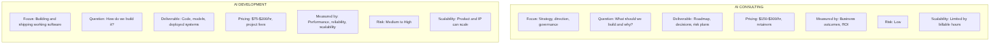
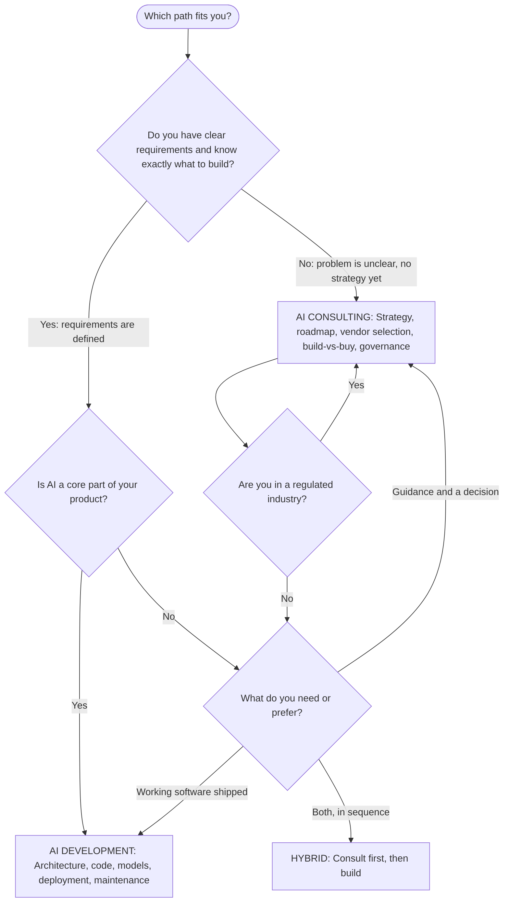

# 7. How to Choose + Real-World Examples

The single most useful question: **"Do you already know exactly what to build?"**

- **No** → consulting first (strategy, roadmap, build-vs-buy, governance).
- **Yes** → development (build it).
- **Both** → hybrid, sequenced: consult → build → maintain [2][3][55].

## Visual 1 — Side-by-side comparison

## Visual 2 — Decision flowchart

*(Both PNGs are rendered from Mermaid source included in `assets/`. They were rendered without errors, but the pixels could not be visually inspected in the generation environment.)*

## Real-world examples of the hybrid model

- **Clarista** — fixed-bid "strategy + working pilot" in 4–6 weeks ($90K–$150K), contrasting with Big-4 strategy-only decks at $300K–$1M [56].
- **Airdev** — strategy (build-vs-buy, roadmap) and production build under one team, shipping code your team can own [57].
- **GXB** — combines McKinsey-style strategy rigor with hands-on development for private-equity portfolio companies [58].
- **Phosai Labs** (prescriptive view): for most $5M–$25M non-tech companies, the right sequence is **buy a platform → embedded consulting (context/workflows/training) → buy automation** — i.e., not a pure build [59].

## Common mistakes to avoid

- Hiring a consultant expecting production code [11].
- Hiring a developer before the problem is framed — you build the wrong thing [3].
- A hybrid partner with a conflict of interest who never tells you *not* to build — ask: "when would you tell us not to build anything?" [8].
- Hourly billing that shrinks income as you get faster [43].
- A "strategy phase" with no defined deliverable or owner [10][11].
