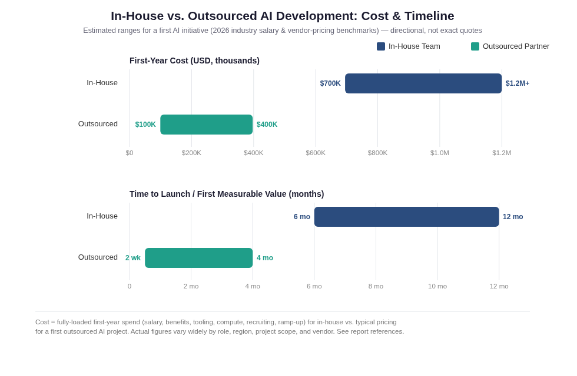

# 2. Cost Comparison

## In-house cost

| Item | Estimate |
|---|---|
| Mid-level ML engineer base salary | $120K–$200K/year |
| Senior ML engineer base salary | $160K–$226K/year (non-FAANG: up to $260K) |
| **Fully-loaded cost per senior engineer** (salary + benefits + tooling + compute + overhead) | **$180K–$230K+/year** |
| Recruiting cost | 15–25% of first-year salary |
| Ramp-up time before full productivity | ~3 months |
| **First-year cost, small team (2–4 people)** | **$700,000–$1,200,000+** |

Sources: [PayScale](https://www.payscale.com/research/US/Job=Machine_Learning_Engineer/Salary), [StealthAgents](https://stealthagents.com/research/cost-of-hiring-a-machine-learning-engineer-2026), [Groovy Web](https://www.groovyweb.co/blog/in-house-vs-outsource-ai-development-2026)

## Outsourced cost

| Project type | Typical price |
|---|---|
| Basic AI automation / chatbot | $8,000–$25,000 |
| Mid-complexity custom AI solution | $40,000–$80,000 |
| Enterprise-grade AI platform | $140,000–$350,000+ |
| **Typical range for a first 1–3 AI projects** | **$100,000–$400,000** |

Sources: [Isometrik](https://www.isometrik.ai/blog/ai-development-agency-vs-in-house-cost/), [AlphaCorp](https://alphacorp.ai/blog/in-house-vs-outsourced-ai-development-2026-guide), [Colan Infotech](https://colaninfotech.com/blog/in-house-vs-outsourcing-ai-development-in-2026/)

## Bottom line

Outsourcing the first 1–3 AI projects is commonly cited as saving **$300,000–$800,000** and landing **4–6 months faster** than building an in-house team from scratch — but that math flips the longer the capability needs to run and the more deeply it gets embedded in your operations. In-house costs stay flat-to-rising; outsourced costs are elastic (scale up for a big push, down during maintenance) but compound if the relationship needs to continue indefinitely.

## Note on sources

Several of the specific dollar figures above come from AI-outsourcing vendors' own marketing content (Groovy Web, Colan Infotech, AlphaCorp, Isometrik are themselves outsourcing providers). Their numbers are broadly consistent with independent salary data (PayScale, StealthAgents), but treat exact figures as **directional industry benchmarks, not precise quotes** — get quotes for your specific scope before budgeting.
