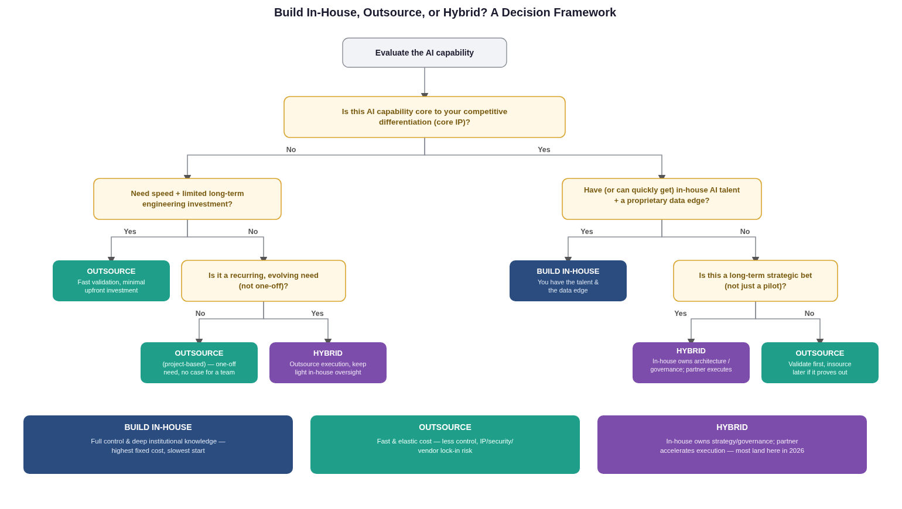

# 7. Decision Framework: Build, Outsource, or Hybrid

The strongest current guidance (2026) treats this as a **per-capability decision**, not a one-time company-wide policy:

| Choose... | When... |
|---|---|
| **Build in-house** | The AI capability is core to your competitive differentiation, you have (or can quickly get) the talent, and you hold a proprietary data advantage that materially improves results. |
| **Outsource** | You need speed, the need is one-off or a pilot, or the capability isn't core IP — you'd rather validate first and insource later if it proves out. |
| **Hybrid** | The capability matters long-term but you lack the in-house bench today — in-house keeps ownership of architecture, governance, and roadmap while a partner accelerates delivery. |

Per [TechAhead](https://www.techaheadcorp.com/blog/enterprise-ai-build-vs-buy-vs-partner/) and [Just Think AI](https://www.justthink.ai/blog/build-vs-buy-enterprise-ai-2026), the majority of enterprises now report running hybrid AI architectures, and case studies suggest hybrid approaches tend to reach sustainable ROI faster than either pure-build or pure-outsource strategies — largely because commoditized/non-differentiating pieces get bought or outsourced while the truly differentiating layer is built and owned internally.

**Recommended process:** define the business outcome first → benchmark whether an external solution/partner can actually meet the quality bar → calculate total cost of ownership (not just sticker price) → map security/legal exposure → then decide how much control that specific workflow deserves.

