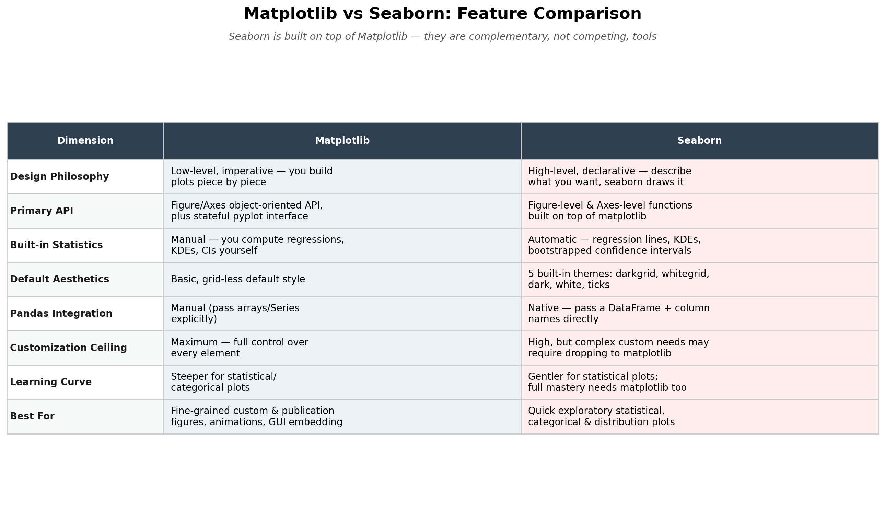

# Comparison Summary & Conclusion

## Conclusion

- **Use Matplotlib** when you need maximum, fine-grained control — custom publication-quality figures, animations, GUI-embedded plots, or performance-critical rendering of large datasets.
- **Use Seaborn** when you want fast, attractive statistical/exploratory plots (distributions, regressions, categorical comparisons) directly from a Pandas DataFrame, with minimal code.
- **In practice**: most real-world workflows use **both** — seaborn for rapid exploration and statistically-aware defaults, then matplotlib's OO API to fine-tune the final figure, since every seaborn function returns matplotlib objects you can further customize.

## Sources

- [Matplotlib Documentation](https://matplotlib.org/stable/index.html)
- [The Architecture of Open Source Applications — matplotlib](https://aosabook.org/en/v2/matplotlib.html)
- [Matplotlib GitHub Repository](https://github.com/matplotlib/matplotlib)
- [Seaborn Official Site](https://seaborn.pydata.org/)
- [Seaborn Introduction Tutorial](https://seaborn.pydata.org/tutorial/introduction.html)
- [Seaborn Function Overview](https://seaborn.pydata.org/tutorial/function_overview.html)
- [Seaborn Aesthetics Tutorial](https://seaborn.pydata.org/tutorial/aesthetics.html)
- [Seaborn GitHub Repository](https://github.com/mwaskom/seaborn)
- [Matplotlib Blog — Pyplot vs Object-Oriented Interface](https://matplotlib.org/matplotblog/posts/pyplot-vs-object-oriented-interface/)

All 9 references were validated (HTTP 200) — see `validated_links.csv`.
x