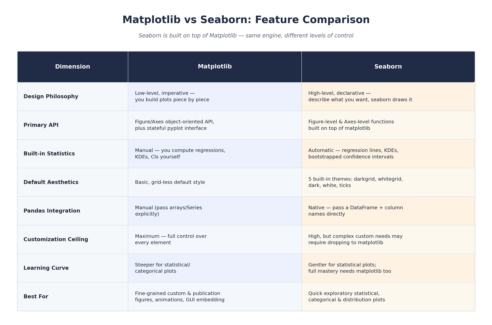

# Comparison Summary & Conclusion

Here's the whole comparison side by side — the cheat-sheet version of everything above:

## So which one should you reach for?

Back to the camera analogy: you don't have to pick a side permanently. Most people who use either library end up using both.

- **Reach for Seaborn** first, when you're exploring a dataset and want fast, good-looking statistical charts — distributions, regressions, category comparisons — straight from a DataFrame, in one or two lines.
- **Reach for Matplotlib** when a chart needs to be exactly right — a publication figure, an animation, something embedded in a GUI, or anything running at a scale where every millisecond counts.
- **In practice**, most real workflows use both, one after the other: sketch with seaborn to find the story in the data fast, then switch to matplotlib's object-oriented API to polish the final figure — because every seaborn chart *is* a matplotlib chart, just one you didn't have to build by hand.

## Sources

- [Matplotlib Documentation](https://matplotlib.org/stable/index.html)
- [The Architecture of Open Source Applications — matplotlib](https://aosabook.org/en/v2/matplotlib.html)
- [Matplotlib GitHub Repository](https://github.com/matplotlib/matplotlib)
- [Seaborn Official Site](https://seaborn.pydata.org/)
- [Seaborn Introduction Tutorial](https://seaborn.pydata.org/tutorial/introduction.html)
- [Seaborn Function Overview](https://seaborn.pydata.org/tutorial/function_overview.html)
- [Seaborn Aesthetics Tutorial](https://seaborn.pydata.org/tutorial/aesthetics.html)
- [Seaborn GitHub Repository](https://github.com/mwaskom/seaborn)
- [Matplotlib Blog — Pyplot vs Object-Oriented Interface](https://matplotlib.org/matplotblog/posts/pyplot-vs-object-oriented-interface/)

All 9 references were re-checked on 2026-08-13 and returned HTTP 200 — see `validated_links.csv`.
