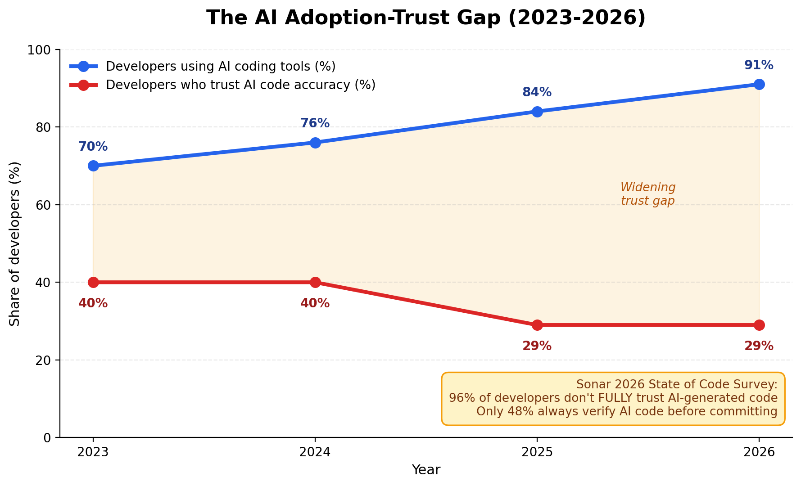
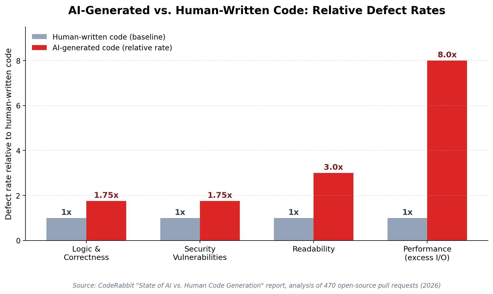

# The AI Coding Shift, 2024–2026

Adoption of AI coding assistants — GitHub Copilot, Claude Code, Cursor, and similar tools — has become close to universal among professional developers, while confidence in the code these tools produce has moved in the opposite direction.

Stack Overflow's developer survey recorded trust in AI accuracy falling from 40% in 2024 to 29% in 2025, even as usage climbed past 84%. Sonar's 2026 State of Code survey, covering more than 1,100 professional developers, found that AI now accounts for 42% of code committed today (projected to reach 65% by 2027), yet 96% of developers say they do not fully trust that output, and only 48% say they always verify AI-generated code before committing it.

**Figure 1.** The widening gap between how much developers use AI coding tools and how much they trust the code those tools produce. Sources: Stack Overflow Developer Survey (2023–2025) and Sonar State of Code Developer Survey (2026).

This gap has a measurable cost. DeviQA's 2026 survey of 300 QA professionals found that 52% report an increase in bug volume since their teams adopted AI coding tools (versus just 2% reporting a decrease), and 58% say their own testing workload has expanded without additional headcount. CodeRabbit's analysis of 470 real-world open-source pull requests quantified the difference in defect types between AI-authored and human-authored changes:

**Figure 2.** Relative defect rates of AI-generated code compared to a human-written baseline, by category. Source: CodeRabbit, "State of AI vs. Human Code Generation" report (2026).

The pattern in all of this data is consistent: AI has sharply increased the *rate* of code production, but verification capacity — human review, QA headcount, testing discipline — has not scaled at the same pace. That imbalance is the direct argument for why a test-first discipline has re-entered the conversation.
