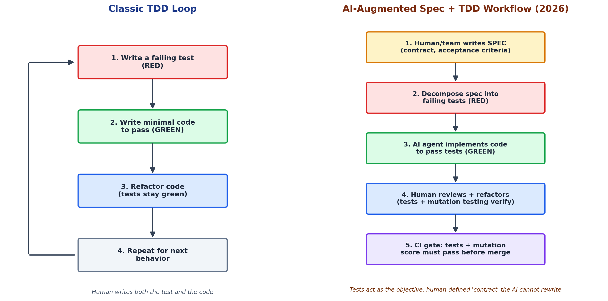

# How TDD Itself Is Evolving

TDD in 2026 is not applied identically to how it was practiced by solo human programmers in the 2000s. It has merged with a newer methodology — **spec-driven development (SDD)** — to form a workflow suited to AI agents that can generate large volumes of code quickly but are, as one 2026 guide puts it, "great at writing code and terrible at guessing what you meant." By 2026, most major AI coding tools (GitHub Spec Kit, AWS Kiro, Claude Code, Cursor, Google Antigravity, among others) ship their own version of this pattern.

**Figure 3.** The classic TDD loop compared with the AI-augmented Spec + TDD workflow now used by AI-native teams. Synthesized from Augment Code's Spec+TDD guide and Thoughtworks Technology Radar Vol. 34 (2026).

Two changes are notable in the AI-augmented version:

## The specification becomes a first-class artifact

Rather than a human holding requirements in their head while writing a test, teams write a version-controlled spec — often as an OpenAPI contract or a set of Gherkin scenarios — that both the failing tests and the eventual code must satisfy. This keeps a fast-moving AI agent anchored to intent rather than to whatever it inferred from a short prompt.

## Mutation testing verifies the verifier

Because large language models can generate tests that are syntactically plausible but assert almost nothing (an empty assertion, a mock that never checks real behavior), teams increasingly run **mutation testing** — deliberately injecting small bugs into code to confirm the test suite actually catches them. Thoughtworks' Technology Radar Volume 34 (April 2026) classifies mutation testing as an "Adopt"-level practice specifically because AI-generated tests have made it urgent to check test quality, not just test coverage.

Academic work such as the Test-Driven Agentic Development (TDAD) paper (Alonso, Yovine & Braberman, 2026) goes further, using dependency-graph impact analysis so an agent can automatically identify and re-run exactly the tests affected by a given change — reducing the regressions that generic, full-suite testing can miss.
