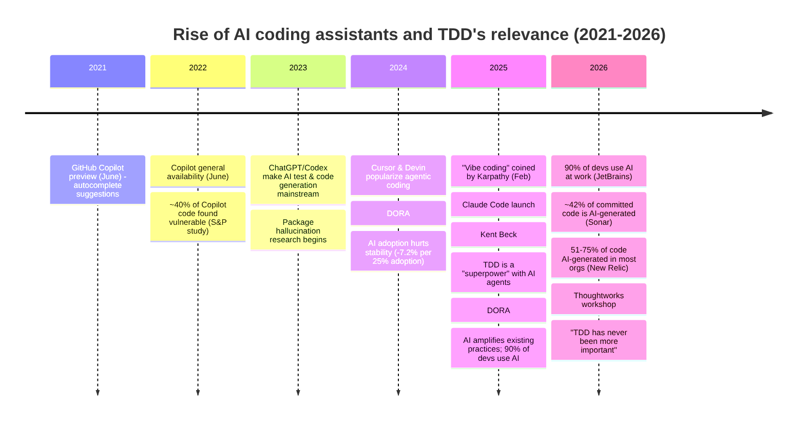
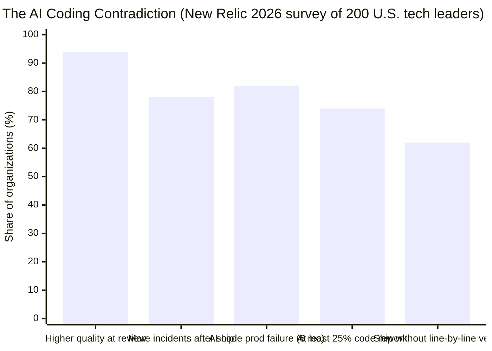

## 3. The AI Coding Shift: 2023–2026

*Timeline of the AI coding shift and when quality/security problems emerged.*

| Year | Milestone | Signal |
|---|---|---|
| 2021 | GitHub Copilot preview | Autocomplete suggestions enter the mainstream |
| 2022 | Copilot general availability | ~40% of Copilot code found vulnerable ("Asleep at the Keyboard") |
| 2023 | ChatGPT/Codex mainstream | AI code & test generation becomes normal; package-hallucination research begins |
| 2024 | Cursor & Devin popularize agentic coding | DORA: AI adoption initially hurts stability |
| 2025 | "Vibe coding" coined (Karpathy) | The term goes viral — and is later retired (see section 7) |
| 2026 | AI authors 30–75% of code (Microsoft/Google) | TDD resurgence: "TDD has never been more important" (Thoughtworks) |

### The reliability gap in numbers

The 2026 New Relic State of AI Coding report found a striking contradiction — developers *believe* AI code is better, yet see *more* failures:

- **94%** of developers rate AI-assisted code *higher quality at review time*.
- Yet **78%** see more incidents, and **82%** report at least one production failure linked to AI code in the past 6 months.
- **74%** say ≥25% of AI-generated code needs rework.
- **62%** ship AI code without line-by-line verification.
- CodeRabbit's analysis of 470 open-source PRs found **AI code has 1.7× more defects** than human code.

Security research reinforces this:
- ~40% of 1,689 Copilot-generated programs contained vulnerabilities ("Asleep at the Keyboard").
- Package hallucinations: **5.2% (commercial)** and **21.7% (open-source)** of recommended packages don't exist — 205,474 unique hallucinated package names across 16 LLMs (USENIX Security 25).
- "Broken by Default": up to **55.8% vulnerability rate** in LLM-generated code (FormAI: 62.07%).

---
