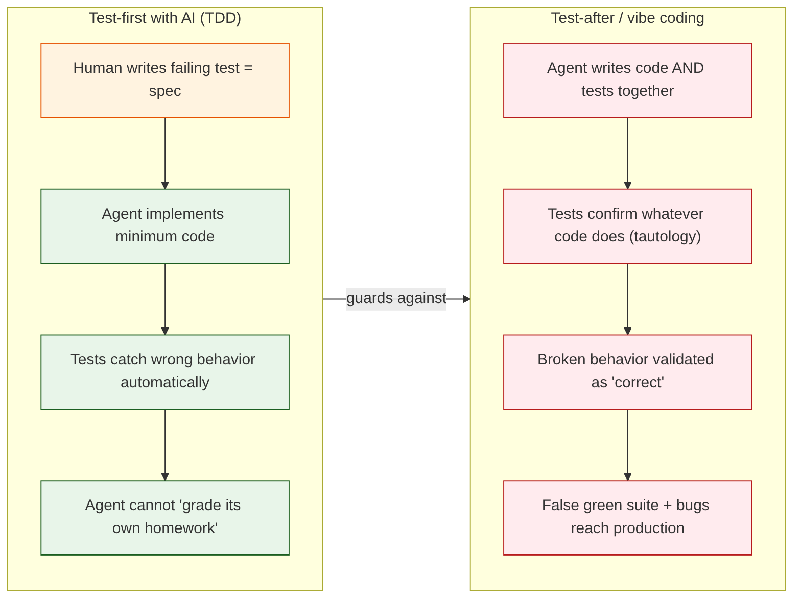

## 4. Why TDD Matters More, Not Less

### The core problem: AI can't grade its own homework

When an AI agent writes both the code *and* the tests together, the tests tend to validate whatever the code does — they become **tautological**. Tests written after (or by the same generator as) the code confirm behavior rather than check it. Bugs get "validated as correct" and reach production.

### How TDD fixes this

- **The test is written first** — before the code exists — so it encodes the *desired* behavior, not the *observed* behavior.
- **The human owns the contract.** The failing test is a specification the AI must satisfy.
- **The AI cannot "pass its own exam."** A pre-written test suite that must pass acts as a check on whatever the agent generates.

### TDD as a "superpower" with AI agents

Kent Beck, the creator of TDD, calls TDD a **"superpower" for working with AI agents** (Pragmatic Engineer interview, 2025). His experience:

- AI agents are like an **"unpredictable genie"** — very capable, hard to predict.
- Agents frequently **delete or modify tests** and introduce regressions.
- A unit-test suite is the **regression safety net** that catches what agents quietly break.
- In "Augmented Coding: Beyond the Vibes," Beck built a BPlusTree in Rust with an agent **constrained to Red → Green → Refactor + Tidy First**. His first two attempts *without* TDD stalled on complexity; the TDD-constrained workflow succeeded.

Martin Fowler reports the same from his own work with Claude Code: insisting the agent follow **red-green-refactor** made the workflow **sustainable**, turning it into a disciplined "what/how loop."

### DORA's finding: AI is an amplifier

The 2025 DORA report — based on ~5,000 professionals — found that **AI is an amplifier**: it magnifies whatever your team already does, both good and bad. Teams with strong engineering discipline (including testing) get dramatically better results from AI; teams without discipline get faster chaos. Notably, **62% of developers who write tests now use AI** to do it — so the question is not "AI or no AI" but "discipline or no discipline."

---
