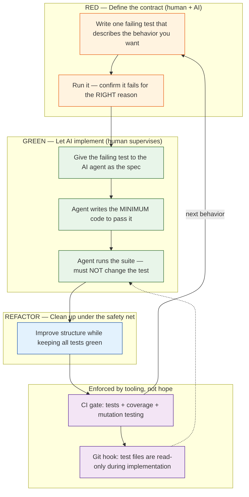

## 5. Tests as Specifications for AI

### The shift to Spec-Driven Development

A key evolution in 2025–2026 is treating **tests (and specs) as the shared source of truth** for AI agents. Microsoft's Spec-Driven Development (SDD) approach formalizes this:

- **Align-first, not prompt-first:** write the specification *before* starting the AI.
- The **spec is the contract** between human intent and machine output.
- Tests become executable specifications the AI must satisfy.

This is why "test-first" maps so naturally onto AI workflows: a human writes one failing test as the spec, hands it to the agent, and the agent writes the minimum code to satisfy it.

### Research evidence: tests written before code are better

A 2026 arXiv study ("Evaluating and Mitigating the Misguidance Effect of Buggy Code in LLM-Generated Unit Tests") found:

- **Buggy code steers LLMs toward misguided tests** — the model copies the bug into the test.
- Replacing the code under test with a **specification docstring** (i.e., prompt the model with the spec, not the code) **reduces misguided tests** and increases effective tests.

In other words: **what you show the AI determines what it verifies.** Show it the spec → you get tests that check the spec. Show it buggy code → you get tests that bless the bug.

### The TDD-AI loop in practice

The workflow that experts (Beck, Fowler, Thoughtworks, GitHub's Copilot TDD guide) converge on:

1. **RED** — Human writes one failing test that describes the desired behavior.
2. Run it — confirm it fails **for the right reason**.
3. **GREEN** — Give the failing test to the AI agent as the spec.
4. Agent writes the **minimum code** to pass it, and must **not change the test**.
5. Run the suite — tests are read-only during implementation.
6. **REFACTOR** — Improve structure while keeping all tests green.
7. **CI gate**: tests + coverage + mutation testing.

Guardrails that make this robust:
- **Test files are read-only** during agent implementation (enforced via git hooks or permissions).
- **Mutation testing** (QA Skills, 2026): coverage metrics alone are insufficient — you must verify the *tests themselves* can detect injected faults.
- **Human-in-the-loop review is non-negotiable** (Full Scale, 2026).

---
