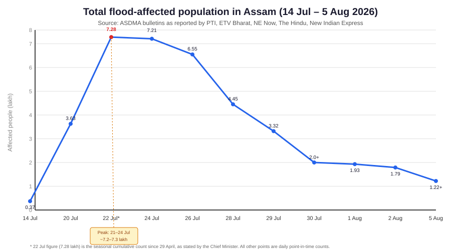
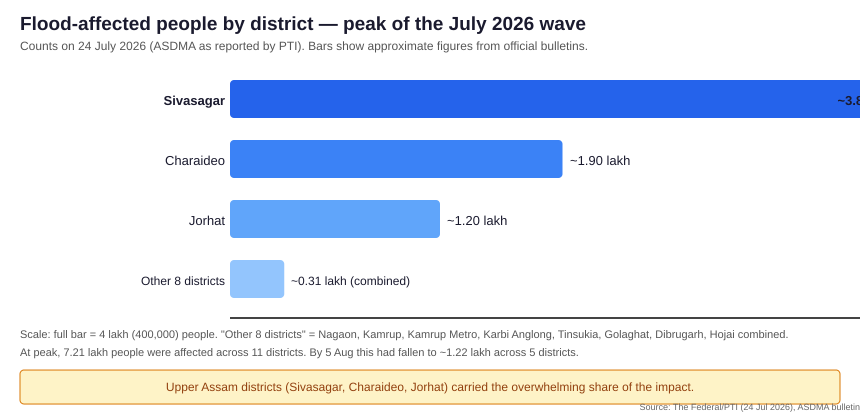

# 1. Executive Summary

**Data as of 5 August 2026 (ASDMA / state government daily bulletins).**

- **At least 89 flood-related deaths** across Assam since 29 April; Upper Assam bore the brunt.
- **~1.22 lakh people currently affected** (down from the 24 July peak of ~2.26 lakh), with **21 districts** and **~900+ villages** impacted at peak.
- **Worst-hit district: Sivasagar** — ~60,000 people affected, **42 deaths** (~47% of the state total).
- **Epicentre: Upper Assam** (Sivasagar, Charaideo, Jorhat), driven by the **Dikhow river breaking its all-time record** (127.02 m on 16 July) and the **Dhansiri still in "severe flood" state**.
- **89 relief camps / relief distribution centres** were active at peak, sheltering **~1.4 lakh people**; the State Disaster Response Force, NDRF, Army, Air Force and Navy all took part.
- **Cause:** Himalayan snowmelt + intense monsoon rains + terrain where the Dikhow is essentially "flat-bottomed" and drains slowly, worsened by encroachment, embankment breaches, and climate change.
- **Relief:** ₹9 lakh ex gratia for deaths (₹4 lakh state + ₹5 lakh CM Relief Fund), ₹15,000 interim aid to affected families, ₹2,500 Orunodoi disbursement for August, and a 6-month loan moratorium for Sivasagar, Charaideo, Jorhat and Golaghat.
- **Official helplines:** 1070, 1079, 112, 1077; ASDMA state control room 0361-2237219 / 9401044617; sdma-assam@gov.in.
- **Flooding has now receded** in most of Upper Assam; the focus has shifted from rescue to relief and disease prevention, with Brahmaputra floodplains and the Barak Valley on watch for the second half of the season.

*Key visuals:*

*Daily affected population, 14 July – 5 August 2026 (data: ASDMA).*

*District-wise affected people at the 24 July peak (data: ASDMA).*
