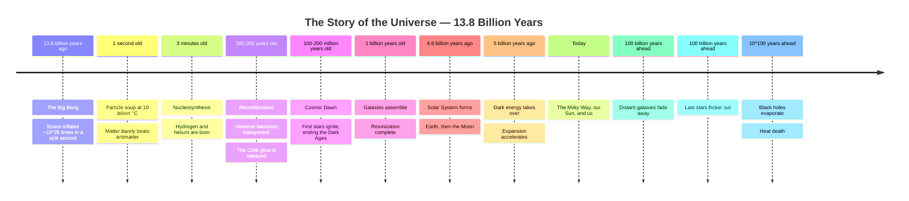

# The Film in One Frame (Visual Timeline)

The full story of the universe compressed into a single timeline. Renders as a Mermaid diagram on GitHub, GitLab, VS Code, Typora, and other Mermaid-enabled viewers.

## Timeline Notes

- The time axis is not to scale — the first billion years contain most of the plot, the following 13.8 billion years are the present day, and the final entries stretch into the far future.
- Estimates such as "100–200 million years old" for the first stars represent current scientific ranges, not exact dates.
- The far-future milestones are projections based on our best current physics and could change if dark energy turns out to behave unexpectedly.
