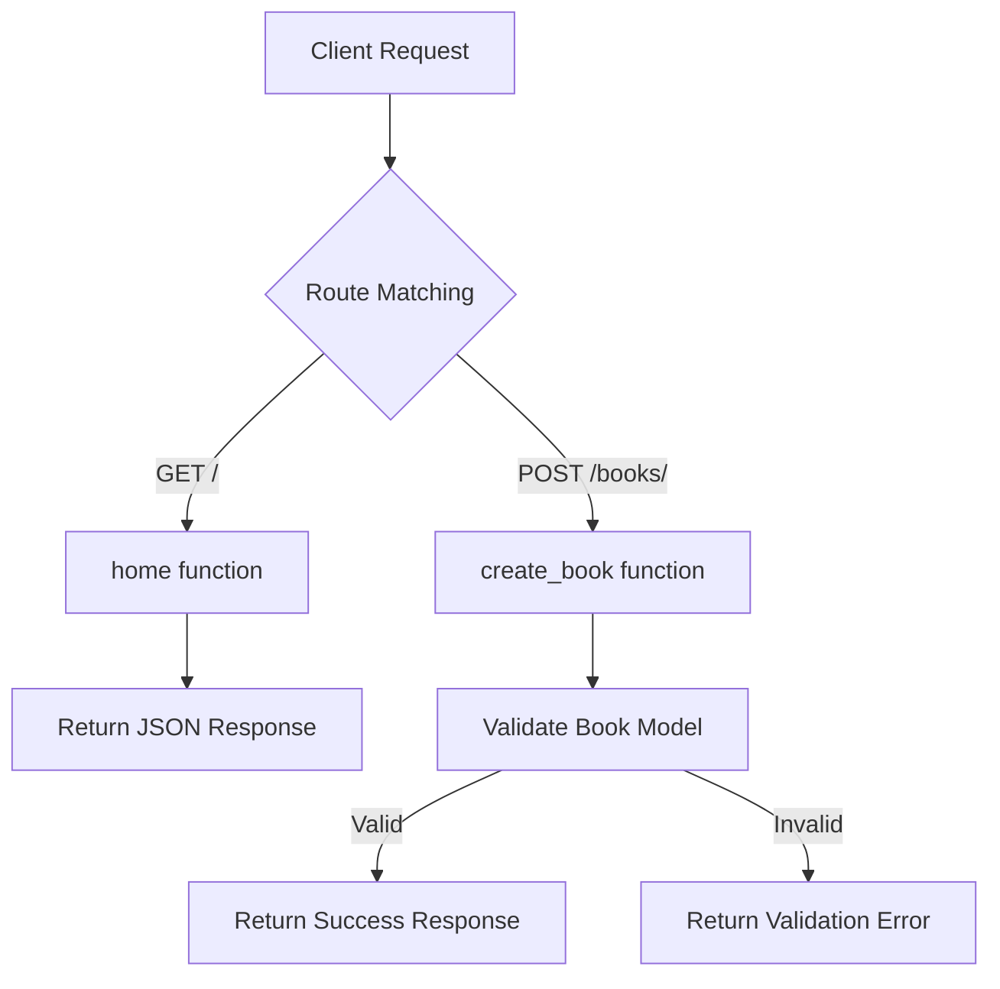

# Code Analysis Report: `fastapi_with_pydantic.py`

## Overview

This is a simple FastAPI application that demonstrates basic API endpoints with Pydantic model validation. The code creates two endpoints: a home GET endpoint and a book creation POST endpoint.

**Language:** Python  
**Framework:** FastAPI  
**Lines of Code:** 21

---

## Code Flow



---

## Findings

### Positive Aspects

| Aspect | Status | Notes |
|--------|--------|-------|
| Code Simplicity | ✅ Good | Clean and easy to understand |
| Type Hints | ✅ Good | Pydantic model provides automatic validation |
| Framework Usage | ✅ Good | Proper use of FastAPI decorators |
| PEP 8 Compliance | ✅ Good | Follows Python style guidelines |

### Issues Identified

| # | Severity | Issue | Location |
|---|----------|-------|----------|
| 1 | 🟡 Medium | Missing docstrings | Functions and class |
| 2 | 🟢 Low | Missing response model | POST endpoint |
| 3 | 🟢 Low | No error handling | POST endpoint |
| 4 | 🟢 Low | No logging | Entire file |

---

## Code Quality

### Readability: ⭐⭐⭐⭐ (4/5)
- Code is concise and well-structured
- Naming conventions follow PEP 8
- Could benefit from docstrings for documentation

### Maintainability: ⭐⭐⭐ (3/5)
- Simple structure makes maintenance easy
- Adding more endpoints would require explicit documentation
- No separation of concerns (routes and models in same file)

---

## Performance

| Concern | Impact | Recommendation |
|---------|--------|----------------|
| Synchronous endpoints | Low | Consider `async` for I/O-bound operations |
| No response caching | Low | Add caching for frequently accessed data |
| No rate limiting | Medium | Implement rate limiting for production use |

---

## Security

| Concern | Risk Level | Details |
|---------|------------|---------|
| No CORS configuration | 🟡 Medium | Required for browser-based clients |
| No authentication | 🟡 Medium | Endpoints are publicly accessible |
| No input sanitization | 🟢 Low | Pydantic provides basic validation |
| No HTTPS enforcement | 🟡 Medium | Required for production |

---

## Suggestions

### 1. Add Docstrings (Recommended)
```python
@app.get("/")
def home():
    """Return a welcome message."""
    return {"message": "Hello World"}

class Book(BaseModel):
    """Book model for API requests."""
    title: str
    author: str
    pages: int
```

### 2. Add Response Model (Recommended)
```python
from pydantic import BaseModel

class BookResponse(BaseModel):
    status: str
    book: Book

@app.post("/books/", response_model=BookResponse)
def create_book(book: Book):
    """Create a new book entry."""
    return {"status": "Book created", "book": book}
```

### 3. Add CORS Middleware (For Production)
```python
from fastapi.middleware.cors import CORSMiddleware

app.add_middleware(
    CORSMiddleware,
    allow_origins=["*"],
    allow_credentials=True,
    allow_methods=["*"],
    allow_headers=["*"],
)
```

### 4. Consider Async Operations
```python
@app.get("/")
async def home():
    """Return a welcome message."""
    return {"message": "Hello World"}
```

---

## Conclusion

This is a well-structured beginner-level FastAPI application that demonstrates the basics of API development with Pydantic validation. The code is clean and follows Python conventions.

**Overall Rating:** ⭐⭐⭐ (3.5/5)

**Key Strengths:**
- Simple and readable
- Proper use of FastAPI and Pydantic
- Follows PEP 8 guidelines

**Areas for Improvement:**
- Add docstrings for documentation
- Implement response models
- Add CORS configuration for production
- Consider async operations for better performance

**Production Readiness:** Not recommended for production use without additional security measures (authentication, CORS, rate limiting).

---

*Report generated on: 2026-08-04*
