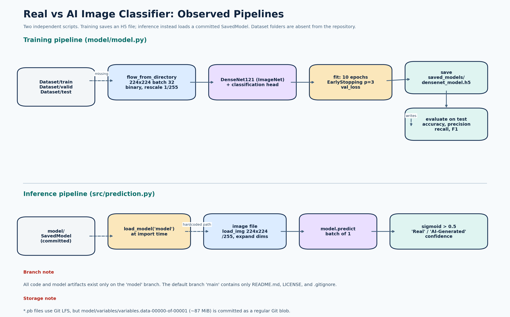
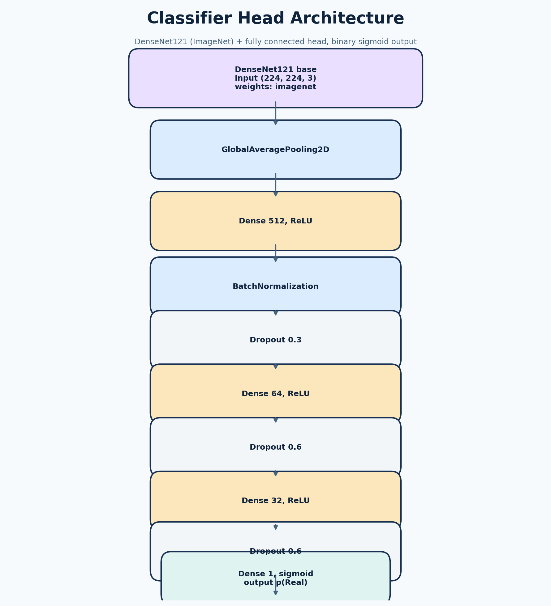

# Code Analysis Report: AI_vs_real_image_classifier

Analysis date: 2026-08-07  
Repository: [nivesh1000/AI_vs_real_image_classifier](https://github.com/nivesh1000/AI_vs_real_image_classifier)  
Analyzed branch: `model` (revision `92b9e11`, 2024-12-12)  
Primary language: Python (TensorFlow / Keras)  
Analysis type: Static analysis with isolated syntax check

## Overview

This project trains and runs a binary image classifier that distinguishes real photographs from AI-generated images. The repository name and the `README.md` describe a StyleGAN-based classification task. The implementation uses DenseNet121 pretrained on ImageNet as a feature extractor, adds a small fully connected head with dropout, and trains it with binary cross-entropy. A committed TensorFlow SavedModel in `model/` provides the deployable artifact that `src/prediction.py` loads for inference.

Two important facts shape this analysis:

1. **All code exists only on the `model` branch.** The default branch, `main`, contains only `README.md`, `LICENSE`, and `.gitignore`. A user who clones the repository normally sees an empty project.
2. **The training and inference pipelines do not share a path.** Training saves an H5 file to `saved_models/densenet_model.h5`, while inference loads the committed SavedModel directory `model/`.

The code is a readable prototype, but it is not reproducible, testable, or robust to upgrades in its current form.

### Scope and Method

- Reviewed `model/model.py`, `src/prediction.py`, `requirements.txt`, `README.md`, `.gitattributes`, `.gitignore`, and `LICENSE`.
- Did not analyze binary model artifacts (`saved_model.pb`, `variables/*`, `keras_metadata.pb`, `fingerprint.pb`) because they are non-code assets. Their storage and size are reported because they affect repository hygiene.
- Ran a Python syntax-compilation check of both `.py` files in an isolated temporary location; it passed under Python 3.10.0.
- Did not install TensorFlow, train the model, or load the SavedModel, because dependency installation was not approved and the dataset is not present.
- Verified branch structure, file storage method, and dependency freshness against the package index.

## Architecture



The project is two independent scripts:

1. `model/model.py` is the training pipeline: data generators -> DenseNet121 transfer learning -> `fit` with early stopping -> save H5 -> evaluate on the test split.
2. `src/prediction.py` is the inference pipeline: load the committed SavedModel -> preprocess one image -> predict -> decode to `"Real"` or `"AI-Generated"` with a confidence value.

There is no shared code, configuration module, package `__init__.py`, CLI, or web/service layer. `src/prediction.py` does not import from `model/model.py`; the two halves are connected only by the trained model artifact on disk.

## Code Flow

### Training Flow

1. `prepare_data_generators()` creates `flow_from_directory` iterators for `Dataset/train`, `Dataset/valid`, and `Dataset/test` at 224x224, batch 32, binary class mode, with `1/255` rescaling.
2. `build_model()` stacks a pretrained DenseNet121 with a `GlobalAveragePooling2D` layer and a classifier head: 512 -> BatchNorm -> Dropout(0.3) -> 64 -> Dropout(0.6) -> 32 -> Dropout(0.6) -> 1 sigmoid. The model is compiled with Adam at learning rate 0.00005 and binary cross-entropy.
3. `train_model()` fits for up to 10 epochs with early stopping on validation loss (patience 3, restore best weights).
4. `save_model()` writes `saved_models/densenet_model.h5`.
5. `evaluate_model()` predicts on the test generator, thresholds at 0.5, and prints accuracy, precision, recall, F1, and a classification report.

### Inference Flow

1. `model = tf.keras.models.load_model('model')` executes at import time.
2. `preprocess_image()` loads the image at 224x224, converts to a NumPy array, divides by 255, and expands dimensions to a batch of one.
3. `predict_image()` calls `model.predict`, thresholds the sigmoid output at 0.5, and returns a formatted string with label and confidence.
4. The script immediately runs example inference on a hardcoded absolute path on import.



## Findings

### Critical

#### 1. The code is invisible on the default branch

**Confirmed issue.** `git ls-remote` shows two branches, `main` and `model`. The code and model artifacts exist only on `model`. The default branch `main` is empty. Anyone cloning the repository without knowing about the `model` branch gets only a one-line README, a license, and `.gitignore`.

**Action:** either merge the code into `main` and make it the default branch, or document prominently that `model` is the working branch. Leaving working code off the default branch makes the project appear abandoned and can cause users to build on the wrong revision.

#### 2. Inference runs at import time with a machine-specific hardcoded path

**Confirmed issue.** `src/prediction.py:48-51` executes example inference immediately at module import:

```python
image_path = '/home/cynoteckdell/Documents/RealvsAIgen-Face-Classifier/Dataset/photowhite.jpeg'
result = predict_image(image_path, model)
print(result)
```

There is no `if __name__ == "__main__":` guard. Importing the module triggers a full prediction, and the path exists only on the author's machine, so the script crashes with a file-not-found error for everyone else. Any future attempt to import the module for testing would trigger this side effect.

**Action:** guard executable statements behind `if __name__ == "__main__":` and accept the image path as a command-line argument or function parameter with a sensible default.

#### 3. `scikit-learn` is imported but missing from dependencies

**Confirmed issue.** `model/model.py:7-9` imports `accuracy_score`, `precision_score`, `recall_score`, `f1_score`, and `classification_report` from `sklearn.metrics`. `requirements.txt` lists only `tensorflow`. Training fails immediately with `ModuleNotFoundError` on a clean environment.

**Action:** declare `scikit-learn` (and `numpy`, used in `src/prediction.py`) in `requirements.txt`.

### High

#### 4. Deprecated TensorFlow APIs combined with an unpinned dependency

**Confirmed issue.** The code relies on `tf.keras.preprocessing.image.ImageDataGenerator`, `flow_from_directory`, `load_img`, and `img_to_array`. These APIs are deprecated in TensorFlow 2.13+ and removed from the Keras 3 path that is now the default. `requirements.txt` pins no version, so `pip install -r requirements.txt` resolves to the latest TensorFlow (2.21.0 as of the analysis date), which may behave differently or drop these symbols entirely.

**Action:** either pin a TensorFlow version compatible with the legacy APIs (`tensorflow==2.15.1` is a reasonable candidate) or migrate to `tf.keras.utils.image_dataset_from_directory` plus Keras preprocessing layers and the Keras 3 API. Do both migrations deliberately, not in the same change.

#### 5. The README claims data augmentation that does not exist

**Confirmed issue.** The README lists "data augmentation and preprocessing for robust model performance." The code only rescales pixels: `ImageDataGenerator(rescale=1.0 / 255)`. No rotation, zoom, flip, shift, or other augmentation is configured.

**Action:** either add augmentation (for example flips and small rotations) or correct the README. If augmentation is added, verify it is applied only to training data, not validation or test data.

#### 6. Training save path and inference load path disagree

**Confirmed issue.** `train_model` saves to `saved_models/densenet_model.h5` (H5 format). `predict_image` loads from `model/` (a TensorFlow SavedModel directory). A fresh training run produces an artifact that the inference script will not use, and the committed `model/` directory does not correspond to anything the training script produces.

**Action:** use a single saved-model path and format for both training output and inference input, and document how the committed artifact was produced.

#### 7. A large binary is committed as a regular Git blob

**Confirmed issue.** `.gitattributes` declares Git LFS for `*.h5` and `*.pb`, and the `.pb` files are correctly LFS-tracked. However, `model/variables/variables.data-00000-of-00001` (~87 MiB) has no matching extension, so it is committed as a regular Git blob. Every clone downloads it directly from GitHub, and it cannot be pruned by LFS.

**Action:** track the TensorFlow SavedModel's variable files with Git LFS as well (for example `variables.data-*` and `variables.index`), and confirm the LFS server is enabled for the repository. Consider whether the committed model should live in the repository at all versus being downloaded from a model registry.

### Medium

#### 8. Configuration is hardcoded and reproducibility is not addressed

**Confirmed issue.** Dataset paths, image size, batch size, epochs, learning rate, dropout rates, patience, save path, and the 0.5 decision threshold are all literal values in module scope. No configuration file, CLI arguments, environment variables, or random seeds are used. TensorFlow training is non-deterministic without a seeded setup, so two runs on the same data may produce different models.

**Action:** centralize configuration in a small module or dataclass, expose it via a CLI, and set `tf.random.set_seed`, NumPy, and Python seeds (plus environment flags) for reproducible experiments. Log the configuration with each run.

#### 9. No error handling or input validation

**Confirmed issue.** Missing image files, missing model directories, malformed images, and empty datasets all surface as raw unhandled tracebacks. The script does not distinguish "not an image" from "not a real/AI image."

**Action:** validate file existence and model availability early, wrap image decoding and prediction with clear error messages, and define behavior for empty results. Do not swallow errors silently; classify them.

#### 10. Inference is single-image, batch-of-one, and loads the model eagerly

**Confirmed issue.** `predict_image` preprocesses one image and calls `model.predict` on a batch of one. Classifying many images repeats model-invocation overhead per image. Model loading at import adds a multi-second, ~96 MiB cost to any process that merely imports the module.

**Action:** batch predictions for multiple images, load the model lazily on first use or explicitly, and keep model loading out of import time.

### Low

#### 11. Training data utilization and minor style issues

**Confirmed observation.** `train_model` sets `steps_per_epoch=len(train_gen)` and `validation_steps=len(val_gen)`, which use `ceil(samples / batch_size)` and skip a trailing partial batch each epoch. The effect is minor, but omitting these arguments would let Keras consume full epochs from the iterators. The code also uses `print` for diagnostics and keeps a debug-style `print(prediction[0][0])` in `src/prediction.py:42`.

**Action:** remove `steps_per_epoch`/`validation_steps` if full-batch handling is intended, use a logging module for diagnostics, and remove the stray debug print.

## Code Quality

`model/model.py` is the stronger file: it has docstrings, type hints, and clean function decomposition. `src/prediction.py` has docstrings but no type hints, mixes module-scope side effects with functions, and executes example code on import. Other observations:

- `src/` has no `__init__.py`, which is acceptable for standalone scripts but inconsistent with the `model/` package layout.
- The lambda in `prepare_data_generators` (`train_val_generator = lambda dir_path: ...`) is a minor style choice; a small helper function would be clearer.
- No formatter, linter, or type-checking configuration is present.
- The two scripts duplicate the concepts of path handling and preprocessing without sharing code, which is acceptable at this size but will drift as the project grows.

## Dependency Analysis

`requirements.txt` contains a single unpinned line: `tensorflow`.

| Dependency | Status | Notes |
|---|---|---|
| `tensorflow` | Required, unpinned | Resolves to 2.21.0 today; the legacy Keras 2 APIs in the code are deprecated. Pin a compatible version or migrate to Keras 3. |
| `scikit-learn` | Missing | Imported in `model/model.py` for evaluation metrics; absent from requirements. |
| `numpy` | Missing | Imported in `src/prediction.py`; only present transitively via TensorFlow. |
| `Pillow` | Implicit | Used indirectly by `load_img`; pulled in by TensorFlow. Not a concern. |

Version availability checked against the package index on 2026-08-07: `tensorflow` latest 2.21.0, `scikit-learn` latest 1.7.2.

A minimal dependency recommendation is saved at [`recommended_requirements.txt`](recommended_requirements.txt). It pins TensorFlow 2.15.1 as a bridge while the code still uses the deprecated APIs. It does not replace the project file because dependency changes require user approval and testing.

The repository correctly uses Git LFS for `.pb` files, but the large `variables.data-00000-of-00001` blob should also be LFS-tracked (see Finding 7).

## Performance Analysis

### Training

Training time is dominated by DenseNet121 forward/backward passes. No accelerator or device control is configured, so a CPU-only machine trains slowly. The dataset size is unknown (not committed), so no throughput estimate is possible without inventing context. The fixed epoch count (10) plus early stopping is reasonable.

### Inference

- Model load at import: multi-second, ~96 MiB memory, repeated on every process start.
- Single-image, batch-of-one predictions: fine for interactive use, inefficient for bulk classification.
- Preprocessing cost is negligible relative to the forward pass.

### Optimizations Worth Doing

- Load the model once per process and reuse it (lazy singleton).
- Batch inference for multiple images.
- Optionally serve with TensorFlow SavedModel's native serving or convert to a lighter format (e.g., quantized) before production deployment.

Optimizations not recommended without measurement: multiprocessing and GPU sharding add complexity with no demonstrated benefit at this scale.

## Security

No secrets are committed, which is good. Points to consider:

- Loading a TensorFlow SavedModel can execute arbitrary code if the artifact is untrusted. The committed model is from the repository owner, but treat any model downloaded from third parties as untrusted and scan/sign it.
- The hardcoded absolute image path is not a security issue by itself, but it implies environment-specific assumptions that can cause surprising failures in production.
- If the classifier is exposed to user-uploaded images, image decoding should happen in a resource-constrained context (size and decompression limits) to avoid decompression-bomb and CPU exhaustion attacks.
- No data-leakage concern exists for the training pipeline, since the dataset is not committed; decide intentionally whether trained artifacts should be public.

## Testing Analysis

The repository has no tests, test runner, CI configuration, or measurable coverage. The syntax check passed for both files, but nothing was executed end-to-end. The recommended strategy starts with the small pure functions (preprocessing, decoding, metric math), then adds mocked-contract tests for model loading and training, and finally an opt-in smoke test against the committed SavedModel.

- [Full testing report](testing/testing_report.md)
- [Testing strategy visual](assets/testing_strategy.png)
- HTML coverage report: not generated because no executable test suite exists

## Prioritized Suggestions

1. Move the working code to the default branch and add a proper README with setup, dataset layout, and run commands.
2. Guard `src/prediction.py` with `if __name__ == "__main__":` and replace the hardcoded path with a parameter or CLI argument.
3. Declare `scikit-learn` and `numpy`, and pin or migrate TensorFlow away from the deprecated Keras 2 image APIs.
4. Align the training save path/format with the inference load path.
5. Make datasets paths, hyperparameters, and the threshold configurable and reproducible (seeds + configuration logging).
6. Add error handling for missing files, missing models, and malformed images.
7. Track the large model variable files with Git LFS.
8. Add tests for preprocessing, decoding, and metric math first (see the testing report).
9. Add augmentation only deliberately, and correct the README claim either way.
10. Adopt formatting, linting, and type-checking tools.

## Conclusion

The project demonstrates a reasonable DenseNet121 transfer-learning approach for a binary real-vs-AI image classification task, and the training script is well structured. The main weaknesses are organizational rather than algorithmic: the code is stranded on a non-default branch, the inference script is not runnable outside the author's machine, dependencies are incomplete, and the deprecated TensorFlow APIs will break on an unmanaged upgrade. Fixing the branch, import side effects, and dependency declarations are the highest-value changes; testing and performance improvements should follow once the code is reproducible.

## Report Assets

- [Observed pipelines PNG](assets/architecture.png)
- [Classifier head architecture PNG](assets/model_architecture.png)
- [Testing strategy PNG](assets/testing_strategy.png)
- [Testing analysis](testing/testing_report.md)
- [Recommended minimal requirements](recommended_requirements.txt)
