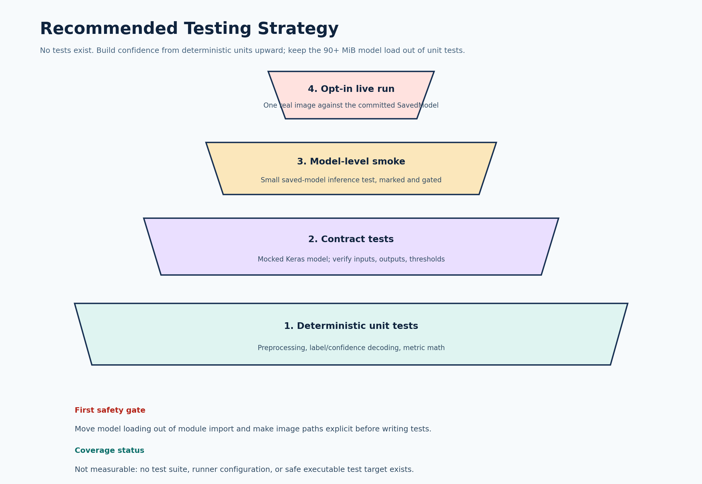

# Testing Analysis: AI_vs_real_image_classifier

Analysis date: 2026-08-07  
Analyzed branch: `model` (revision `92b9e11`)  
Status: No tests or test configuration are present.

## Summary

The repository contains no `tests/` directory, test modules, test runner configuration, continuous-integration workflow, or coverage configuration. Runtime coverage therefore cannot be measured responsibly; a numeric percentage would be misleading because no test process exists to instrument the code.

A Python syntax-compilation check of `model/model.py` and `src/prediction.py` passed in an isolated temporary environment under Python 3.10.0. That only proves the files parse. Imports and model loading were not executed because TensorFlow is not installed in the analysis environment and no dependencies may be installed without permission.



## Current Testability Risks

| Severity | Risk | Evidence | Testing impact |
|---|---|---|---|
| High | Model loads at import time | `src/prediction.py:6` calls `tf.keras.models.load_model('model')` | Importing the module loads ~96 MiB and can fail on a machine without the committed model directory. |
| High | Script executes example inference on import | `src/prediction.py:48-51` runs a prediction with a hardcoded absolute path | Importing the module crashes with a file-not-found error for any other machine. |
| High | Deep-learning training path needs large assets | `Dataset/train`, `Dataset/valid`, `Dataset/test` are absent from the repository | No real end-to-end training test can run from the repository contents alone. |
| High | No dependency isolation | Unpinned `tensorflow` plus missing `scikit-learn`/`numpy` declarations | Tests cannot be reproduced across environments. |
| Medium | No CLI or injectable boundaries | Paths, epochs, sizes, and thresholds are hardcoded in module scope | Deterministic fakes can only be applied through refactoring or fragile monkeypatching. |
| Medium | No error contract | No validation, custom exceptions, or handling for missing files/models | Expected behavior under failure is undefined, so tests have nothing to assert against. |

## Coverage Assessment

- Measured statement coverage: unavailable.
- Measured branch coverage: unavailable.
- HTML coverage report: not generated because there is no executable test suite and dependencies were not installed without permission.
- Syntax coverage: both Python implementation files parsed successfully under Python 3.10.0.
- Behavioral confidence: low; the only executable paths depend on the committed model, local datasets, and a full TensorFlow installation.

## Recommended Test Order

| Priority | Area | Suggested cases |
|---|---|---|
| P0 | Preprocessing | `preprocess_image` returns shape `(1, 224, 224, 3)`; values in `[0, 1]`; a non-image or missing file raises a controlled error. |
| P0 | Decoding logic | A mocked `predict` returning `0.9` yields `"Real"` with confidence `0.9`; returning `0.2` yields `"AI-Generated"` with confidence `0.8`; exactly `0.5` has a defined boundary. |
| P0 | Metric math | `evaluate_model` computes accuracy, precision, recall, and F1 correctly against a mocked prediction set and known labels. |
| P0 | Model loading | `load_model` is called once, lazily, and with the configured path; a missing model directory raises a clear message before any network or heavy work. |
| P1 | Data generators | Tiny synthetic `train`/`valid`/`test` folders verify `flow_from_directory` receives the correct directory, size, batch, class mode, and shuffle flags. |
| P1 | Training behavior | `train_model` passes `epochs=10`, correct callbacks, and generator steps; `EarlyStopping` restore behavior is verified with a stub history. |
| P1 | Save/load alignment | The path and format produced by `save_model` match what `predict_image` loads, or the mismatch is documented and fixed. |
| P1 | Dataset parity | Training, validation, and test splits use consistent class ordering (`class_indices`) so labels are not silently swapped. |
| P2 | Model-level smoke | One small, marked test loads the committed SavedModel and predicts on a synthetic image tensor; excluded from default runs. |
| P2 | Live run | An opt-in end-to-end test with a real image; never runs in pull requests without an explicit flag. |

## Proposed Structure

```text
tests/
  unit/
    test_preprocessing.py
    test_decoding.py
    test_metrics.py
    test_data_generators.py
    test_training.py
  contract/
    test_model_loading.py
  smoke/
    test_saved_model_smoke.py
  conftest.py
```

Use `pytest` and `pytest-cov` only after approval to add development dependencies. Mock `model.predict` and `tf.keras.models.load_model` at the boundaries instead of patching internals. Keep the committed-model smoke test behind an explicit marker so CI stays light.

## Refactoring Needed Before Tests

1. Add `if __name__ == "__main__":` guards to `src/prediction.py` and remove top-level example execution.
2. Load the model lazily (first use or an explicit `load_model()` call) instead of at import.
3. Accept image paths and model paths as parameters instead of hardcoded values.
4. Extract pure functions for preprocessing, decoding, and metric math so they can be tested without TensorFlow execution.
5. Create a small configuration object for dataset paths, sizes, batch size, and epochs.
6. Pin dependencies and declare `scikit-learn` and `numpy`.
7. Document the training data layout and class ordering so fixture folders can be built consistently.

## Coverage Plan

1. Establish a baseline after the deterministic unit suite is runnable.
2. Enforce coverage on changed code first rather than an arbitrary project-wide threshold.
3. Add branch coverage for the threshold boundary and all error paths.
4. Generate `coverage.html` with `pytest --cov=model --cov=src --cov-branch --cov-report=html` once imports are safe.
5. Add the model smoke test separately from coverage gates because it is slow and environment-dependent.

## Conclusion

The most valuable testing work is small: `preprocess_image`, the prediction decoding logic, and the metric math are pure, fast, and currently untested. Those should be covered first. Model loading and heavy training should be refactored behind boundaries before broader testing is attempted.
