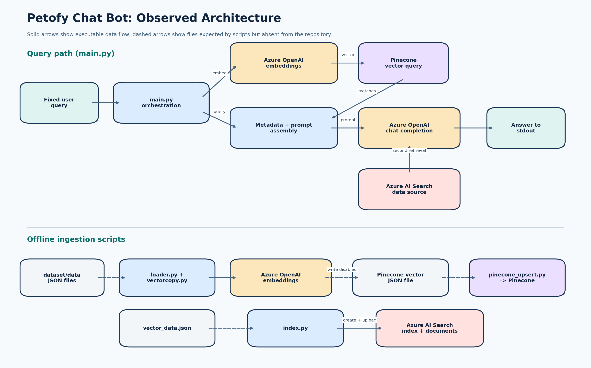

# Code Analysis Report: Petofy-Chat-Bot-PineCone

Analysis date: 2026-08-07  
Repository: [nivesh1000/Petofy-Chat-Bot-PineCone](https://github.com/nivesh1000/Petofy-Chat-Bot-PineCone)  
Analyzed revision: `5431515` (2024-07-22)  
Primary language: Python  
Analysis type: Static analysis with isolated syntax and safe-import checks

## Overview

This repository is a proof-of-concept retrieval-augmented generation (RAG) chatbot. Its main script embeds the fixed question `what is petofy`, retrieves related metadata from Pinecone, inserts that metadata into a prompt, and requests an answer from Azure OpenAI. The same completion call also configures Azure AI Search as a second retrieval source. Separate scripts load JSON records, generate embeddings, upsert Pinecone vectors, and create/upload an Azure AI Search vector index.

The implementation demonstrates the intended service connections, but it is not safe or reproducible enough for production or collaborative development. The most urgent issue is a committed Pinecone API key. The next largest risks are external side effects during module import, inconsistent package imports, absent tests, missing input artifacts/documentation, and tightly coupled service orchestration.

### Scope and Method

- Reviewed all seven `.py` implementation files, `requirements.txt`, `.gitignore`, and `README.md`.
- Did not inspect committed `.pyc` binary files, in accordance with the non-code asset rule.
- Did not install dependencies, call paid APIs, validate the exposed credential, or mutate the source repository.
- Ran Python syntax compilation in an isolated temporary location; it passed under Python 3.10.0.
- Ran one safe import check; `import src.loader` failed because of an invalid bare import.
- Attempted a dependency vulnerability audit, but `pip-audit` is not installed. No package was installed without permission.

## Architecture

The project has two loosely connected paths:

1. `main.py` is the query path and directly coordinates environment loading, Azure OpenAI embedding, Pinecone retrieval, prompt construction, Azure AI Search retrieval, and Azure OpenAI completion.
2. Files under `src/` are ingestion scripts for local JSON, embeddings, Pinecone, and Azure AI Search.

There is no application/service layer, adapter boundary, command-line interface, web API, or reusable query function. The repository name says "chat bot," but the current behavior is a one-shot script with a hardcoded question and `stdout` output.

## Code Flow

### Query Flow

1. `main.py` loads `config/.env` and creates Azure OpenAI clients.
2. It embeds a fixed query using the deployment name `text-embedding`.
3. It queries Pinecone index `web-scrap-index`, namespace `ns1`, for five matches.
4. It concatenates each match's metadata using Python string representations.
5. It sends the combined prompt to Azure OpenAI.
6. The completion request additionally supplies Azure AI Search index `petofy-vector-data` as a data source.
7. It prints the first returned message.

### Ingestion Flow

- `src/loader.py` recursively loads every JSON file under `dataset/data`.
- `src/vectorcopy.py` requests one embedding per record and builds Pinecone vector dictionaries in memory.
- Writing those vectors to `vector1_data_for_pinecone.json` is commented out.
- `src/pinecone_upsert.py` nevertheless requires that absent file and upserts it immediately.
- `src/index.py` immediately creates/updates an Azure AI Search index and uploads the absent `vector_data.json` file.

## Findings

### Critical

#### 1. A Pinecone API key is committed publicly

**Confirmed issue.** The same plaintext credential appears in [`main.py:28`](https://github.com/nivesh1000/Petofy-Chat-Bot-PineCone/blob/5431515/main.py#L28) and [`src/pinecone_upsert.py:4`](https://github.com/nivesh1000/Petofy-Chat-Bot-PineCone/blob/5431515/src/pinecone_upsert.py#L4).

Anyone with repository access can copy it, and deleting it in a new commit would not remove it from Git history. Unauthorized reads, writes, usage charges, or data deletion may already be possible.

**Required response:** revoke and rotate the key immediately in Pinecone, inspect account/index activity, move the replacement to a secret store or environment variable, remove it from every source file, and purge the historical secret with an appropriate history-rewrite process. Enable repository secret scanning. Do not reuse the exposed key.

### High

#### 2. Importing modules can mutate remote systems or incur cost

**Confirmed issue.** [`src/index.py:95`](https://github.com/nivesh1000/Petofy-Chat-Bot-PineCone/blob/5431515/src/index.py#L95) creates or updates an index on import, and line 117 uploads data. [`src/vectorcopy.py:31`](https://github.com/nivesh1000/Petofy-Chat-Bot-PineCone/blob/5431515/src/vectorcopy.py#L31) generates paid embeddings on import. `src/pinecone_upsert.py` performs its file read and upsert at module scope. `main.py` executes its full network path at module scope.

This makes normal imports unsafe, prevents reliable unit testing, and creates accidental cost or data mutation risks. Move all executable work into functions and place command entry points behind `if __name__ == "__main__":`.

#### 3. Package imports are inconsistent and fail in normal package usage

**Confirmed issue.** Some modules use `src.pathmaker`, while others use bare imports such as `from pathmaker import data_path`, `from loader import load_json`, and `from client import client_env`. From the project root, `import src.loader` fails with `ModuleNotFoundError: No module named 'pathmaker'`.

Use package-relative imports inside `src`, for example `from .pathmaker import data_path`, and define a single supported launch command. Add packaging metadata (`pyproject.toml`) so editable installs and test imports behave consistently.

#### 4. The repository cannot reproduce its own ingestion workflow

**Confirmed issue.** `dataset/data`, `vector_data.json`, `vector1_data_for_pinecone.json`, and `config/.env` are absent. Secrets should remain absent, but an `.env.example`, expected JSON schemas, sample non-sensitive records, and commands are also absent. `README.md` contains only the project title.

The vector output needed by `pinecone_upsert.py` is especially problematic because the only write operation that could create it is commented out in `vectorcopy.py:27-28`. Document and validate every required input instead of allowing file or key errors deep in execution.

### Medium

#### 5. Two retrieval systems are used in one answer request without a clear policy

**Confirmed behavior; design risk.** Pinecone metadata is inserted into the user prompt, while Azure AI Search is also supplied through `extra_body.data_sources`. This causes two retrieval paths for one question, increasing latency and service cost. It can also provide overlapping or contradictory context with no ranking or attribution policy.

Choose one retrieval source unless there is a measured reason for federation. If both are required, merge and rank results explicitly, deduplicate context, track source attribution, and test answer quality against a baseline.

#### 6. Retrieved metadata is concatenated unsafely and ambiguously

**Confirmed issue.** `main.py:40-43` concatenates `str(match['metadata'])` with no separators, schema validation, size limit, or selected fields. Records can run together, dictionary formatting is not a stable prompt format, and uncontrolled indexed text can contain prompt-injection instructions.

Select only necessary fields, enforce a context token budget, serialize records with clear boundaries and source IDs, and tell the model that retrieved text is untrusted data rather than instructions. Add content and authorization controls appropriate to the indexed data.

#### 7. Configuration is global, hardcoded, and not validated

**Confirmed issue.** Index names, namespaces, API versions, model/deployment names, dimensions, `top_k`, and HNSW settings are spread across scripts. Missing environment variables become `None` and fail later inside SDKs. `main.py` also imports `env_path`, then shadows that name with a string.

Create one typed configuration object, validate required values at startup, and make environment-specific identifiers configurable. Confirm that the embedding output dimension equals both the Pinecone index dimension and Azure AI Search's hardcoded `1536`.

#### 8. Service failures and resources are not handled safely

**Confirmed issue.** No network call has exception handling, retry policy at the application boundary, timeout policy, or structured logging. Azure Search clients are manually closed only after successful operations, so an exception can skip cleanup.

Use context managers where SDKs support them or `try/finally`, classify transient and permanent failures, and emit structured diagnostics without secrets or retrieved private content. Avoid broad exception swallowing.

#### 9. Ingestion is serial, unbounded, and all-in-memory

**Confirmed implementation; scale impact depends on data size.** `loader.py` loads all JSON into one list. `vectorcopy.py` requests one embedding at a time and retains every vector. Azure Search upload and Pinecone upsert attempt whole collections at once.

For more than small demo data, stream records, use service-supported batches, bound concurrency, checkpoint progress, and retry failed batches. Measure service rate limits and end-to-end throughput before introducing async or threads. The workload is network I/O-bound, so the GIL is not the limiting factor; multiprocessing is not justified here.

#### 10. JSON and service responses are trusted without validation

**Confirmed issue.** `loader.py` assumes each JSON root can be passed to `list.extend`; a dictionary would silently append its keys. `vectorcopy.py` assumes every record contains `Prompt`. `main.py` assumes `matches`, `metadata`, embedding data, completion choices, and message content all exist.

Validate input schemas and external responses, reject malformed records with actionable errors, and define behavior for empty retrieval and partial service responses.

### Low

#### 11. Python quality and repository hygiene need cleanup

**Confirmed issues.** The code has duplicate imports, unused imports (`credentials`, `TextAnalyticsClient`, `AzureKeyCredential`, `json`, and `env_path` in various files), discarded client creation, commented-out production logic, inconsistent spacing, no type hints, almost no docstrings, and `print` instead of logging. Multiple Python 3.8 and 3.12 `.pyc` files are committed.

Add `__pycache__/`, `*.py[cod]`, `.env*`, generated vector files, and local environments to `.gitignore`; remove tracked bytecode in a future code change. Apply a formatter/linter and add concise type annotations after functional boundaries are established.

## Python Version

The project does not declare a Python version. Committed bytecode names indicate that Python 3.8 and 3.12 were used at some point; Python 3.8 is end-of-life, while 3.12 remains supported. The source syntax compiled under the local Python 3.10.0 interpreter.

Declare a supported runtime in `pyproject.toml` and CI. Python 3.12 is a conservative baseline for this code, but test dependencies before moving to the latest stable Python release. Never commit interpreter bytecode as a compatibility mechanism.

## Dependency Analysis

### Directly Required by Current Imports

- `openai`
- `python-dotenv`
- `pinecone-client` with gRPC support
- `azure-core`
- `azure-search-documents`
- `azure-ai-textanalytics` only because `src/client.py` imports it; the imported symbols are unused and should be removed

### Likely Unnecessary Direct Pins

- `azure-common` is not imported.
- `pinecone-plugin-interface` is not imported and should be resolved transitively.
- `pydantic` and `pydantic_core` are not imported and should be resolved by packages that need them.
- `protoc-gen-openapiv2` is not imported or documented as a build tool.
- `grpcio` should normally be selected through the Pinecone gRPC extra instead of independently pinned, unless the project directly uses its API.

A conservative minimal dependency proposal is saved at [`recommended_requirements.txt`](recommended_requirements.txt). It preserves the current major versions and assumes removal of unused Text Analytics imports. It has not replaced the project's file because dependency changes require user approval and regression tests.

### Version Freshness

Version availability was checked against the configured Python package index on 2026-08-07:

| Package | Pinned | Latest observed | Guidance |
|---|---:|---:|---|
| `openai` | 1.35.3 | 2.53.0 | Major upgrade; review Azure API behavior and test request payloads. |
| `pinecone-client` | 4.1.2 | 6.0.0 | Package naming has moved toward `pinecone`; migrate deliberately and test gRPC imports. |
| `pinecone` | not used as requirement name | 9.1.0 | Do not jump versions without following Pinecone migration guidance. |
| `azure-search-documents` | 11.4.0 | 12.0.0 | Major upgrade; validate vector schema/model APIs. |
| `azure-core` | 1.30.2 | 1.41.0 | Update with Azure SDK compatibility tests. |
| `azure-ai-textanalytics` | 5.3.0 | 5.4.0 | Remove if unused; otherwise test and update. |
| `python-dotenv` | 1.0.1 | 1.2.2 | Small dependency, but still test environment discovery. |
| `grpcio` | 1.64.1 | 1.83.0 | Prefer a compatible transitive constraint from Pinecone's gRPC extra. |
| `pydantic` | 2.7.4 | 2.13.4 | Remove direct pin unless application models are added. |

No vulnerability result is available because `pip-audit` was absent and dependencies were not installed. Add an automated dependency audit in CI rather than treating version freshness as a security result.

## Performance Analysis

### Query Path

The query performs at least three sequential remote operations: Azure embedding, Pinecone search, and Azure chat completion. The completion may itself retrieve from Azure AI Search. Network latency dominates; CPU and the Python GIL are insignificant. The clearest optimization is to remove unneeded duplicate retrieval and measure each service call. Cache embeddings only for repeated identical queries after confirming that repetition is common and that cache privacy is acceptable.

### Ingestion Path

The current `O(n)` algorithm is expected, but one request per record creates avoidable network overhead. Memory also grows with all records plus all vectors. Batch embeddings where the selected Azure deployment supports it, batch index writes within provider limits, stream input, and record checkpoints. Async or bounded thread concurrency may improve throughput for this I/O-bound work, but only after rate-limit-aware batching and measurements.

### Scalability Unknowns

Dataset size, vector dimensions in Pinecone, request quotas, token sizes, and expected concurrency are not documented. No throughput or memory benchmark is possible without inventing context. Add telemetry around call duration, retry count, token use, retrieved context size, and batch failures before choosing optimizations.

## Security

### Confirmed Risks

- Publicly committed Pinecone credential.
- Untrusted retrieved metadata inserted directly into an LLM prompt.
- Secrets handled as long-lived API keys with no startup validation or redaction policy.
- Import-time operations can write to remote indexes accidentally.
- Generated vector/metadata files have no explicit ignore rules and could expose source data if committed later.

### Recommendations

- Rotate the Pinecone credential first; code cleanup is not an adequate response to an exposed key.
- Use managed identity/`DefaultAzureCredential` for Azure services where deployment supports it; otherwise use a managed secret store.
- Apply least-privilege, separate development/test/production resources, and restrict index access.
- Treat retrieved documents as untrusted input and test prompt-injection resistance.
- Add secret scanning and dependency auditing to CI.
- Decide whether indexed pet/customer data has privacy or retention requirements before logging prompts or results.

## Testing Analysis

The repository has no tests, test runner, CI configuration, or measurable coverage. The syntax check passed, but a safe package import failed. The recommended strategy begins with side-effect removal and deterministic unit tests, then mocked SDK contracts, test-resource integration, and opt-in live smoke checks.

- [Full testing report](testing/testing_report.md)
- [Testing strategy visual](assets/testing_strategy.png)
- HTML coverage report: not generated because no executable test suite exists

## Prioritized Suggestions

1. Revoke the exposed Pinecone key, inspect activity, and purge it from repository history.
2. Put all execution behind functions and `__main__` guards so imports are safe.
3. Standardize package-relative imports and add `pyproject.toml` with a declared Python version.
4. Add validated configuration and move every credential/index/model name out of source.
5. Select one retrieval path or explicitly implement and measure result federation.
6. Extract query, context construction, and ingestion services with injectable SDK clients.
7. Add P0 tests from the [testing report](testing/testing_report.md), followed by CI coverage and secret/dependency scans.
8. Document setup, required files and schemas, launch commands, architecture, and operational cautions.
9. Stream and batch ingestion only after collecting representative size and timing measurements.
10. Remove unused imports/dependencies and committed bytecode; adopt formatting, linting, and type checking.

## Conclusion

The repository communicates a RAG prototype but currently behaves as a collection of tightly coupled scripts rather than a dependable chatbot application. The exposed key requires immediate operational action. After that, making imports safe and configuration explicit will unlock reliable tests and reduce accidental service mutations. Architecture and performance improvements should follow measured requirements, especially the decision to use Pinecone, Azure AI Search, or a deliberate combination of both.

## Report Assets

- [Architecture PNG](assets/architecture.png)
- [Testing strategy PNG](assets/testing_strategy.png)
- [Testing analysis](testing/testing_report.md)
- [Recommended minimal requirements](recommended_requirements.txt)
