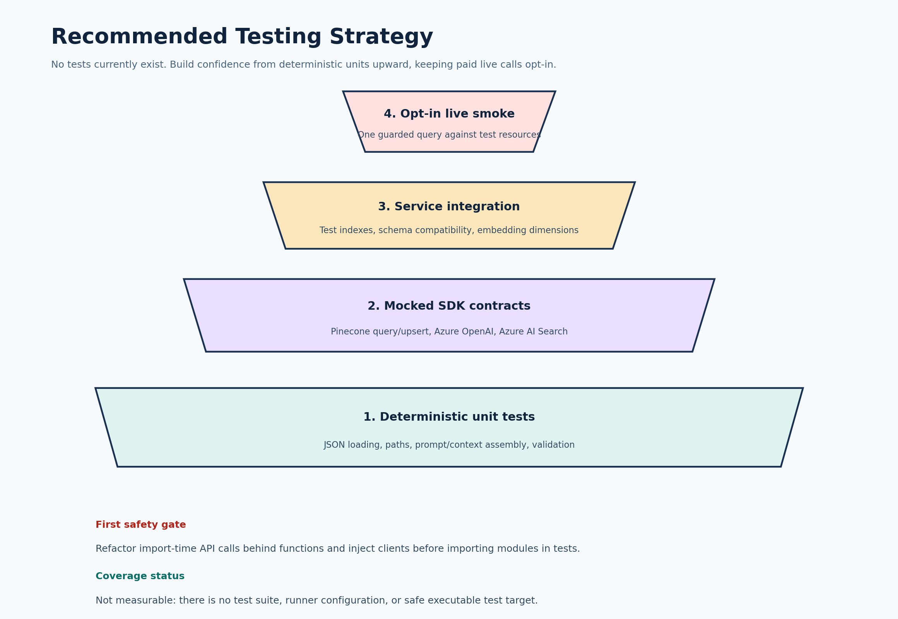

# Testing Analysis: Petofy-Chat-Bot-PineCone

Analysis date: 2026-08-07  
Source revision: `5431515`  
Status: No tests or test configuration are present.

## Summary

The repository has no `tests/` directory, test modules, test runner configuration, continuous-integration workflow, or coverage configuration. Runtime coverage therefore cannot be measured responsibly. Reporting a numeric percentage would be misleading because no test process exists to execute or instrument the application.

The Python sources passed a syntax compilation check with Python 3.10.0 in an isolated temporary environment. This proves only that the files parse; it does not prove that imports, credentials, external APIs, or application behavior work. A safe import check of `src.loader` failed with `ModuleNotFoundError: No module named 'pathmaker'`, confirming the package's inconsistent import strategy.



## Current Testability Risks

| Severity | Risk | Evidence | Testing impact |
|---|---|---|---|
| Critical | A live Pinecone key is embedded in source | `main.py:28`, `src/pinecone_upsert.py:4` | Tests could accidentally use a compromised production credential. |
| High | Modules execute work at import time | `src/index.py:95,117`, `src/vectorcopy.py:31`, all of `src/pinecone_upsert.py` | Importing code can create indexes, upload data, issue paid requests, or fail before a test can patch dependencies. |
| High | Imports are inconsistent | Package-qualified imports coexist with `from pathmaker`, `from loader`, and `from client` | Tests cannot reliably import modules from the project root. |
| High | External clients are constructed globally | `main.py`, `src/client.py`, `src/index.py`, `src/vectorcopy.py` | Tests cannot inject deterministic fakes without refactoring or fragile monkeypatching. |
| Medium | Required files and schemas are undocumented | `dataset/data`, `vector_data.json`, and `vector1_data_for_pinecone.json` are absent | Fixtures cannot be derived confidently from the repository alone. |
| Medium | No explicit error contract exists | No validation, custom exceptions, or error handling | Expected behavior for missing credentials, malformed data, and service failures is undefined. |

## Coverage Assessment

- Measured statement coverage: unavailable.
- Measured branch coverage: unavailable.
- HTML coverage report: not generated because there is no executable test suite and project dependencies were not installed without permission.
- Syntax coverage: all seven Python implementation files parsed successfully under Python 3.10.0.
- Behavioral confidence: low, because the primary paths depend on three remote services and have no mocks or integration tests.

## Recommended Test Order

| Priority | Area | Suggested cases |
|---|---|---|
| P0 | Configuration and safety | Missing variables fail before client creation; secrets never appear in logs/errors; no API work occurs on import. |
| P0 | Query orchestration | A mocked embedding is sent to Pinecone; top-k matches become delimited context; the expected deployment receives the final prompt; empty matches are handled. |
| P0 | Retrieval response handling | Missing `matches`, missing `metadata`, malformed match objects, and Pinecone exceptions produce controlled outcomes. |
| P1 | Prompt grounding | Retrieved content is marked as untrusted data; out-of-scope questions receive the fallback; malicious instructions in metadata do not override the system policy. |
| P1 | JSON loading | Nested directories, empty folders, valid lists, malformed JSON, non-list JSON roots, non-UTF-8 data, and deterministic file order. |
| P1 | Embedding generation | IDs are stable; required `Prompt` fields are validated; batches and partial failures are handled; dimensions match target indexes. |
| P1 | Azure AI Search indexing | Expected schema/profile is created; upload batching works; clients close on success and failure. |
| P1 | Pinecone ingestion | Correct namespace and index are used; records are batched; malformed vectors fail before network access. |
| P2 | Service integration | Use disposable/test indexes to verify SDK request shapes, dimensions, namespaces, and retrieval relevance. |
| P2 | Live smoke | One explicitly enabled, budget-limited end-to-end query; never run by default in pull requests. |

## Proposed Structure

```text
tests/
  unit/
    test_config.py
    test_loader.py
    test_prompt.py
    test_query_service.py
    test_vector_generation.py
  contract/
    test_azure_openai_adapter.py
    test_azure_search_adapter.py
    test_pinecone_adapter.py
  integration/
    test_retrieval_pipeline.py
  conftest.py
```

Use `pytest` and `pytest-cov` only after approval to add development dependencies. Mock SDK client methods at adapter boundaries, not internal implementation details. Keep live tests behind an explicit marker and environment flag.

## Refactoring Needed Before Tests

1. Move executable statements into functions and add `if __name__ == "__main__":` entry guards.
2. Create a configuration object that validates required environment variables once.
3. Pass Azure OpenAI, Pinecone, and Azure Search clients into orchestration functions.
4. Convert bare imports to package-relative imports, such as `from .pathmaker import data_path`.
5. Split prompt/context construction from network calls so it can be tested deterministically.
6. Define error behavior for missing data, malformed service responses, and transient failures.

## Coverage Plan

1. Establish a baseline after the deterministic unit suite is runnable.
2. Enforce coverage on changed code first rather than selecting an unsupported project-wide percentage.
3. Add branch coverage for all validation and fallback paths.
4. Generate `coverage.html` in CI with `pytest --cov=src --cov=main --cov-branch --cov-report=html` once imports are safe.
5. Increase the threshold only when the suite covers behavior rather than merely executing lines.

## Conclusion

The highest-value testing work is not adding many tests immediately; it is first making imports side-effect free and introducing client boundaries. Once that is done, the fixed query path, retrieval response handling, and ingestion validation should receive the first tests because they control credentials, cost, and answer correctness.
