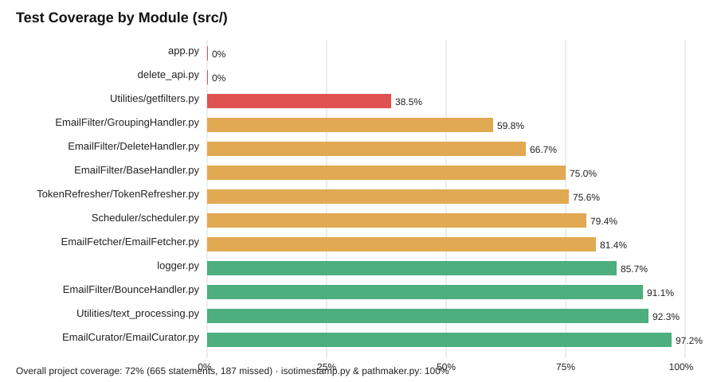

# Testing Analysis — Inbox Curator

> Generated: 2026-08-07 · Test runner: `pytest` (via `.venv/bin/python -m pytest`, config in `pytest.ini`)
> HTML coverage report: [htmlcov/index.html](./htmlcov/index.html)
> Coverage-by-module chart: [assets/coverage_by_module.svg](./assets/coverage_by_module.svg)

## Summary

| Metric | Value |
|---|---|
| Test files collected | 5 of 6 (`testfilter.py` is not discovered — see below) |
| Tests collected | 7 |
| Tests passing | 7 / 7 |
| Overall statement coverage | **72%** (665 statements, 187 missed) |
| Fully untested files | `src/app.py` (0%), `src/delete_api.py` (0%) |



## Test Suite Overview

| File | Target | Style |
|---|---|---|
| `test_email_curator.py` | `EmailCurator.task()` | `unittest.TestCase` + heavy mocking |
| `test_email_fetcher.py` | `EmailFetch.task_fetch_and_store_emails()` | `unittest.TestCase` + mocked `requests`/Redis |
| `test_email_handlers.py` | `DeleteHandler`, `BounceHandler`, `GroupHandler` | `unittest.TestCase`, one happy-path test per handler |
| `test_token_refresher.py` | `TokenRefresh.task()` | `unittest.TestCase` + mocked `requests`/`pickle` |
| `test_stub.py` | placeholder | trivial smoke test |
| `testfilter.py` | handler chain | **dead code — see below** |

All tests use `unittest.mock.patch`/`MagicMock`; there is no use of `pytest` fixtures, parametrization, or an integration/end-to-end test against a real (or fake) Redis instance.

## Findings

### 1. `testfilter.py` is dead code — never runs, and would fail if it did
`pytest.ini` relies on pytest's default `python_files` pattern (`test_*.py` / `*_test.py`). `testfilter.py` matches neither, so it is silently skipped on every run — confirmed by `pytest --collect-only`, which lists 7 tests from the other four files and none from this one.

Even if it were renamed to match the pattern, it would fail immediately: it calls `handler.handle(email, context)` with a single `dict`, but every handler's `handle()` method (`DeleteHandler.py`, `BounceHandler.py`, `GroupingHandler.py`) iterates over its argument as a list (`for email in emails`). Passing a dict would iterate over its *keys* (strings), and `key.get(...)` calls would raise `AttributeError`. The test's assertions (`self.assertEqual(result, "Email deleted successfully")`) also expect string return values that no handler produces — `handle()` returns `None` or delegates to the next handler.

**This file documents an old, incompatible version of the handler API.** Recommendation: delete it, or rewrite it against the current list-based signature and rename to `test_filter_chain.py` so pytest actually collects it.

### 2. Mocking hides real integration bugs
`test_email_curator.py` patches `DeleteHandler` itself (the class), so the real chain (`DeleteHandler(BounceHandler(GroupHandler()))`) is replaced wholesale by a `MagicMock`. This test verifies that `EmailCurator.task()` calls `.task()` and `.handle()` once — it does not exercise `BounceHandler` or `GroupHandler` at all, and would not catch a wiring mistake (e.g., if `EmailCurator.__init__` built the chain in the wrong order).

`test_token_refresher.py` patches `pickle.dump`/`pickle.load` but not the built-in `open()`. `Tokens.save_tokens()`/`get_tokens()` still open a real file handle at `config/tokens.pkl` (resolved via `get_tokens_path()`). The test currently passes only because that file happens to exist in this checkout; on a clean CI checkout without `config/tokens.pkl` pre-created, `get_tokens()` catches the `FileNotFoundError` internally (logs and continues), but `save_tokens()`'s `open(..., 'wb')` would still succeed by creating the file — so this test is fragile rather than broken, but it is silently dependent on filesystem state outside the test's control.

### 3. No test touches `src/app.py` or `src/delete_api.py` (0% coverage each)
- `app.py` wires up Celery, instantiates `TokenRefresh`, `EmailCurator`, and registers observers **at import time** — this makes it hard to test without side effects (real Celery app creation, an immediate `token_refresher.task()` network call on import). Consider extracting the wiring into a `main()`/`create_app()` function that tests can call with mocks, leaving module-level code to just invoke it under `if __name__ == "__main__"` or a Celery-specific entrypoint guard.
- `delete_api.py` imports `flask`, which is **not installed in the virtualenv and not listed in `requirements.txt`** (confirmed via `pip list`). This file cannot currently be imported, let alone tested. This should be flagged as a dependency bug (see main report's Dependency Analysis) before writing tests for it.

### 4. Missing edge-case and error-path tests
None of the following are covered, despite being realistic runtime conditions for a service that talks to three external APIs and a pickle file on disk:

| Area | Missing scenario | Why it matters |
|---|---|---|
| `Utilities/isotimestamp.py` | `subtract_hours_from_iso("Unknown Timestamp")` and timestamps with fractional seconds (e.g. `"2026-08-07T10:00:00.1234567Z"`, which Microsoft Graph commonly returns) | `datetime.strptime` uses a fixed `"%Y-%m-%dT%H:%M:%SZ"` format string with no fractional-second component and no fallback. Either input raises an uncaught `ValueError` that will crash the whole `task_fetch_and_store_emails()` call (see main report, Confirmed Bugs). A unit test would catch this immediately — currently `isotimestamp.py` shows 100% *line* coverage, but that number is misleading: the single happy-path test only exercises one input shape, not one of the failure modes described. |
| `EmailFilter/GroupingHandler.py` | Negative-keyword exclusion when a negative keyword matches; multiple matching groups on one email; `default_group` fallback when no keyword matches; email that already has `email["group"]` pre-set (early `continue`) | Only ~60% of this file is covered — the largest gap in the codebase. These branches implement the core business rule ("assign to Unsubscribe first, then other active groups, then default"), so an untested regression here would silently misclassify production email. |
| `EmailFilter/DeleteHandler.py` | `delete_email()` called before `update()` sets `self.access_token` (AttributeError case); Graph API returning non-204 status | Directly related to Bug 2 in the main report. |
| `EmailFetcher/EmailFetcher.py` | Multi-page pagination (`@odata.nextLink` present); missing/empty `access_token` (`ValueError` path); non-2xx Graph response | Only a single-page happy path is tested; the `while email_fetcher_url:` loop's core pagination behavior is unverified. |
| `TokenRefresher/TokenRefresher.py` | `task_refresh_tokens()` returning `(None, None)` (should raise); HTTP failure during refresh | The "empty token" guard clause has no test forcing it to trigger. |
| `Utilities/getfilters.py` | Non-2xx / connection error response (currently only 38% covered — the `except` branch is entirely untested) | `fetch_filters()` returning `None` on failure is the trigger for Bug 5 in the main report; a regression test here would also serve as the regression guard once that bug is fixed. |

## Recommended Additional Tests

```
tests/
  test_utilities.py                       # text_normalization, subtract_hours_from_iso (incl. fractional seconds & "Unknown Timestamp")
  test_group_handler_negative_keywords.py # exclusion logic + default-group fallback + already-grouped skip
  test_delete_handler_no_token.py         # delete_email() before access_token is set
  test_email_fetcher_pagination.py        # multi-page @odata.nextLink handling
  test_email_fetcher_no_token.py          # ValueError when access_token is unset
  test_get_filters_failure.py             # fetch_filters() returns None on RequestException
  test_token_refresh_empty_tokens.py      # task_refresh_tokens() returns (None, None)
```

Also recommended at the process level:
- Replace class-level mocking of entire handlers (`test_email_curator.py`) with mocking only the I/O boundaries (`requests`, `redis_client`) so the real chain-of-responsibility wiring is exercised end-to-end.
- Add a `pytest` fixture that provides a fake/mock Redis (e.g. `fakeredis`) so integration-style tests can run the full `EmailCurator.task()` batch loop without a real Redis server.
- Delete or rewrite `testfilter.py` (see Finding 1).
- Once `delete_api.py`'s Flask dependency is resolved, add tests for the `/delete-emails` endpoint covering: missing API key, wrong API key, malformed JSON body, and successful deletion — using Flask's test client.

## Coverage Report

Full line-by-line HTML coverage report generated with `pytest-cov`:
[`htmlcov/index.html`](./htmlcov/index.html)
