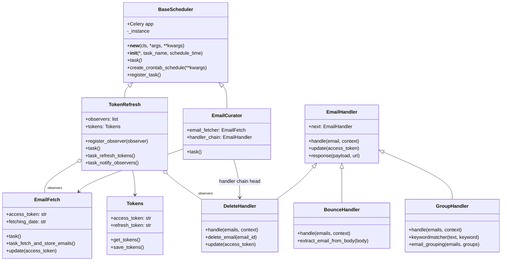
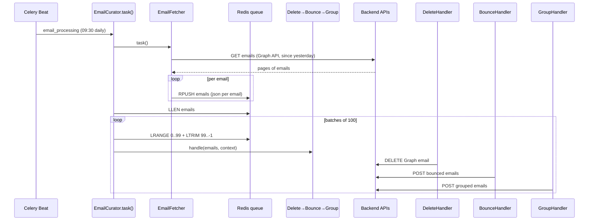

# Inbox Curator — Architecture Diagram

```mermaid
flowchart TB
    subgraph Celery["Celery (Redis broker on localhost:6380)"]
        BEAT["Celery Beat Scheduler"]
        WORKER["Celery Worker"]
        APP["src/app.py — entry point"]
    end

    subgraph Scheduler["Scheduler"]
        BS["BaseScheduler (ABC)
            Celery app · crontab · beat registration"]
        EC["EmailCurator
            fetch → batch → handler chain"]
        TR["TokenRefresh (Observer subject)
            refresh → notify observers"]
    end

    subgraph Pipeline["Email Pipeline"]
        F["EmailFetcher
            Graph API → normalize → Redis queue"]
        DC["DeleteHandler → BounceHandler → GroupHandler
            (Chain of Responsibility)"]
        REDIS[("Redis
            'emails' queue")]
    end

    subgraph External["External APIs"]
        GRAPH["Microsoft Graph API"]
        APIKEY["Backend APIs
            (filters, bounce, grouped)"]
    end

    APP --> TR
    APP --> EC
    TR -->|register_observer / update(token)| F
    TR -->|register_observer / update(token)| DC
    BEAT --> WORKER
    WORKER -->|email_processing| EC
    WORKER -->|token_refreshing| TR

    F -->|GET emails| GRAPH
    F -->|rpush json per email| REDIS
    EC -->|lrange/ltrim batches| REDIS
    EC --> DC
    DC -->|POST bounced / grouped| APIKEY
    DC -->|DELETE email| GRAPH
```

# Class / Inheritance Diagram



# Email Processing Flow


