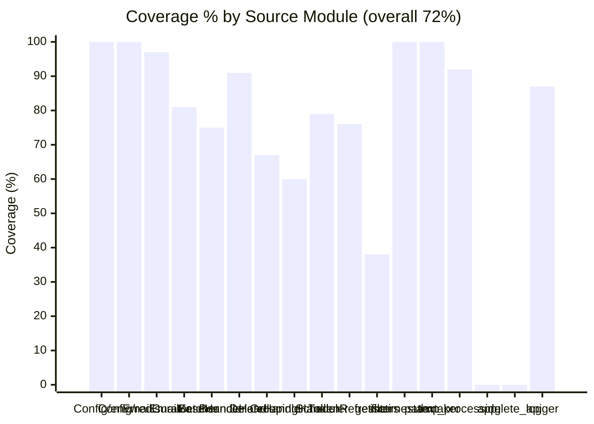
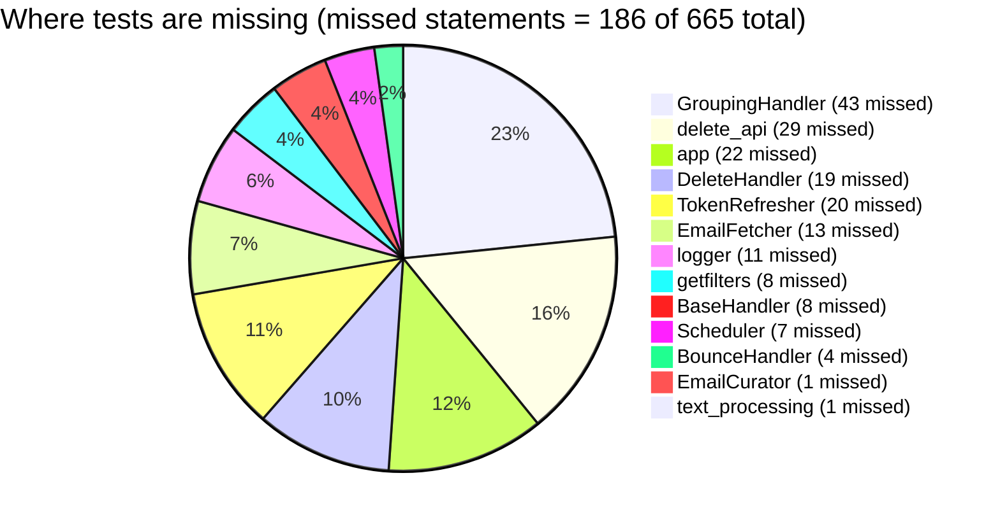
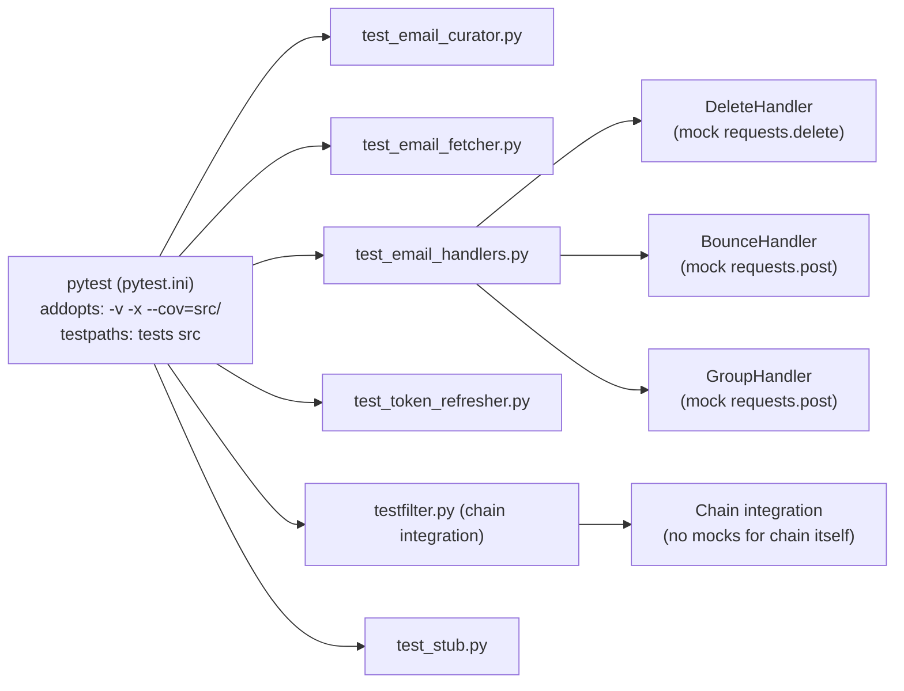

# Inbox Curator — Test Coverage by Module

```mermaid
xychart-beta
    title "Coverage % by Source Module (overall 72%)"
    x-axis ["Config/env", "Config/redis", "EmailCurator", "EmailFetcher", "BaseHandler", "BounceHandler", "DeleteHandler", "GroupingHandler", "Scheduler", "TokenRefresher", "getfilters", "isotimestamp", "pathmaker", "text_processing", "app", "delete_api", "logger"]
    y-axis "Coverage (%)" 0 --> 100
    bar [100, 100, 97, 81, 75, 91, 67, 60, 79, 76, 38, 100, 100, 92, 0, 0, 87]
```

# Untested entry points (0% coverage)

```mermaid
pie title Where tests are missing (missed statements = 186 of 665 total)
    "GroupingHandler (43 missed)" : 43
    "delete_api (29 missed)" : 29
    "app (22 missed)" : 22
    "DeleteHandler (19 missed)" : 19
    "TokenRefresher (20 missed)" : 20
    "EmailFetcher (13 missed)" : 13
    "logger (11 missed)" : 11
    "getfilters (8 missed)" : 8
    "BaseHandler (8 missed)" : 8
    "Scheduler (7 missed)" : 7
    "BounceHandler (4 missed)" : 4
    "EmailCurator (1 missed)" : 1
    "text_processing (1 missed)" : 1
```

# Test execution flow

```mermaid
flowchart LR
    PYTEST["pytest (pytest.ini)
        addopts: -v -x --cov=src/
        testpaths: tests src"]
    T1["test_email_curator.py"]
    T2["test_email_fetcher.py"]
    T3["test_email_handlers.py"]
    T4["test_token_refresher.py"]
    T5["testfilter.py (chain integration)"]
    T6["test_stub.py"]
    PYTEST --> T1
    PYTEST --> T2
    PYTEST --> T3
    PYTEST --> T4
    PYTEST --> T5
    PYTEST --> T6
    T3 --> DEL["DeleteHandler
        (mock requests.delete)"]
    T3 --> BOUNCE["BounceHandler
        (mock requests.post)"]
    T3 --> GROUP["GroupHandler
        (mock requests.post)"]
    T5 --> CHAIN["Chain integration
        (no mocks for chain itself)"]
```
