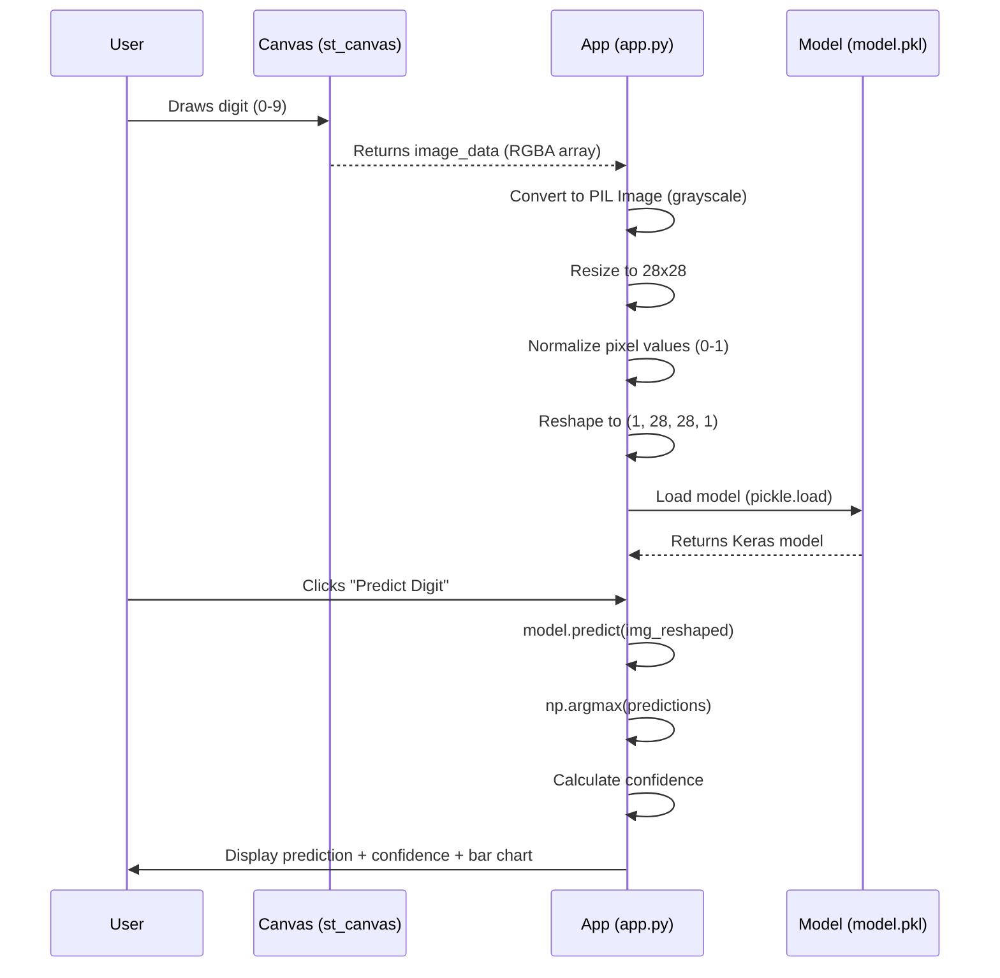
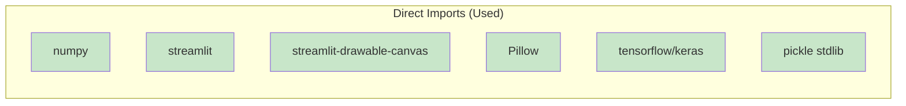

# MNIST Classifier - Code Analysis Report

## Project Overview

**Project Name:** mnist-classifier (digit_recognition)  
**Repository:** https://github.com/Codivy4706/mnist-classifier  
**Primary Language:** Python 3.10  
**Project Type:** End-to-end Deep Learning Application  
**Purpose:** Handwritten digit recognition using MNIST dataset with Streamlit web interface  

### Key Components
- **train.py** - CNN model training script (41 lines)
- **app.py** - Streamlit web application for inference (79 lines)
- **inference.py** - Placeholder (empty)
- **model.pkl** - Pre-trained Keras model (1.5 MB)
- **requirements.txt** - Dependencies (68 packages)

---

## Architecture

The project follows a simple two-phase architecture:

### Training Phase (`train.py`)
1. Load MNIST dataset from Keras
2. Preprocess: normalize (0-1) and reshape to (28, 28, 1)
3. Build CNN: 2×Conv2D(32,64) + MaxPool + Flatten + Dense(64) + Dense(10, softmax)
4. Compile with Adam optimizer and sparse categorical crossentropy
5. Train for 5 epochs with 10% validation split
6. Evaluate on test set
7. Serialize model using `pickle.dump`

### Inference Phase (`app.py`)
1. Load model via `pickle.load` (cached with `@st.cache_resource`)
2. Provide drawing canvas via `streamlit-drawable-canvas`
3. On predict: preprocess drawn image → resize to 28×28 → normalize → reshape
4. Run `model.predict()` and display results with confidence and probability bar chart

```mermaid
graph TD
    A[User] --> B[Streamlit Web App - app.py]
    B --> C[Drawing Canvas<br/>streamlit-drawable-canvas]
    C --> D[User Draws Digit]
    D --> E[Preprocessing]
    E --> F[Resize to 28x28<br/>Normalize 0-1<br/>Reshape to (1,28,28,1)]
    F --> G[Load Model<br/>model.pkl]
    G --> H[Keras CNN Model<br/>2 Conv2D + MaxPool<br/>Dense + Softmax]
    H --> I[Prediction]
    I --> J[Display Results<br/>Predicted Digit<br/>Confidence %<br/>Class Probabilities]
    
    K[train.py] --> L[Load MNIST Data]
    L --> M[Preprocess Data<br/>Normalize + Reshape]
    M --> N[Build CNN Model]
    N --> O[Compile<br/>Adam + Sparse Categorical Crossentropy]
    O --> P[Train 5 Epochs]
    P --> Q[Evaluate on Test Set]
    Q --> R[Save model.pkl<br/>pickle.dump]
    
    style B fill:#e1f5fe
    style H fill:#fff3e0
    style K fill:#e8f5e9
    style R fill:#fff3e0
```

---

## Code Flow



---

## Findings

### Static Analysis Results

| Tool | Issues Found | Severity |
|------|--------------|----------|
| **flake8** | 14 issues | Style/Format |
| **pylint** | 22 issues | Style/Logic/Imports |
| **bandit** | 3 issues | Security |

### Detailed Findings by Category

#### 1. Style & Formatting (PEP 8 Violations) - 18 issues
| File | Line | Issue | Description |
|------|------|-------|-------------|
| app.py | 15 | E302 | Expected 2 blank lines before function, found 1 |
| app.py | 21 | E305 | Expected 2 blank lines after function definition |
| app.py | 24, 25 | E501 | Lines too long (105, 168 > 79 chars) |
| app.py | 44, 50, 57, 62, 75 | W293 | Blank lines contain whitespace |
| app.py | 70-77 | E117/W0311 | Indentation errors (12 spaces vs expected 8) |
| app.py | 79 | W292 | Missing newline at end of file |
| train.py | 41 | W292 | Missing newline at end of file |

#### 2. Missing Documentation - 3 issues
| File | Issue | Description |
|------|-------|-------------|
| app.py | C0114 | Missing module docstring |
| app.py | C0116 | Missing function docstring for `load_model()` |
| train.py | C0114 | Missing module docstring |

#### 3. Import Issues - 5 issues
| File | Line | Issue | Description |
|------|------|-------|-------------|
| app.py | 4 | C0411 | `pickle` (stdlib) should be before third-party imports |
| train.py | 1, 2 | F401/W0611 | Unused imports: `tensorflow as tf`, `keras` from tensorflow |
| train.py | 37 | C0413/E402 | `import pickle` not at top of module |
| train.py | 37 | C0411 | `pickle` should be before third-party imports |

#### 4. Indentation Errors - 7 issues (app.py lines 70-77)
The results display block has inconsistent indentation (12 spaces instead of 8), causing logical nesting issues.

#### 5. Runtime/Logic Issues - 2 issues
| File | Line | Issue | Description |
|------|------|-------|-------------|
| app.py | 18 | W0621 | `model` variable redefines outer scope variable (line 21) |
| app.py | 56 | E1121 | `Image.resize()` called with too many positional arguments |

#### 6. Security Issues - 3 issues (Bandit)
| File | Line | Severity | Issue |
|------|------|----------|-------|
| app.py | 4 | Low | Pickle import - consider security implications |
| app.py | 18 | **Medium** | `pickle.load()` - unsafe deserialization of untrusted data |
| train.py | 37 | Low | Pickle import - consider security implications |

> **Critical Security Note:** Using `pickle` for model serialization allows arbitrary code execution during deserialization. Since `model.pkl` is loaded from disk, if an attacker replaces the file, they can execute arbitrary code. Use `model.save()` / `keras.models.load_model()` instead.

#### 7. Missing Type Hints - 4 functions
- `load_model()` - no return type annotation
- No type hints for function parameters or returns in either file

---

## Code Quality Assessment

### Strengths
- ✅ Clean separation of training and inference
- ✅ Uses `@st.cache_resource` for model loading (good performance)
- ✅ Proper data normalization (0-1 range)
- ✅ CNN architecture appropriate for MNIST
- ✅ Validation split during training

### Areas for Improvement

| Aspect | Current State | Recommendation |
|--------|---------------|----------------|
| **Code Style** | Multiple PEP 8 violations | Run `black` and `isort` |
| **Documentation** | No docstrings | Add module and function docstrings (PEP 257) |
| **Type Safety** | No type hints | Add type annotations |
| **Error Handling** | None | Add try/except for file loading, prediction |
| **Security** | Pickle deserialization | Use Keras native save/load |
| **Testing** | No tests | Add unit and integration tests |
| **Modularity** | All in single files | Extract preprocessing to shared module |

---

## Dependency Analysis

### Direct Dependencies (Actually Used)


### Requirements.txt Analysis
The `requirements.txt` contains **68 packages**, but only **6 are directly imported** by the application code. The remaining 62 are transitive dependencies.

**Key Observations:**
- Many packages are development/build tools (setuptools, wheel, pip, etc.)
- Heavy ML stack (tensorflow, keras, numpy, pandas, scikit-learn, scipy) - appropriate for training
- Web stack (streamlit, altair, starlette, uvicorn, watchdog) - appropriate for app
- **Unused direct imports:** `pandas`, `scikit-learn`, `scipy`, `pydeck`, `requests`, etc. are in requirements but not imported

### Recommendations
1. **Split requirements**: Create `requirements-train.txt` and `requirements-app.txt`
2. **Use `pip-compile`** or `pip-tools` to generate minimal locked requirements
3. **Remove unused packages**: Audit and remove packages not needed at runtime
4. **Pin versions** for reproducibility (currently many are unpinned)

---

## Performance Analysis

### Current Performance Characteristics

| Component | Analysis |
|-----------|----------|
| **Model Loading** | Cached with `@st.cache_resource` - loads once per session |
| **Inference** | Single forward pass on 28×28×1 input - very fast (< 10ms) |
| **Training** | 5 epochs on 60K samples - completes in ~30-60s on CPU |
| **Memory** | Model ~1.5 MB, minimal runtime memory |

### Potential Optimizations

| Optimization | Applicability | Benefit |
|--------------|---------------|---------|
| **Model Quantization** | Post-training | Reduce model size 4×, faster inference |
| **TensorFlow Lite** | Deployment | Mobile/edge deployment ready |
| **ONNX Export** | Cross-platform | Run on ONNX Runtime (faster CPU) |
| **Batch Predictions** | High throughput | Process multiple images at once |
| **Async Inference** | Concurrent users | Non-blocking predictions with `asyncio` |

> **GIL Note:** This application is **I/O-bound** (Streamlit web server) with brief **CPU-bound** inference. The GIL impact is minimal since inference is fast and single-threaded. For high-concurrency, consider running multiple Streamlit processes behind a load balancer.

---

## Security Analysis

### Critical Issues

| Issue | Severity | File | Line | Description |
|-------|----------|------|------|-------------|
| **Pickle Deserialization** | **HIGH** | app.py | 18 | `pickle.load(f)` executes arbitrary code from model.pkl |
| **Pickle Serialization** | MEDIUM | train.py | 38-39 | `pickle.dump(model, f)` creates vulnerable pickle file |

### Mitigation
Replace pickle with Keras native format:
```python
# train.py - Save
model.save('model.keras')  # or 'model.h5'

# app.py - Load
from keras.models import load_model
model = load_model('model.keras')
```

### Other Security Considerations
- No input validation on drawn image (could be malformed)
- No rate limiting on predict endpoint
- Model file integrity not verified (checksum/signature)
- Streamlit runs with debug features enabled by default

---

## Testing Analysis

### Current State
**No tests exist** in the project. The `inference.py` file is empty (placeholder).

### Recommended Test Strategy

| Test Type | Priority | Components to Test |
|-----------|----------|-------------------|
| **Unit Tests** | High | Preprocessing functions, model loading, prediction logic |
| **Integration Tests** | High | End-to-end: draw → preprocess → predict → display |
| **Model Tests** | Medium | Accuracy on test set, edge cases (blank, noisy images) |
| **UI Tests** | Low | Streamlit components, button interactions |

### Suggested Test Cases

```python
# test_preprocessing.py
def test_resize_to_28x28():
    img = np.random.randint(0, 255, (280, 280), dtype=np.uint8)
    result = preprocess(img)
    assert result.shape == (1, 28, 28, 1)
    assert 0 <= result.min() and result.max() <= 1

def test_predict_returns_valid_digit():
    model = load_model()
    img = np.zeros((1, 28, 28, 1))
    pred = model.predict(img)
    assert pred.shape == (1, 10)
    assert 0 <= np.argmax(pred) <= 9

# test_model_accuracy.py
def test_model_accuracy_above_threshold():
    _, acc = model.evaluate(X_test, y_test, verbose=0)
    assert acc > 0.95  # Expect >95% on MNIST
```

### Testing Report Location
See [Testing Analysis Report](testing/testing_report.md) for detailed testing analysis and coverage recommendations.

---

## Visual Assets

| Diagram | Description | Location |
|---------|-------------|----------|
| **Architecture** | Training & inference pipeline overview | [assets/architecture.mmd](assets/architecture.mmd) |
| **Code Flow** | Sequence diagram of inference process | [assets/code_flow.mmd](assets/code_flow.mmd) |
| **Dependencies** | Direct vs transitive dependencies | [assets/dependencies.mmd](assets/dependencies.mmd) |
| **Issues Distribution** | Code quality issues by category | [assets/issues_distribution.mmd](assets/issues_distribution.mmd) |

> View Mermaid diagrams at [mermaid.live](https://mermaid.live) or with VS Code Mermaid extension.

---

## Suggestions

### Immediate (High Priority)
1. **Fix security vulnerability**: Replace `pickle` with `model.save()` / `load_model()`
2. **Fix indentation bug** in app.py lines 70-77 (results display block)
3. **Fix `Image.resize()` call** - use keyword arguments: `img.resize((28, 28))`
4. **Remove unused imports** in train.py (`tensorflow as tf`, `from tensorflow import keras`)
5. **Move `import pickle`** to top of train.py

### Short Term (Medium Priority)
6. **Add module and function docstrings** (PEP 257)
7. **Add type hints** to all functions
8. **Run code formatters**: `black app.py train.py` && `isort app.py train.py`
9. **Split requirements.txt** into train/app specific files
10. **Add error handling** for model loading, prediction failures

### Long Term (Low Priority)
11. **Add unit tests** with pytest
12. **Add integration tests** for Streamlit app
13. **Implement model quantization** for faster inference
14. **Add input validation** and sanitization
15. **Consider model versioning** and A/B testing framework
16. **Add logging** for production monitoring
17. **Containerize** with Docker for consistent deployment

---

## Conclusion

The MNIST Classifier is a functional end-to-end deep learning demonstration with a clean architecture separating training and inference. The Streamlit interface provides an interactive user experience for digit recognition.

### Summary of Key Issues

| Category | Count | Critical |
|----------|-------|----------|
| Style/Format | 18 | No |
| Documentation | 3 | No |
| Imports | 5 | No |
| Indentation/Logic | 9 | **Yes (1)** |
| Security | 3 | **Yes (1)** |
| Type Hints | 4 | No |

### Overall Assessment
- **Functionality**: ✅ Works correctly
- **Code Quality**: ⚠️ Needs improvement (PEP 8, docs, types)
- **Security**: ❌ **Critical vulnerability** (pickle deserialization)
- **Testing**: ❌ No tests present
- **Maintainability**: ⚠️ Moderate (small codebase but technical debt)

### Recommended Next Steps
1. **Immediately** fix the pickle security vulnerability
2. **Before any deployment** fix the indentation bug in results display
3. **Before production** add basic test coverage and error handling
4. **For maintainability** apply code formatting and add documentation

---

*Report generated by Code Analyzer on 2026-08-07*  
*Analysis directory: `analysis_report_mnist-classifier/`*