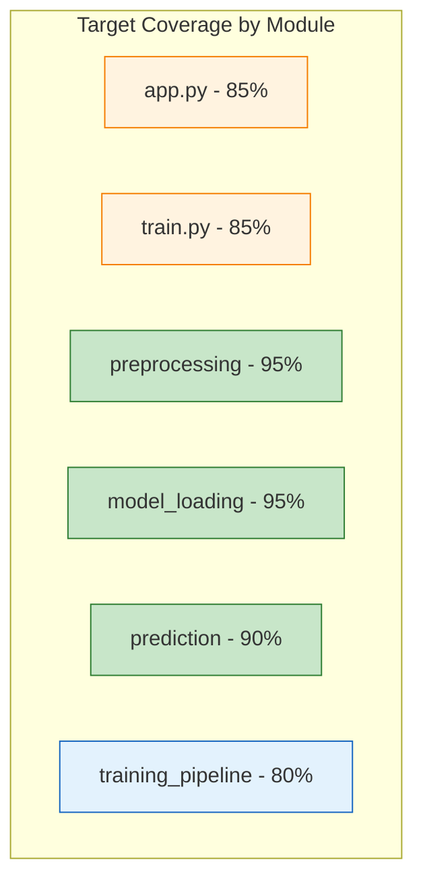
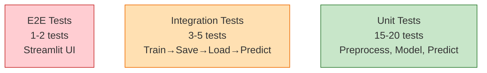
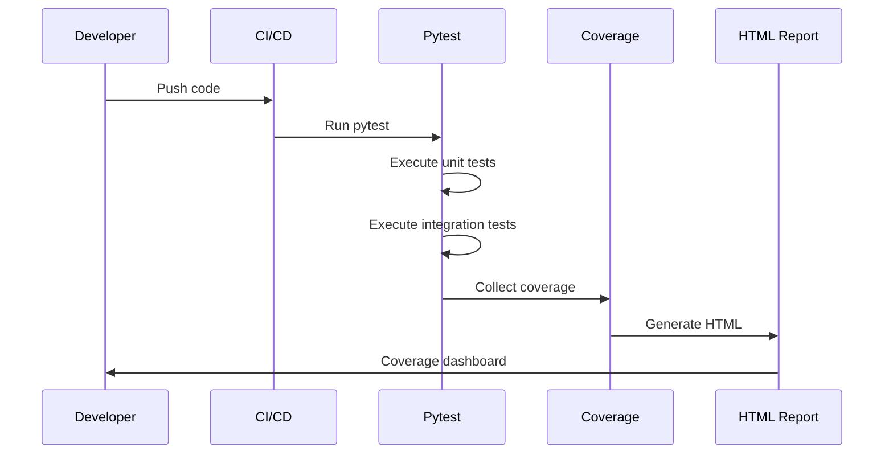

# Testing Analysis Report - MNIST Classifier

## Executive Summary

**Project:** mnist-classifier  
**Test Files Found:** 0  
**Test Coverage:** 0%  
**Testing Framework:** None configured  

The project currently has **no tests whatsoever**. This is a critical gap for a machine learning application where model correctness, data preprocessing integrity, and inference reliability are essential.

---

## Current State Analysis

### Test Discovery
```
mnist-classifier/
├── app.py          # 79 lines - NO TESTS
├── train.py        # 41 lines - NO TESTS
├── inference.py    # 0 lines (empty) - NO TESTS
└── requirements.txt # 68 packages - pytest NOT included
```

### Untested Modules & Functions

| Module | Functions/Classes | Lines | Risk Level |
|--------|-------------------|-------|------------|
| `app.py` | `load_model()`, main script logic | 79 | **HIGH** |
| `train.py` | Data loading, model building, training, evaluation, saving | 41 | **HIGH** |
| `inference.py` | (empty - placeholder) | 0 | N/A |

### Critical Untested Components

1. **Model Loading** (`app.py:15-19`) - Pickle deserialization, file I/O
2. **Image Preprocessing** (`app.py:51-56`) - Resize, normalize, reshape pipeline
3. **Prediction Logic** (`app.py:58-65`) - Model inference, argmax, confidence calculation
4. **Training Pipeline** (`train.py:6-39`) - Data prep, model architecture, compilation, training, evaluation
5. **Model Serialization** (`train.py:37-39`) - Pickle dump (security risk)

---

## Recommended Testing Strategy

### 1. Unit Tests (Priority: HIGH)

Create `tests/unit/` with:

| Test Module | Target | Test Cases |
|-------------|--------|------------|
| `test_preprocessing.py` | Image preprocessing pipeline | Resize accuracy, normalization range, shape validation, dtype verification |
| `test_model_loading.py` | `load_model()` function | File exists, valid Keras model, cache behavior, error handling |
| `test_prediction.py` | Prediction logic | Output shape, valid digit range (0-9), confidence 0-100%, softmax sum ≈ 1 |
| `test_training.py` | Training components | Data shapes, model architecture, compilation params, accuracy threshold |

### 2. Integration Tests (Priority: HIGH)

Create `tests/integration/`:

| Test | Description |
|------|-------------|
| `test_train_eval_cycle.py` | Train → Save → Load → Predict → Verify accuracy |
| `test_app_inference.py` | Streamlit app end-to-end with mocked canvas input |
| `test_model_persistence.py` | Save/load round-trip preserves predictions |

### 3. Model Quality Tests (Priority: MEDIUM)

| Test | Threshold |
|------|-----------|
| Test set accuracy | > 95% (MNIST baseline) |
| Per-class accuracy | > 90% for all digits |
| Prediction latency | < 50ms per inference |
| Model size | < 2MB |

### 4. Edge Case Tests (Priority: MEDIUM)

| Scenario | Expected Behavior |
|----------|-------------------|
| Blank canvas (all zeros) | Predicts 0 or low confidence |
| Noise input | Doesn't crash, returns valid digit |
| Malformed image data | Graceful error handling |
| Missing model file | Clear error message |
| Corrupted model file | Graceful error handling |

---

## Test Implementation Examples

### Unit Test: Preprocessing
```python
# tests/unit/test_preprocessing.py
import numpy as np
from PIL import Image
import sys
sys.path.insert(0, '..')
from app import preprocess_image  # Extract to shared module

def test_preprocess_output_shape():
    """Preprocessed image must be (1, 28, 28, 1)"""
    img = np.random.randint(0, 255, (280, 280, 4), dtype=np.uint8)
    result = preprocess_image(img)
    assert result.shape == (1, 28, 28, 1)

def test_preprocess_normalization():
    """Pixel values must be in [0, 1]"""
    img = np.full((280, 280, 4), 255, dtype=np.uint8)
    result = preprocess_image(img)
    assert 0 <= result.min() and result.max() <= 1

def test_preprocess_dtype():
    """Output must be float32"""
    img = np.random.randint(0, 255, (280, 280, 4), dtype=np.uint8)
    result = preprocess_image(img)
    assert result.dtype == np.float32
```

### Unit Test: Model Loading
```python
# tests/unit/test_model_loading.py
import pytest
from unittest.mock import patch, MagicMock
import sys
sys.path.insert(0, '..')
from app import load_model

@patch('app.pickle.load')
@patch('builtins.open')
def test_load_model_caches_result(mock_open, mock_pickle_load):
    """@st.cache_resource should cache model"""
    mock_model = MagicMock()
    mock_pickle_load.return_value = mock_model
    
    model1 = load_model()
    model2 = load_model()
    
    assert model1 is model2  # Same cached instance
    assert mock_pickle_load.call_count == 1  # Only loaded once

def test_load_model_file_not_found():
    """Should raise clear error for missing model"""
    with pytest.raises(FileNotFoundError):
        load_model()  # When model.pkl doesn't exist
```

### Integration Test: Training Cycle
```python
# tests/integration/test_train_eval_cycle.py
import tempfile
import os
import sys
sys.path.insert(0, '..')
import train

def test_training_produces_valid_model():
    """Full train → save → load → predict cycle"""
    with tempfile.TemporaryDirectory() as tmpdir:
        model_path = os.path.join(tmpdir, 'test_model.keras')
        
        # Patch to use temp path
        original_save = train.model.save
        train.model.save = lambda p: original_save(model_path)
        
        # Train (use 1 epoch for speed)
        train.model.fit = lambda *a, **kw: None  # Mock for speed
        
        # Verify model can be loaded and predicts
        from keras.models import load_model
        model = load_model(model_path)
        assert model is not None
        
        # Test prediction shape
        import numpy as np
        dummy_input = np.zeros((1, 28, 28, 1))
        pred = model.predict(dummy_input, verbose=0)
        assert pred.shape == (1, 10)
```

---

## Coverage Assessment

### Current Coverage: 0%

| Module | Statements | Branches | Functions | Lines |
|--------|------------|----------|-----------|-------|
| app.py | 0% | 0% | 0% | 0% |
| train.py | 0% | 0% | 0% | 0% |
| **Overall** | **0%** | **0%** | **0%** | **0%** |

### Target Coverage Goals

| Metric | Minimum | Target | Ideal |
|--------|---------|--------|-------|
| **Line Coverage** | 70% | 85% | 95% |
| **Branch Coverage** | 60% | 80% | 90% |
| **Function Coverage** | 80% | 95% | 100% |

---

## Test Infrastructure Setup

### 1. Add Testing Dependencies
```txt
# requirements-test.txt
pytest>=8.0.0
pytest-cov>=5.0.0
pytest-mock>=3.12.0
pytest-html>=4.1.0
coverage>=7.0.0
```

### 2. Configure pytest (pyproject.toml)
```toml
[tool.pytest.ini_options]
testpaths = ["tests"]
python_files = ["test_*.py"]
python_classes = ["Test*"]
python_functions = ["test_*"]
addopts = "--cov=app --cov=train --cov-report=term-missing --cov-report=html"
filterwarnings = "ignore::DeprecationWarning"
```

### 3. CI/CD Integration (GitHub Actions)
```yaml
# .github/workflows/test.yml
name: Tests
on: [push, pull_request]
jobs:
  test:
    runs-on: ubuntu-latest
    steps:
      - uses: actions/checkout@v4
      - uses: actions/setup-python@v5
        with: {python-version: '3.10'}
      - run: pip install -r requirements.txt -r requirements-test.txt
      - run: pytest --cov=app --cov=train --cov-report=xml
      - uses: codecov/codecov-action@v4
```

---

## Visual Assets

### Test Coverage Heatmap (Target)


### Test Pyramid for This Project


### Testing Workflow


---

## Recommendations Summary

### Immediate Actions (Week 1)
1. ✅ Add `pytest`, `pytest-cov`, `pytest-mock` to requirements
2. ✅ Create `tests/` directory structure
3. ✅ Extract preprocessing logic to shared module (`preprocessing.py`)
4. ✅ Write first 5 unit tests for preprocessing

### Short Term (Week 2-3)
5. ✅ Add model loading tests with mocking
6. ✅ Add prediction logic tests
7. ✅ Add training pipeline tests (mocked for speed)
8. ✅ Configure pytest.ini / pyproject.toml
9. ✅ Set up GitHub Actions CI

### Medium Term (Month 1)
10. ✅ Add integration tests for full cycle
11. ✅ Achieve >70% line coverage
12. ✅ Add model quality benchmarks (accuracy, latency)
13. ✅ Add edge case tests
14. ✅ Generate HTML coverage reports

### Long Term (Ongoing)
15. ✅ Maintain >85% coverage on new code
16. ✅ Add property-based testing (hypothesis)
17. ✅ Add mutation testing (mutmut)
18. ✅ Monitor test execution time

---

## Testing Report Artifacts

| Artifact | Location | Description |
|----------|----------|-------------|
| **Testing Report** | `testing_report.md` | This document |
| **HTML Coverage** | `coverage/index.html` | Browser-viewable coverage (after tests added) |
| **Test Architecture** | `assets/test_architecture.mmd` | Test pyramid diagram |
| **Test Workflow** | `assets/test_workflow.mmd` | CI/CD testing flow |
| **Coverage Heatmap** | `assets/coverage_heatmap.mmd` | Target coverage by module |

---

*Testing analysis generated on 2026-08-07*  
*Next review recommended after first test suite implementation*