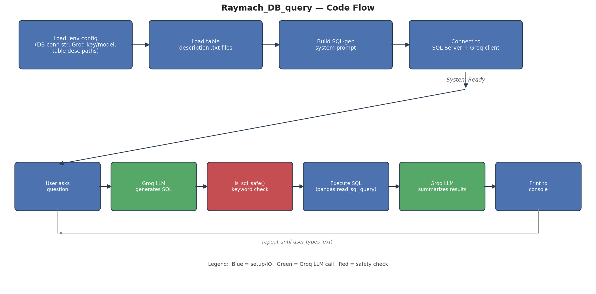

# Code Analysis Report — Raymach_DB_query

**Language:** Python 3.10
**Project type:** Command-line "chat with your database" tool — converts natural-language questions into SQL Server queries using the Groq LLM API, executes them, and summarizes results in plain English.

---

## 1. Overview

The project is a single-file CLI application (`src/main.py`, 243 lines) that:

1. Loads DB and Groq credentials from `.env`.
2. Loads two plain-text table descriptions (`table_infos/*.txt`) that explain column meanings and abbreviations.
3. Builds a large system prompt instructing an LLM (via Groq) to act as a "SQL Server Query Generator."
4. Opens a SQL Server connection (`pyodbc`) and a Groq client.
5. Runs a REPL loop: user types a question → LLM generates SQL → a keyword-based safety check runs → the SQL is executed with `pandas.read_sql_query` → the LLM summarizes the resulting DataFrame in natural language → result printed to console.

Supporting files: two JSON schema files (`schemas/*.json`) describing the `CaeCrewList` and `CrewLeaveBalance` tables, and a `requirements.txt` with four unpinned dependencies.

## 2. Architecture / Code Flow



The whole project is one file with no packages, modules, or separation of concerns — config loading, prompt building, LLM calls, safety checks, DB execution, and the REPL loop are all top-level functions in `main.py`. For a script of this size that's acceptable, but it will not scale if more features (e.g., multiple tables, a web UI) are added.

## 3. Findings (Confirmed Issues)

### 🔴 Critical — Security

**The SQL "forbidden keyword" safety check is broken and does nothing.**
`src/main.py:133`:
```python
re.search(rf"\\b{word}\\b", sql, flags=re.I)
```
Because this is a *raw* f-string, `\\b` is **not** the regex word-boundary metacharacter `\b` — it is a literal backslash followed by the letter `b`. I verified this directly:

```python
>>> re.search(r"\\bDROP\\b", "SELECT * FROM T WHERE name = 'DROP TABLE'", flags=re.I)
None   # never matches, even though "DROP" is right there
```

This means the `forbidden = ["DROP", "DELETE", "UPDATE", ...]` check in `is_sql_safe()` **can never trigger**, regardless of what the LLM generates. The only real protection left is the `sql.upper().startswith("SELECT")` check — which a single `SELECT 1; DROP TABLE Users;--` statement-injection style payload would still pass if the driver executes multiple batches, or which simply doesn't catch a destructive statement smuggled inside a subquery/CTE. **Fix:** use a normal (non-raw) string or a single backslash: `rf"\b{word}\b"`.

### 🟠 High — Reliability / Dead Code

**Schema JSON files and their loader are completely unused.**
- `load_schema_json()` (`src/main.py:28-34`) is defined but never called anywhere in the file.
- `SCHEMA_JSON_PATH` is read via `.env` documentation but `load_config()` never actually reads it into `CONFIG`.
- The two JSON schema files in `schemas/` (full column lists with types/nullability for `CaeCrewList` and `CrewLeaveBalance`) are never fed to the LLM.

The LLM only ever sees the two hand-written `.txt` descriptions. This means the model is generating SQL without ever seeing the authoritative column list, types, or nullability — it can only guess column names it wasn't told about (e.g. `ID`, `fleetCode`, `docIssueDate`, etc. appear in the JSON schema but not in the text description), increasing the chance of hallucinated column names and failed/incorrect queries.

### 🟡 Medium — Robustness

- **Bare/broad exception handling everywhere**: `except:` (`load_description`, line 44) and `except Exception:` swallow all errors and only `print()` them — no logging, no distinction between recoverable and fatal errors, no exit codes. A malformed `.env`, unreachable DB, or expired API key all just print a message and either silently continue with empty data or exit uninformatively.
- **`db_conn.close()` is not guaranteed to run.** It sits after the `while True` loop (`main.py:238`), so a `KeyboardInterrupt` (Ctrl+C) or any unhandled exception inside the loop leaves the SQL Server connection open. Should be wrapped in `try/finally`.
- **`global CONFIG` inside `main()`** (`main.py:189`) is unnecessary — `CONFIG` is only used locally within `main()`. This is a code smell suggesting leftover/experimental code.
- **No input validation on `sql` before `is_sql_safe(sql)`** — if `generate_sql()` returns `None` (Groq call failed), `is_sql_safe(None)` will crash with `AttributeError: 'NoneType' object has no attribute 'upper'` at `main.py:128`. There's no `if sql is None: continue` guard before calling it.

### 🟢 Low — Style / Maintainability

- No docstrings on any function (violates PEP 257); only banner comments.
- No type hints anywhere (function signatures like `def generate_sql(client, user_query, system_prompt, model):` give no indication of expected types).
- No logging module — everything goes through `print()`, making this unsuitable for any non-interactive/production use.
- Long multi-line prompt strings are fine here, but hardcoding the whole prompt template inline makes it hard to version or tweak without redeploying code; consider moving it to a template file.

## 4. Code Quality Summary

| Aspect | Assessment |
|---|---|
| Naming | Clear, consistent snake_case |
| Function design | Small, single-purpose functions — good decomposition |
| Docstrings | Missing throughout |
| Type hints | Missing throughout |
| Error handling | Overly broad, inconsistent, some crash paths unguarded |
| Logging | None (print-based) |
| Comments | Present but only as section banners, not explaining "why" |

## 5. Dependency Analysis

`requirements.txt`:
```
pandas
pyodbc
python-dotenv
groq
```

- **No version pins** on any dependency — a future `pip install -r requirements.txt` can pull breaking major versions of `pandas` or `groq` with no warning. Recommend pinning at least major/minor versions (e.g. `pandas>=2.2,<3`).
- **All four listed dependencies are actually imported and used** — no unused or duplicate packages.
- **Missing from requirements but required by the code indirectly**: `pyodbc` requires a system-level ODBC driver (e.g. `msodbcsql18`) to be installed separately — not something pip can provide. Worth a note in a README (none currently exists) so a new environment doesn't fail with a cryptic driver error.
- No dev/test dependencies (`pytest`, linters) are declared, consistent with the fact there are no tests.
- `.venv` present and uses Python 3.10, which is currently supported (security fixes until October 2026). No urgent upgrade need, though moving to 3.12+ would be reasonable for a fresh project.

I have not modified `requirements.txt` or installed/removed anything — let me know if you'd like me to pin versions or add `pytest`.

## 6. Testing Analysis

**There are no tests in this project** — no `tests/` directory, no `pytest`/`unittest` files.

Given the current design (functions taking explicit parameters rather than relying on globals, aside from the `CONFIG` global noted above), the code is actually fairly testable if tests were added. Suggested starting point:

- `is_sql_safe()` — highest priority given the bug found above. Test cases should include:
  - `"SELECT * FROM T"` → safe
  - `"select * from T"` (lowercase) → safe
  - `"DROP TABLE T"` → unsafe
  - `"SELECT 1; DROP TABLE T"` → unsafe (currently would incorrectly pass — this test will catch the regex bug)
  - `"SELECT * FROM Users WHERE name = 'DROPme'"` → should stay safe (word boundary matters) once the regex is fixed
- `load_config()` — with mocked/monkeypatched env vars, verify keys map correctly and defaults apply (`groq_model` default).
- `load_schema_json()` / `load_description()` — valid file, missing file, malformed JSON.
- `build_sql_system_prompt()` — verify both table texts are embedded in the output.
- `generate_sql()` / `summarize_results()` — mock the `Groq` client to avoid real network/API calls; verify prompt construction and error fallback paths (currently `generate_sql` returns `None` on error, but nothing downstream guards against that — see Finding above).
- `execute_sql()` — mock a DB connection/cursor to test both success and exception paths without a real database.

## 7. Performance Analysis

This is an interactive, single-user CLI tool that is **I/O-bound** (waiting on network calls to Groq and on SQL Server round-trips), not CPU-bound. The Global Interpreter Lock (GIL) is not a relevant bottleneck here — there is no parallel computation happening, and the program spends nearly all its time blocked on `input()`, HTTP calls, or DB queries.

No measurable performance issue was found. I'm not recommending caching, threading, multiprocessing, or async rewrites — none would produce a measurable benefit for a single-user REPL that is naturally sequential (each step depends on the previous step's output).

One minor, non-performance-related observation: `pd.read_sql_query` on an unbounded `SELECT` (if the LLM omits `TOP`/`OFFSET-FETCH` despite the prompt's instructions) could pull a very large result set into memory. This is a robustness edge case worth guarding against (e.g., always append a hard `TOP` cap server-side) rather than a performance concern per se.

## 8. Security Summary

| Concern | Status |
|---|---|
| SQL injection via LLM-generated SQL | ⚠️ Partially mitigated by "must start with SELECT," but the keyword blocklist meant to catch destructive statements embedded in a compound/multi-statement query is broken (see Finding #1) |
| Credentials in `.env` | OK as a pattern — `.env` is not committed to the analyzed files shown and `python-dotenv` is used correctly; just ensure `.env` is git-ignored if this becomes a repo |
| API key / connection string exposure | Not printed or logged anywhere in the code — good |
| Only-SELECT enforcement | Present, but incomplete without a working keyword blocklist |

**Priority recommendation:** fix the regex in `is_sql_safe()` before this tool is used against any real/production database — right now the "no DROP/DELETE/UPDATE" guarantee the code claims to provide does not actually exist.

## 9. Suggestions (Ranked)

1. **Fix the `is_sql_safe()` regex** (`\\b` → `\b`) — this is the single highest-impact fix, closing a false sense of security.
2. **Wire up the JSON schema files** that are already collected in `schemas/` — either load them via the existing (currently dead) `load_schema_json()` function and inject them into the system prompt, or remove the dead code/env var if they're intentionally deprecated in favor of the `.txt` descriptions.
3. **Guard against `sql is None`** before calling `is_sql_safe(sql)`.
4. **Wrap the REPL loop in `try/finally`** so `db_conn.close()` always runs, including on Ctrl+C.
5. **Pin dependency versions** in `requirements.txt`.
6. **Add a `tests/` suite**, starting with `is_sql_safe()` given the bug found.
7. Optional polish: add type hints, docstrings, and replace `print()` with the `logging` module for anything beyond casual local use.

## 10. Conclusion

The project is a small, readable proof-of-concept for natural-language-to-SQL querying, with good function decomposition for its size. However, it has one concrete, verified security bug (the safety-check regex never matches anything) that undermines the tool's core safety claim, plus a chunk of dead code (JSON schema loading) that — if wired up — would likely improve SQL generation accuracy. There is currently zero automated test coverage. None of the performance characteristics are concerning given the tool's single-user, I/O-bound nature. Addressing items 1–4 above would meaningfully improve both safety and correctness with minimal effort.
