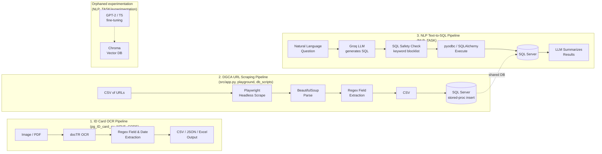

# Code Analysis Report — id-card-text-extractor

**Language:** Python 3.10 (local venv) / 3.9 (CI workflow — mismatch, see Findings)
**Scope:** Hand-written source code only. Excluded: `.venv/`, `gpt2-qa-model/`, `t5-small-qa-model/` (vendored model checkpoints), and bulk CSV/JSON dataset files under `BINNN/dataset`, `BINNN/docs`, `NLP_TASK/csv_data`.

---

## Overview

This repository actually contains **three independent, loosely-coupled pipelines** plus one orphaned experiment, all living in the same repo without a shared package structure:

1. **ID Card OCR Pipeline** — extracts fields (ID numbers, dates) from scanned ID card images/PDFs.
2. **DGCA URL Scraping Pipeline** — scrapes aviation document pages and loads results into SQL Server.
3. **NLP Text-to-SQL Pipeline** — lets a user ask natural-language questions that an LLM turns into SQL against the same SQL Server database.
4. **Orphaned experimentation** — a GPT-2/T5 fine-tuning + Chroma vector-DB prototype, disconnected from the rest.

There is no top-level orchestrator tying these together; each is invoked as a standalone script.

---

## Architecture

`P4` does not import from or feed into `P1`–`P3` — it is a disconnected prototype matching the vendored `gpt2-qa-model/` and `t5-small-qa-model/` checkpoints.

---

## Findings

Findings are split into **Confirmed** (verified directly in code) and **Recommendation** (suggested improvement, not a defect).

### 🔴 Critical — Security

| # | Finding | Location | Type |
|---|---------|----------|------|
| 1 | SQL Server credentials hardcoded in plaintext (`SERVER=103.190.95.44\RAYMACH,9987`, `UID=Shivam`, `PWD=Welcome@123`) | `BINNN/src/app.py:733-742`, `BINNN/playground/connect_to_db.py:4-15`, `csv_toDB_data_Insetion.py:7-18`, `main2.py:432-443`, `url_to_csv_n_DB.py:428-439`, `NLP_TASK/table_schema.py:4-12`, `NLP_TASK/view_db_simple.py:4-15`, `db_scripts/csv_data_to_db.py` | Confirmed |
| 2 | LLM-generated SQL is validated only with a keyword blocklist (`is_sql_safe()`, regex for `DROP`/`DELETE`/etc.), not an allowlist or read-only DB role — bypassable via comments, stacked statements, or obfuscation | Every `NLP_TASK/main*.py` variant | Confirmed |

**Why this matters:** finding #1 is a live, committed production credential across 7+ files — if this repo is pushed to any shared remote, the DB is compromised. In contrast, `NLP_TASK`'s main pipeline correctly loads secrets from `.env` (which is gitignored) — the hardcoding problem is isolated to the older `BINNN` codebase and should be fixed the same way there.

### 🔴 Critical — Correctness Bugs

| # | Finding | Location |
|---|---------|----------|
| 3 | `date_extraction.py` imports the `datetime` module but calls `datetime.strptime(...)` directly — this raises `AttributeError` at runtime (should be `from datetime import datetime` or `datetime.datetime.strptime`) | `BINNN/pg_ID_card_ex/date_extraction.py:13` |
| 4 | `gemini_main.py.main()` references `schema_prompt` in the query loop, but it is never assigned — `format_schema_for_prompt()` is defined but never called. First query raises `NameError` | `NLP_TASK/gemini_main.py:164-217` (used at line 201) |
| 5 | `test_stub.py` calls `app.main()`, but `src/app.py` defines no `main()` function — all logic sits under `if __name__ == "__main__":`. This test errors if run | `BINNN/tests/test_stub.py:6` |
| 6 | `set_console_mode`/`set_file_mode` assign to `self.console_mode`/`self._file_mode` (wrong attribute names, missing/extra underscore) instead of the `_console_mode`/`_file_mode` actually read elsewhere — toggling console/file logging silently does nothing | `BINNN/src/logger.py:137-146` |
| 7 | `csv_data_to_db.py`'s `except Exception` branch calls `conn.close()`, but `conn` is only assigned inside the `try` — if `pyodbc.connect()` itself fails, this raises `UnboundLocalError` instead of the original error | `db_scripts/csv_data_to_db.py:72` |

### 🟠 High — Duplication / Project Structure

**Confirmed:** the codebase re-implements the same three workflows repeatedly instead of sharing modules:

- **OCR + regex extraction**, ~5 near-identical implementations: `pg_ID_card_ex/fields_extractor.py`, `raymach_provided_code.py`, `NOV5_CODE/2x.py`, `BEAP_DIR.py`, `TEAP_DIR.py`, `BOTH_TEAP_BEAP_DIR.py` — each with slightly different regex tolerance (copy-paste drift).
- **URL scraper + DB insert**, ~4 near-identical copies: `src/app.py`, `playground/main.py`, `main2.py`, `url_to_csv_n_DB.py` (confirmed ~85-95% textually identical).
- **NL→SQL engine**, 5 variations differentiated only by how the schema is sourced: `NLP_TASK/main.py`, `main2.py`, `main_sim.py`, `gemini_main.py`, `query_using_2_txt.py`. `gemini_main.py` is also misnamed — it uses `groq.Groq`, not any Gemini API.

**Recommendation:** consolidate each cluster into one shared module with a config/CLI flag for variants (document type, schema source, etc.). This single change would eliminate most of the code-quality findings below at once, since they stem from copy-paste drift rather than distinct designs.

### 🟠 High — Code Quality

- `raymach_provided_code.py` (463 lines) has a single top-level script block with 20+ chained `if info["taep_no"] is None:` fallback branches (lines 238-357) — very hard to follow or extend; uses `print()` for diagnostics and a broad `except Exception as e: print(...)` (line 443) instead of logging.
- Absolute local paths hardcoded as the only configuration mechanism, in nearly every script: `raymach_provided_code.py:13`, `2x.py:134-139`, `BEAP_DIR.py:115-116`, `TEAP_DIR.py:137`, `input_txt_creator.py:3,14`, `src/app.py:771-777`. None of these are read from CLI args, env vars, or a config file.
- `doctr_text_extraction.py` and `raymach_provided_code.py` instantiate the docTR OCR model at **import time** (module-level side effect) — importing either module for any reason (including tests) triggers a full model load/download.
- `date_extraction.py` runs a live regex self-test via a bare `print()` at module scope (line 25) — importing the module executes test code.
- `src/logger.py` opens a log file handle in `setup_logging()` that is never closed in the normal running path — a file-handle leak for the process lifetime.
- No type hints or docstrings across the entire `pg_ID_card_ex` / `NOV5_CODE` / `playground` clusters.
- `setup.py` at repo root is an empty (0-byte) file — no packaging metadata despite the project being structured as installable packages (`__init__.py` present in `src/`, `pg_ID_card_ex/`).

### 🟡 Medium — Testing

- `test_date_regex_new.py` and `test_ID_regex.py` are solid, focused unit tests — but they **re-define the regex inline in the test file** rather than importing it from `date_extraction.py`/`fields_extractor.py`. This means tests can pass while production code (which has ~5 divergent copies, see above) is completely untested and can silently drift from what's tested.
- **Zero test coverage** for: `doctr_text_extraction.py`, `fields_extractor.py`, `raymach_provided_code.py`, all of `NOV5_CODE/`, all of `playground/`, `db_scripts/csv_data_to_db.py`, and all of `NLP_TASK/` — including the safety-critical `is_sql_safe()` function, which is the one piece of code standing between an LLM and a live SQL Server database.
- `conftest.py` only appends `src/` to `sys.path`; no fixtures.

### 🟢 Low — Performance

- URL scraping correctly uses `asyncio.gather` with batching (`batch_size = 15`) — reasonable I/O-bound concurrency design (duplicated across 3 files, see Duplication above).
- DB inserts use `cursor.executemany(...)` (batched, parameterized) — correct, not N+1, and not vulnerable to SQL injection in that layer.
- `remove_from_input()` in `NOV5_CODE/2x.py:124-130` rewrites the entire input file on every single processed record — O(n²) over a batch; only matters at larger batch sizes.
- OCR/model inference is CPU/GPU-bound and runs single-threaded per file with no batching across images — likely fine at current volumes but won't scale without batching if throughput needs increase.

---

## Dependency Analysis

- **Python version mismatch:** local `.venv` targets **3.10**, but `.github/workflows/workflow-py.yml` runs CI against **3.9**. Both are past or nearing end-of-life-adjacent territory for a project actively adding ML dependencies (Python 3.9 EOL: Oct 2025) — recommend standardizing on 3.11+ for both.
- **`requirements.txt` cannot install the codebase.** It is a raw `pip freeze` dump (pinned exact versions, all transitive `nvidia-*`/CUDA packages) missing several directly-imported top-level packages:
  - `doctr` (python-doctr) — the core OCR engine used throughout `pg_ID_card_ex`/`NOV5_CODE` — **entirely unlisted**.
  - `groq` — core to all of `NLP_TASK`.
  - `chromadb`, `sentence_transformers`, `transformers`, `datasets` — used in `NLP_TASK/experimentation/`.
- The many `ultralytics`, `qrdet`, `qreader`, `zxing-cpp`, `pyzbar`, `selenium`, `PyMuPDF`, `pdf2image`, `polars`, `scikit-image` entries in requirements.txt are almost certainly *transitive* dependencies of the unlisted `doctr`/`ultralytics`/`qrdet` packages — further evidence the file was frozen from a working environment rather than hand-curated.
- **Recommendation (needs your approval before any action):** regenerate `requirements.txt` as a curated, top-level dependency list (e.g., via `pip-compile` or `pipreqs`) grouped by pipeline (OCR extras, scraping extras, NLP extras), and add the missing `doctr`/`groq`/`chromadb`/`transformers`/`datasets` entries. I have not modified this file — let me know if you'd like me to proceed.

---

## Suggestions (Priority Order)

1. **Rotate the exposed DB credentials immediately** and move them to environment variables / `.env` (a pattern already correctly used in `NLP_TASK`) — this is the single highest-impact fix.
2. **Fix the 5 correctness bugs** listed above (`date_extraction.py`, `gemini_main.py`, `test_stub.py`, `logger.py`, `csv_data_to_db.py`) — these are outright runtime errors, not style issues.
3. **Consolidate the three duplicated pipelines** (OCR extraction, URL scraper, NL→SQL) into single shared modules with configuration-driven variants, instead of maintaining 3-5 parallel copies of each.
4. **Regenerate `requirements.txt`** as a curated top-level list including the missing `doctr`, `groq`, `chromadb`, `transformers`, `datasets` packages (with your permission before installing/modifying).
5. **Add tests for the untested, higher-risk surfaces** first: `is_sql_safe()`, `fields_extractor.py`, and the DB-insert path — and have existing regex tests import the real production functions instead of re-defining the regex inline.
6. **Align Python version** between local dev (3.10) and CI (3.9); consider moving both to a currently-supported version (3.11+).
7. Move hardcoded absolute file paths to CLI arguments or a config file so scripts are portable across machines.

---

## Conclusion

The codebase is functional and covers three real, distinct workflows, but it grew by copy-pasting working scripts into new files rather than refactoring shared logic — that single habit is the root cause of most findings here (duplicated OCR/scraper/NL2SQL logic, drifted regex between production and tests, and credentials repeated in 7+ files instead of centralized in one place). The `NLP_TASK` pipeline's use of `.env` for secrets is a good pattern already present in the repo; applying it to the older `BINNN` scripts would resolve the most serious issue. None of the runtime bugs found (items 3-7) are currently caught by tests, so they would only surface in production use of those specific code paths.
