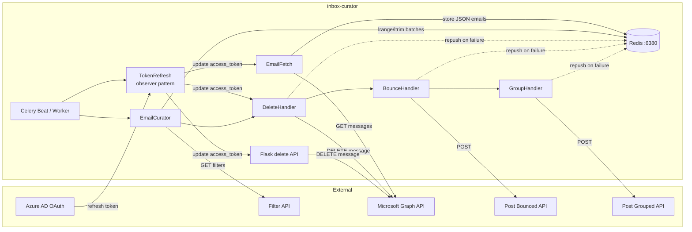
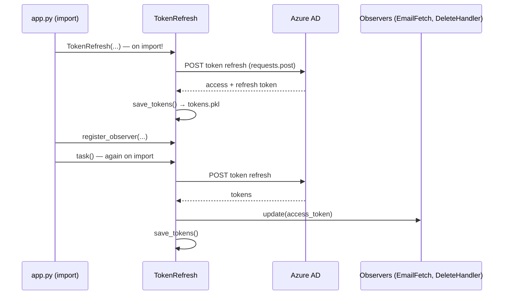
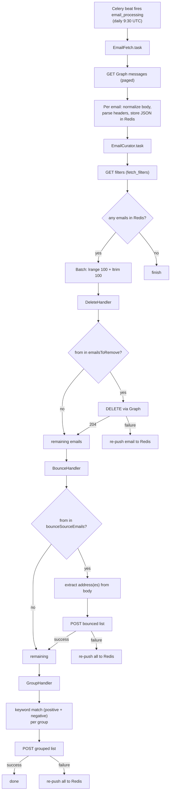

# Analysis Report — Inbox Curator

**Project:** Inbox Curator (`/media/cynoteckdell/data/Documents/inbox-curator`)
**Language:** Python (analyzed with the Python analyzer)
**Date:** 2026-08-05
**Scope:** Full repository analysis — architecture, code quality, dependencies, testing, performance, security
**Verification:** Static review + isolated sandbox execution (temporary venv in `/tmp`, dummy credentials, cleaned up after)

---

## 1. Overview

Inbox Curator is a scheduled email-processing pipeline. It:

1. Fetches emails from the Microsoft Graph API.
2. Stores them temporarily in Redis.
3. Processes them through a chain of handlers (Delete → Bounce → Group).
4. Posts results (bounced emails, grouped emails) to external APIs.
5. Refreshes OAuth tokens on a schedule and distributes them to components via an observer pattern.

Core technologies: Python 3.10+, Celery (scheduling), Redis (broker + email store), Requests (HTTP), Flask (small delete API), BeautifulSoup/Unidecode (body normalization).

**Overall verdict:** The design (Chain of Responsibility + Observer + Celery scheduling) is sensible and the code is readable, but the project is currently **not runnable, not fully testable, and not CI-safe** as-is. The most urgent problems are a committed credential file, broken tests, a broken CI matrix (Python 3.9 vs 3.10-only syntax), an out-of-sync virtual environment, and import-time network side effects.

---

## 2. Architecture



**Patterns used:**
- **Chain of Responsibility** — `DeleteHandler(BounceHandler(GroupHandler()))`, built in `EmailCurator.py:48`.
- **Observer** — `TokenRefresh` notifies registered observers with fresh access tokens (`TokenRefresher.py:91-151`).
- **Scheduler-Worker** — Celery Beat schedules `email_processing` and `token_refreshing` tasks (`app.py:22-56`).

**Token refresh sequence (note: runs at import time):**



**Good points:**
- Separation of concerns is clean: each module has a single responsibility.
- Observer pattern correctly decouples token producers from consumers.
- Docstrings are present throughout.
- The batched Redis read (`lrange` + `ltrim` in a pipeline) is a good touch.

---

## 3. Code Flow



Key observation: on any downstream API failure, the same emails are pushed back to Redis and reprocessed on the next run, so the same emails can be POSTed to downstream APIs multiple times (see Finding F-08).

---

## 4. Findings

Legend: 🔴 **Confirmed issue** (verified by inspection or execution) · 🟡 **Risk / improvement**

### 4.1 Critical

| ID | Severity | Finding |
|----|----------|---------|
| F-01 | 🔴 | **OAuth tokens committed to Git.** `config/tokens.pkl` is tracked (`git ls-files` shows it). It contains the access and refresh tokens. It must be removed from the repository *and* history, and the tokens rotated. |
| F-02 | 🔴 | **Importing `src.app` performs live network I/O.** `app.py:62` calls `token_refresher.task()` at module import, and `TokenRefresh.__init__` (`TokenRefresher.py:80-89`) refreshes tokens and writes `tokens.pkl` during construction. Any `import src.app` (tests, Celery, tooling) triggers a real HTTP request to Azure AD and file writes. Confirmed: the test suite fails at *collection* because of this (`tests/test_stub.py`). |
| F-03 | 🔴 | **The test suite is broken.** In the sandbox run: 1 collection error (`test_stub.py` — import-time refresh) and 2 failures (`test_group_handler`, `test_token_refresh_task`). Details in §6. |
| F-04 | 🔴 | **CI cannot work.** `.github/workflows/workflow-py.yml:16,50` pins **Python 3.9**, but the code uses PEP 604 unions (`str | None`, `dict | None`) without `from __future__ import annotations` — e.g. `EmailCurator.py:37`, `TokenRefresher.py:67`, `scheduler.py:51`. Verified on Python 3.8/3.9: `TypeError: unsupported operand type(s) for |`. In addition, CI has no `.env`, so `Settings()` (pydantic) raises a validation error on import. |
| F-05 | 🔴 | **The project's `.venv` is out of sync with `requirements.txt`.** It contains a FastAPI/uvicorn/starlette stack; **none** of `celery`, `redis`, `requests`, `beautifulsoup4`, `Unidecode`, `pydantic-settings`, `pytest`, `flake8`, or `coverage` are installed. The application cannot be started or tested from its own environment. |
| F-06 | 🔴 | **`tests/test_stub.py` calls `app.main()` which does not exist.** `src/app.py` defines no `main()`; this test can never pass even if the import were side-effect-free. |

### 4.2 High

| ID | Severity | Finding |
|----|----------|---------|
| F-07 | 🔴 | **`DeleteHandler` invalid-email guards are dead code.** `DeleteHandler.py:36-39`: `if email["email_id"] is None and isinstance(email["email_id"], str)` is always `False` when `email_id is None` (verified: `None is None and isinstance(None, str)` → `False`). It should be `is None or not isinstance(...)`. Emails with missing IDs/from-addresses are **not** skipped and flow into deletion. |
| F-08 | 🔴 | **Repush-on-failure causes duplicate downstream processing.** On API failure, `DeleteHandler.py:47`, `BounceHandler.py:67`, and `GroupingHandler.py:176` re-push emails to Redis. Nothing records that an email was already processed/attempted, so the next run re-groups and re-POSTs the same emails → duplicate posts and unbounded retry. |
| F-09 | 🔴 | **Logger line numbers are always the same module line.** `file_info = LineFileProvider.get_file_info()` is captured once at module import, so every log entry in a module reports the module's *definition* line, not the real call site. Verified in sandbox logs: all `TokenRefresher` entries report `TokenRefresher.py:18`. This defeats the purpose of `LineFileProvider`. |
| F-10 | 🔴 | **To-header parsing corrupts addresses.** `EmailFetcher.py:84-86`: when a `To:` header has no `<...>` (e.g. `recipient@example.com`), `find('<')` returns `-1`, and `to_header[start+1:end]` silently drops the last character (verified: yields `recipient@example.co`). |
| F-11 | 🟡 | **`fetch_filters` returns `None` on error, then `context["data"]` raises.** `EmailCurator.py:61-62` — an uncaught `TypeError` aborts the whole task if the filter API fails. |

### 4.3 Medium

| ID | Severity | Finding |
|----|----------|---------|
| F-12 | 🟡 | **`BaseHandler.response` treats only HTTP 201 as success** (`BaseHandler.py:73`). A valid `200` response is logged as failure and triggers the re-push path. |
| F-13 | 🟡 | **`requests` calls have no timeouts** — `EmailFetcher.py:66`, `getfilters.py:22`, `BaseHandler.py:64`, `TokenRefresher.py:135`. A hung endpoint hangs the whole task indefinitely. |
| F-14 | 🟡 | **Singleton + non-idempotent `__init__`.** `BaseScheduler.__new__` (`scheduler.py:40-49`) caches one instance, but `__init__` (and `TokenRefresh.__init__`, which performs network I/O) runs on **every** construction. Instantiating twice re-runs token refresh and re-registers beat tasks. |
| F-15 | 🟡 | **`datetime.utcnow()` is deprecated** (`EmailFetcher.py:128`). Verified `DeprecationWarning` on Python 3.12. Use `datetime.now(timezone.utc)`. |
| F-16 | 🟡 | **Redis connection/broker hardcoded to `localhost:6380`** — `scheduler.py:17-18`, `redis_config.py:3`. Not driven by environment; will silently point at the wrong server in production. |
| F-17 | 🟡 | **`isotimestamp.subtract_hours_from_iso` is brittle.** It only parses the exact format `%Y-%m-%dT%H:%M:%SZ` (`isotimestamp.py:18`). Microsoft Graph timestamps may include fractional seconds (`...T12:00:00.1234567Z`), which raises an unhandled `ValueError` and kills the fetch. The `hours=5` offset is also hardcoded. |
| F-18 | 🟡 | **Dual import naming (`EmailFilter.X` vs `src.EmailFilter.X`).** Internal modules import without the `src.` prefix (relying on the `sys.path` hack in `app.py:12`/`conftest.py`), while tests import with it. This can create two separate module objects for the same file. |
| F-19 | 🟡 | **`logger.set_console_mode` has no effect** (`logger.py:216`): it sets `self.console_mode` but the code reads `self._console_mode`. The `filename` parameter to `__init__` is also ignored (`logger.py:87,97`), and the log file handle opened in `setup_logging` (`logger.py:99`) is never closed. The custom logger also bypasses Python's standard `logging` module (no rotation, no formatters, no thread-safety guarantees). |
| F-20 | 🟡 | **`EmailFetcher` stores `{}` as `from` when address is missing** (`EmailFetcher.py:92-94` default `{}`), and `subscriber_email` is always `""` (`EmailFetcher.py:108`) — a dead field. |
| F-21 | 🟡 | **Dead/empty artifacts in the repo:** empty `setup.py`, empty `src/EmalDeletion/deletion_email_api.py` (note the typo *Emal*Deletion), unused `src/Config/ad_config.json`, and `playground/grouping_part.py` which contains **indentation-broken code** (`email_grouping` never terminates properly). |
| F-22 | 🟡 | **Repo hygiene:** `celerybeat-schedule` (binary) and `config/local` (pyenv marker) are committed; historical `logs/*.log` files are committed too (later gitignored but still in history). `logquery.py` at the repo root is unrelated to the package. |
| F-23 | 🟡 | **flake8 reports ~45 violations.** Notable: unused imports (`logging` in `EmailFetcher.py:5` and `TokenRefresher.py:4`), `C901` complexity 39 for `GroupingHandler.email_grouping` (limit 10), many `E501` lines > 120 chars, trailing whitespace, missing EOF newlines. |

---

## 5. Code Quality

**Strengths**
- Readable, purposeful naming and clear module boundaries.
- Consistent docstring style (Google/NumPy-ish) and some type hints.
- Correct use of `with` for the Redis pipeline and file reads in `Tokens.get_tokens`.

**Areas to improve**
- **Logging architecture (`logger.py`):** reimplements logging by hand instead of using the standard `logging` module. `LineFileProvider.get_file_info()` should be called *inside* `log()` so every call site is captured correctly — the current `file_info`-at-import design guarantees wrong line numbers (F-09).
- **Type hints are partial:** lots of `str | None` but many functions are untyped (`fetch_filters`, `keywordmatcher` return usage, handler payloads). Add a `py.typed`-style discipline and `from __future__ import annotations` to keep 3.9 compatibility or drop 3.9.
- **Exception handling:** several `except Exception` blocks swallow and re-wrap errors, discarding tracebacks (`EmailFetcher.py:41-43`, `TokenRefresher.py:115-117`). Prefer `raise ... from e` and log the original traceback.
- **`GroupingHandler.email_grouping` is a 116-line god-method** (complexity 39) with the unsubscribe logic duplicated from the generic group loop (`GroupingHandler.py:114-131` vs `138-159`). Extract `match_group(email, group)`.
- **Readability nits:** `email_headers= email.get(...)` spacing (`EmailFetcher.py:78-79`), stale comments (`EmailFetcher.py:106` `# "raw_body": raw_body`), unused emoji comment (`GroupingHandler.py:105`).
- **Duplication:** `GEMINI.md` duplicates `README.md`; consider consolidating.

---

## 6. Testing Analysis

### 6.1 Current state (verified in sandbox)

| Test | Result |
|------|--------|
| `tests/test_stub.py` | ❌ **Collection error** — importing `src.app` triggers live token refresh |
| `tests/test_email_handlers.py::TestGroupHandler::test_group_handler` | ❌ **Fails always** |
| `tests/test_token_refresher.py::TestTokenRefresher::test_token_refresh_task` | ❌ **Fails always** |
| `tests/test_email_curator.py::TestEmailCurator::test_email_curator_task` | ✅ Passes |
| `tests/test_email_fetcher.py::TestEmailFetcher::test_fetch_and_store_emails` | ✅ Passes |
| `tests/test_email_handlers.py::TestDeleteHandler::test_delete_handler` | ✅ Passes |
| `tests/test_email_handlers.py::TestBounceHandler::test_bounce_handler` | ✅ Passes |
| `tests/testfilter.py` | Not collected (name doesn't match `test_*.py`) — stale/obsolete code that mirrors an old handler API (single-dict input, string `emailsToRemove`, string return values) |

**Why the failing tests fail:**
- `test_group_handler` asserts `mock_next_handler.handle.assert_called_once_with([], context)` (`test_email_handlers.py:82`), but `GroupHandler.handle` is the **terminal** handler and never calls `super().handle()`. The test is asserting behavior the code intentionally doesn't have. Its mock also never sets `status_code=201`, so `BaseHandler.response` returns `False` and the handler takes the failure path (re-push to Redis).
- `test_token_refresh_task` asserts `mock_pickle_dump.assert_called_once()` (`test_token_refresher.py:40`), but `TokenRefresh.__init__` *already* calls `save_tokens()` before `task()` is run → `pickle.dump` is called **twice**. Verified: `Calls: [call(...), call(...)]`.

### 6.2 Coverage (measured in sandbox)

```
TOTAL                                    667    188    72%
```

- `src/app.py` **0%**, `src/delete_api.py` **0%** — never imported due to the `test_stub` collection error.
- `src/Utilities/getfilters.py` **38%**, `GroupingHandler.py` **61%**, `DeleteHandler.py` **67%**, `BaseHandler.py` **69%**, `TokenRefresher.py` **76%**.
- The reported 72% is misleading because whole modules (app, delete API) are never loaded.

### 6.3 What's missing

- **Error paths:** HTTP failures, `@odata.nextLink` pagination, empty batches, invalid JSON, timeouts.
- **Edge cases:** emails with no `To:` brackets, no `from`, no body; bounced emails with no address in body; unsubscribe negative-keyword rules; default-group assignment; emails already carrying a `group`.
- **Integration-level tests** for the Celery task wiring in `app.py` (without live network — mock `requests`).
- **Tests for `delete_api.py`** — including missing/invalid `X-API-Key` (403), malformed payload (400), and the 500 path.
- **Unit tests for `logger.py`**, `text_processing.py`, `isotimestamp.py`, `getfilters.py`.
- **A deterministic fixture** for `Tokens.get_tokens/save_tokens` (no real token file).
- **Regression tests** for the specific bugs found: F-07 guard, F-08 re-push semantics, F-10 header parsing, F-12 non-201 success codes.

### 6.4 Recommendations

1. Remove `tests/test_stub.py` (or fix it to mock everything; it currently makes the entire suite uncollectable).
2. Fix `test_group_handler` to assert the correct terminal behavior (no next-handler call; assert POST called with grouped payload and `status_code=201` mocked).
3. Fix `test_token_refresh_task` to account for the `__init__` save (`assert_called_with` or reset the mock).
4. Move from `unittest` to plain `pytest` functions with `monkeypatch`/`mocker` fixtures; use `responses`/`pytest-httpserver` instead of `MagicMock` for HTTP.
5. Add a `tests/conftest.py` fixture that writes a temp `.env`/`tokens.pkl` so tests are hermetic and CI-friendly.
6. Delete `tests/testfilter.py` or rewrite it to the current handler API.

---

## 7. Performance Analysis

The app is **I/O-bound** (HTTP + Redis), so the GIL is not a concern; no multiprocessing is warranted. Findings below focus on measurable waste.

| ID | Issue | Where | Impact / fix |
|----|-------|-------|--------------|
| P-01 | **Regex recompiled on every comparison.** `keywordmatcher` builds the pattern inside `re.search` for every keyword × email (`GroupingHandler.py:44`). | O(emails × groups × keywords) with per-call compile | Precompile each keyword pattern once (e.g., `re.compile` in a dict keyed by group) before the email loop. |
| P-02 | **One Redis `rpush` per email.** `EmailFetcher.py:110` issues N round-trips to Redis. | Large mailboxes | Use `redis_client.pipeline()` and batch `rpush`, matching the batched `lrange`/`ltrim` read pattern already used. |
| P-03 | **Full payload logged on failure.** `BaseHandler.py:78` logs the entire payload (email subjects/bodies) — expensive and leaks PII. | On every failed POST | Log only email IDs/counts. |
| P-04 | **`text_normalization` parses full HTML per email** (`text_processing.py:30`). | CPU cost per email | Acceptable for daily batches; consider dropping to `lxml` parser if it becomes hot. No change needed now. |
| P-05 | **Retry storm.** Re-pushed emails are reprocessed next run, multiplying API/Redis load (F-08). | All handlers | Mark attempts (e.g., a `retry_count` field or a "processed" set) and cap retries. |

The batched pipeline read (`EmailCurator.py:68-70`) and the observer-based token reuse are good performance choices already.

---

## 8. Security

| ID | Severity | Finding |
|----|----------|---------|
| S-01 | 🔴 | **Credentials in version control.** `config/tokens.pkl` (OAuth access/refresh tokens) is committed; historical `logs/*.log` may also contain sensitive content. Remove from history (BFG / `git filter-repo`) and **rotate the tokens immediately**. |
| S-02 | 🟡 | **`pickle` deserialization of token file.** `Tokens.get_tokens` (`TokenRefresher.py:34-36`) uses `pickle.load` on a file. Locally this is low risk, but pickle on any attacker-influenced file enables code execution. Prefer a JSON/encrypted token store. |
| S-03 | 🟡 | **API-key check order + plaintext comparison.** `delete_api.py:28-33` loads/updates tokens *before* validating the key, and compares with a plain `!=`. Use `secrets.compare_digest`, validate the key first, and store the key as `SecretStr`. |
| S-04 | 🟡 | **No request timeouts** (F-13) — enables connection-draining/hangs. |
| S-05 | 🟡 | **PII logging.** Bounce/group payloads and full emails are logged on failure (`BaseHandler.py:78`). |
| S-06 | 🟡 | **`fetch_filters` unauthenticated GET** (`getfilters.py:22`) — confirm the filter endpoint is internal/authorized. |
| S-07 | ℹ️ | Flask dev server with hardcoded `localhost:5000` (`delete_api.py:53`) — acceptable for dev; production should use a WSGI server behind TLS. |

Good: the access token is kept in memory and never logged directly; `pydantic.SecretStr` is used for `refresh_token`/`access_token` in settings (though `api_authentication_key` is a plain `str`).

---

## 9. Dependency Analysis

### 9.1 `requirements.txt` review

| Package | Status |
|---------|--------|
| `bs4==0.0.2` | 🟡 **Dummy package.** Verified: it's a PyPI placeholder that silently pulls in `beautifulsoup4` (unpinned). Pin `beautifulsoup4` explicitly instead. |
| `celery==5.5.3` | ✅ Used (scheduler). |
| `redis==6.2.0` | ✅ Used (`redis_config.py`). |
| `Unidecode` | 🟡 Used, but **unpinned**. Pin a version. |
| `requests==2.28.2` | ✅ Used. Note: 2.28.2 is several years old; a newer 2.3x is available. |
| `Flask==2.2.3` | ✅ Used (`delete_api.py`). Old; 2.2.x is EOL — upgrade to 3.x (the venv already has 3.1.3). |
| `pydantic-settings` | 🟡 Used, **unpinned**. Pin it. |

### 9.2 Missing / broken

- **Test/runtime tooling referenced but not in `requirements.txt`:** `pytest` + `pytest-cov` (pytest.ini uses `--cov`), `coverage` (Makefile `coverage html`), `flake8` (Makefile/CI). CI will fail to install these via `pip install -r requirements.txt`.
- **The project `.venv` is unusable** — it contains a FastAPI/uvicorn stack and none of the runtime dependencies (F-05). Verified by `pip list` in the project venv.
- **`pydantic` is a transitive dependency** of `pydantic-settings`; consider pinning it explicitly (it is already installed).

### 9.3 Recommendations

1. Replace `bs4==0.0.2` with `beautifulsoup4==4.15.0` (or the current version).
2. Pin `Unidecode`, `pydantic-settings`; bump `requests` and `Flask`.
3. Add a `requirements-dev.txt` with `pytest`, `pytest-cov`, `flake8`.
4. Rebuild the `.venv` (`make virtualenv && make install`) to match `requirements.txt`.
5. Add a `Makefile`/README note that the project requires Python **3.10+** (the union type syntax) and fix CI to 3.10/3.12 instead of 3.9.

---

## 10. Suggestions (prioritized action plan)

**Now (blocks everything else)**
1. Remove `config/tokens.pkl` from Git history and rotate the OAuth tokens. Add `config/tokens.pkl` to `.gitignore`.
2. Remove the import-time side effects in `app.py` (wrap `token_refresher.task()` and object construction in a `main()` / `if __name__ == "__main__":` or a guarded `setup()`), so importing the module is safe.
3. Fix `tests/test_stub.py`, `test_group_handler`, and `test_token_refresh_task` so the suite collects and passes.
4. Fix the CI matrix Python version (3.10+), add a `.env.example`, and ensure CI installs dev requirements.

**Soon**
5. Fix the F-07 guard, F-10 header parsing, F-09 logger line capture, and F-12 non-201 handling.
6. Add request timeouts everywhere.
7. Replace `datetime.utcnow()` and make the ISO timestamp parser tolerant of fractional seconds.
8. Rebuild `.venv` and pin/clean `requirements.txt` per §9.3.

**Later**
9. Refactor `GroupingHandler.email_grouping` (extract helpers, precompile regexes).
10. Replace the custom logger with the standard `logging` module (or fix `set_console_mode`, close file handles).
11. Move Redis/broker settings to env variables.
12. Add retry-cap logic to prevent duplicate downstream posts (F-08).

---

## 11. Conclusion

Inbox Curator has a sound overall design — the Chain of Responsibility handler pipeline, the observer-based token distribution, and the Celery + Redis architecture are appropriate for the problem and generally readable. However, the project is not in a working state today: a live credential file is committed to Git, the test suite cannot be collected, the CI pins an incompatible Python version, and the virtual environment is out of sync with the declared dependencies. Once the top items in §10 are addressed, the remaining work is largely quality hardening (logging, timeouts, tests, and splitting the grouping god-method), all of which is straightforward with the current structure.

---

*Report generated by the Code Analyzer skill. Verification performed in an isolated temporary sandbox (`/tmp`) with dummy credentials; no project files were modified and the sandbox was removed afterward.*
