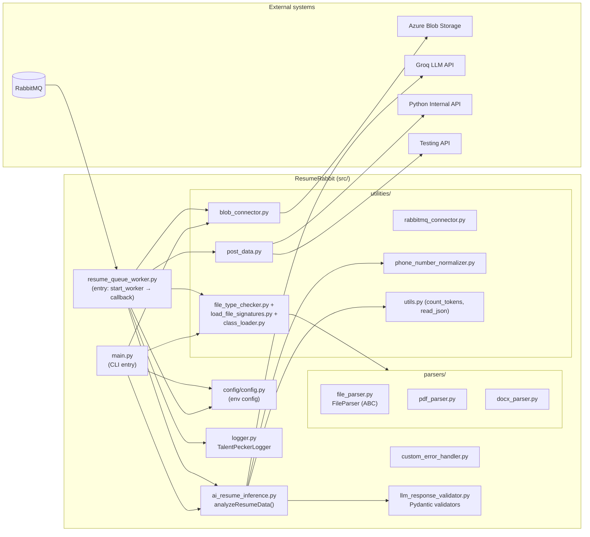
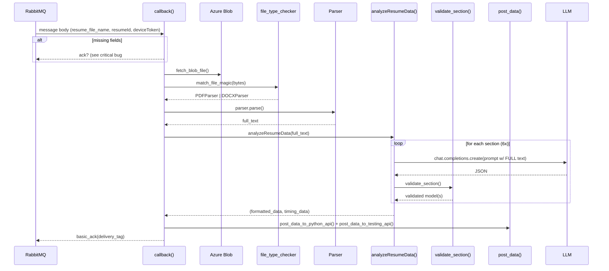
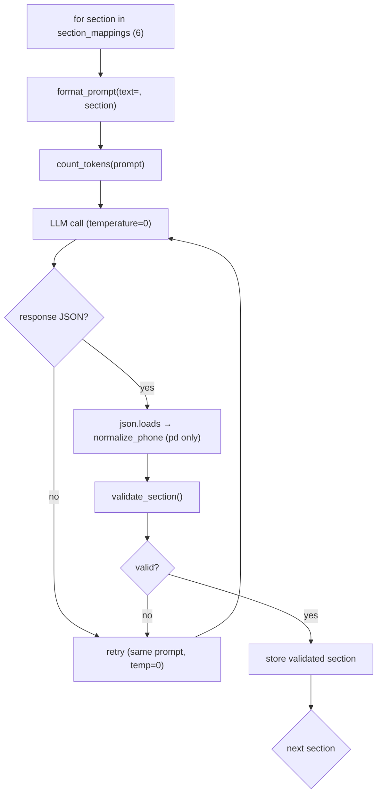

# Analysis Report — ResumeRabbit

**Project analyzed:** `/media/cynoteckdell/data/Documents/ResumeRabbit`
**Language:** Python (3.10 in the local `.venv`; `python:3.13` in the Dockerfile; 3.9 in CI)
**Date:** 6 Aug 2026
**Tooling:** `code-analyzer` skill → `python-analyzer`; tests executed in an isolated sandbox (`/tmp/opencode/rr_sandbox`) using the project's own `.venv` (all dependencies pre-installed). The original project files were not modified.

---

## 1. Overview

ResumeRabbit is a **resume-parsing microservice**. It:

1. Fetches a resume file (PDF/DOCX) from **Azure Blob Storage**.
2. Detects the file type by **magic bytes** and selects a parser.
3. Extracts text (PyMuPDF for PDF text, docx2txt for DOCX, EasyOCR as an image fallback).
4. Calls the **Groq LLM** once per resume *section* (personal details, education, experience, projects, certification, skills) with the whole document embedded in every prompt.
5. Validates the LLM JSON with **Pydantic** models, then normalizes the phone number.
6. Posts the structured result back to two internal HTTP APIs.

It is designed to run as a **RabbitMQ worker** (`src/resume_queue_worker.py`), consuming messages that point at a blob file and returning the parsed result. A CLI entry point (`src/main.py`) also exists.

**Scale:** ~3,180 lines across `src/`, `config/`, `tests/`, and `playground/`.

**Overall verdict:** The architecture is clear and sensible (parser abstraction, validation layer, queue-based worker), but the codebase contains several **confirmed runtime bugs**, some of which are **critical** (a NameError on every error path of the worker callback, a call to a non-existent logger method, and a stale return-value contract). The test suite cannot run in CI as configured and is largely dependent on live LLM/network calls.

---

## 2. Architecture

### 2.1 Component map



### 2.2 Design highlights (good)

- **Parser abstraction** — `FileParser` ABC with `PDFParser`/`DOCXParser`; a magic-byte signature CSV drives dynamic class loading (`class_loader.py`), so adding a new format is declarative.
- **Validation layer** — Pydantic models per section with regex constraints; a `validate_keys` fallback that nulls invalid fields instead of failing a whole section.
- **Enum centralization** — `ResumePayloadKeys` and `ResumeSectionNames` avoid magic strings.
- **Error-code table** — `data/errors.csv` and `data/api_responses.json` centralize error codes/messages.
- **OCR is lazy** — EasyOCR reader is initialized on first use and cached per parser instance.

### 2.3 Design concerns

- **Duplicate inference engine.** `tests/test_infer.py` (~350 lines) is nearly a line-for-line copy of `ai_resume_inference.py`, diverged just enough to drift. The test `test_llm_personaldetail.py` calls `run_inference` from it, and `test_llm_*` files import from it. Fixing a bug in the real engine does not fix the copy.
- **Config requires secrets at import time.** `config/config.py` raises `EnvironmentError` for every missing variable, so *any* import of a module that touches `config` fails without a populated `.env`. This breaks the entire CI test job (see Testing).
- **Two entry points with different return contracts.** `main()` still unpacks `analyzeResumeData()` as a single value even though it now returns a tuple.
- **No test doubles.** All LLM tests hit the real Groq API and real Azure Blob, so the suite is slow, non-deterministic, costs money, and cannot run offline.

---

## 3. Code Flow

### 3.1 Worker message flow



### 3.2 LLM section loop (per resume)



**Note:** because the temperature is `0` and the prompt is identical, a "retry" produces the *same* answer — retries rarely resolve a validation failure. Also, errors like a `KeyError` for a missing section key or a `TypeError` for a non-dict list item escape the JSON/Validation handler and abort the *entire* resume with `RuntimeError` (verified in the sandbox).

---

## 4. Findings

### 4.1 Confirmed critical bugs

| # | Location | Bug | Evidence |
|---|----------|-----|----------|
| C1 | `src/utilities/rabbitmq_connector.py:31` | Calls `logger.exception(...)`, but `TalentPeckerLogger` defines **no** `exception` method. Any RabbitMQ connection failure raises `AttributeError` instead of returning `(None, None)`. | `'exception' in dir(TalentPeckerLogger())` → `False` (verified in sandbox). |
| C2 | `src/resume_queue_worker.py:118–124` | `testing_llm_response` is referenced in the `finally` block but only assigned on the success path (line 84). Every early-return error path (blob error, file-type error, no text) raises **`NameError`** in `finally`. The final `ch.basic_ack(...)` (line 139) is then never reached, so the message is never acknowledged and is redelivered forever — a **poison-message loop** that also means the error response is never posted. | Code inspection: `testing_llm_response` initialized nowhere before `finally`. |
| C3 | `src/main.py:34` | `analyzeResumeData()` now returns a **2-tuple** `(data, timing)`, but `main()` assigns it to a single variable. `if not llm_response` is then always falsy/false against a tuple, `json.dumps` serializes a nested tuple, and `main()` returns a wrongly-shaped result. | Compare `main.py:34` with `resume_queue_worker.py:84` (correct unpacking). |

### 4.2 Confirmed high-severity bugs

| # | Location | Bug |
|---|----------|-----|
| H1 | `config/config.py:39` | `RABBITMQ_PORT` is returned as a **string**; pika requires an `int` (`HEARTBEAT`/`BLOCKED_CONNECTION_TIMEOUT` are cast with `int()`, the port is not). Worker connection fails at runtime. |
| H2 | `src/utilities/utils.py:60` | `AutoTokenizer.from_pretrained(model_name, use_auth_token=HF_TOKEN)` — `use_auth_token` was deprecated and **removed** in modern `transformers` (verified absent in installed 4.53.3). Token counting fails; must be `token=`. |
| H3 | `tests/test_stub.py:2` | `from src import app` — `src/app.py` **does not exist** (`src/main.py` does). Collection fails and aborts the whole pytest run. |
| H4 | `tests/test_llm_date_format.py:6` | `from src.utilities.utilities import read_json` — the module is `src.utilities.utils`. Also references a non-existent `test_scripts/` folder and requires the live LLM. |
| H5 | `tests/inference_validator.py:10` | Calls `main(resume_file_path=...)`, but `main()`'s parameter is `resume_file_name` → `TypeError`. It also needs live Azure Blob + LLM. |
| H6 | `tests/test_phone_normalizer.py:57–67` | Two tests contradict each other on multi-phone input: `test_multiple_phone_numbers` asserts `None`; `test_multiple_phone_numbers_list` asserts a list. `normalize_phone_number` returns `None`, so the latter **fails** (verified: `1 failed, 39 passed`). This also highlights that multiple phone numbers are silently dropped rather than handled. |
| H7 | `Makefile` | `run` target executes `src/app.py` (does not exist); `clean` uses `@$ rm -rf logs/*` — `$ ` is invalid make syntax (stray `$`). |

### 4.3 Confirmed medium-severity issues

| # | Location | Issue |
|---|----------|-------|
| M1 | `src/parsers/docx_parser.py:28` | Log string `"Error extracting text using docx2txt for file:{e}"` is **not** an f-string — `{e}` is printed literally, the real error is never logged. |
| M2 | `src/logger.py:138` | `set_console_mode` writes `self.console_mode` (never read) instead of `self._console_mode` — toggling console mode is a no-op. |
| M3 | `src/custom_error_handler.py` | `ErrorEnum` is `None` until `load_errors()` is called, and `main()` only calls it inside `if __name__ == "__main__"`. Any imported use of `main()` raising `CustomErrorHandler(...)` hits `AttributeError: 'NoneType'`. |
| M4 | `src/ai_resume_inference.py:202,232` | `parsed_llm_data[section_name]` can raise `KeyError`/`TypeError` (valid JSON, wrong shape) — **not** caught by `except (json.JSONDecodeError, ValidationError)`. Similarly, a non-dict element in a section list raises `TypeError` from `validate_section`. Both escape to `RuntimeError(f"LLM call failed: ...")`, aborting all six sections with **no retry** (verified: `TypeError: ...argument after ** must be a mapping, not str`). |
| M5 | `src/llm_response_validator.py:150` | `error["loc"][0]` indexes the first location blindly — a validator error whose `loc` is empty raises `IndexError`. |
| M6 | `src/llm_response_validator.py:15` | Name regex `^[A-Za-z\s'.\-]+$` **rejects non-ASCII names** ("José García" → field set to `None`; verified). International resumes will lose the candidate's name. Several other regexes are similarly Anglo-centric (job titles, skills like `AI/ML`, `C++`, project titles with digits). |
| M7 | `.github/workflows/workflow-py.yml` | The `test` job runs `pytest` with **no `.env`**; `config.config` then raises `EnvironmentError` at collection → CI test job fails. (The lint job passes — verified `flake8 -select=E9,F63,F7,F82` → 0.) |
| M8 | Repo hygiene | `re` (0-byte) in root; `setup.py` and `LICENSE` are empty; `data/regex.json` and `data/field_validations.json` are referenced nowhere; `PathConfig.EXTRACTION_FIELDS_FILE` points to `data/extraction_fields.json` which **does not exist**. |
| M9 | `tests/test_llm_personaldetail.py:25` | Contains a module-level `exit(0)` — when pytest imports the module, it raises `SystemExit` and can abort the whole run. |

### 4.4 Recommendations (not yet applied)

- **Worker error path** — initialize `testing_llm_response = {}` beside `llm_response = {}` and wrap the finally body in try/except so `basic_ack` is always attempted.
- **Add `exception()`** to `TalentPeckerLogger` (or use `logger.error` with `exc_info=True`).
- **Align `main()`** with the tuple return of `analyzeResumeData`, or revert the engine to a single return value.
- **Cast `RABBITMQ_PORT` to int** in config.
- **Replace `use_auth_token` with `token=`** and cache the tokenizer (see Performance).
- **Harden `analyzeResumeData`** — wrap the shape checks (`isinstance(parsed_llm_data, dict)`, key presence, list-item types) so malformed-but-valid JSON triggers a retry instead of a global `RuntimeError`.
- **Restrict PII regexes** — validate presence/format, but don't null names merely because they contain non-ASCII letters or dots.
- **Fix the contradictory phone test** — decide whether multiple numbers should be a list and implement it, then keep a single test.
- **Remove dead code** — delete the ~120 lines of commented-out test bodies and the duplicated `test_infer.py` engine (have it import from `src` instead).

---

## 5. Code Quality

### 5.1 Lint (`flake8 src`, project config)

```
src/ai_resume_inference.py:4:1  F401 'copy.deepcopy' imported but unused
src/ai_resume_inference.py:13:1 F401 'PersonalDetailsValidator' imported but unused
src/ai_resume_inference.py:70:1 C901 'analyzeResumeData' is too complex (18 > 10)
src/custom_error_handler.py:12:5 E303 too many blank lines
src/llm_response_validator.py:1:1 F401 'pydantic.HttpUrl' imported but unused
src/parsers/docx_parser.py:17:5 C901 'DOCXParser.parse' is too complex (12)
src/parsers/docx_parser.py:26:9 F841 local variable 'e' assigned but never used
src/parsers/docx_parser.py:33:13 F541 f-string missing placeholders
src/parsers/file_parser.py:9:1 F401 'io.BytesIO' imported but unused
src/resume_queue_worker.py:5:1 F401 'CustomErrorHandler' imported but unused
src/resume_queue_worker.py:17:1 C901 'callback' is too complex (14)
src/utilities/utils.py:5-9  E402 module-level imports not at top of file
```
Plus `E501` long lines and `E261` inline-comment spacing. Nothing fatal, but the unused imports and the 4 functions over the complexity budget are the ones to fix first.

### 5.2 Style / Pythonic conformance

- **Naming:** mostly clear (`analyzeResumeData` is camelCase — not PEP 8; should be `analyze_resume_data`). Mixed `full_name`/`fullText` conventions in tests.
- **Docstrings:** present at class level (PEP 257-friendly) but missing from most functions (`format_prompt`, `validate_section`, `match_file_magic`, all of `logger` methods except a few).
- **Type hints:** used in `validate_section`, `count_tokens`, `read_json`, `load_class`, `fetch_blob_file` — but absent from most functions and all Pydantic models (Pydantic allows dataclass-style fields, so this is minor).
- **Dead code:** large commented-out blocks (`resume_queue_worker.py:184–302`, `test_llm_inferences.py:150–272`, `blob_connector.py:34–69`, `custom_error_handler.py:34–68`, `main.py:73–79`). These should be deleted.
- **`assert` in library code:** `logger.log` uses `assert filename is not None` — asserts vanish under `python -O` and are the wrong tool for runtime checks.
- **`LineFileProvider`:** cleverly reports the *caller's* file/line because the expression is evaluated in the caller's frame — this works, but it is fragile (returns `(None, None)` if `f_back` is `None`).

---

## 6. Dependency Analysis

`requirements.txt` is **completely unpinned** (no version constraints), which makes builds non-reproducible.

### 6.1 Used dependencies (keep)

`groq`, `easyocr`, `pymupdf` (fitz), `docx2txt`, `python-docx`, `requests`, `pika`, `transformers`, `azure-storage-blob`, `pydantic` (+ `pydantic[email]` → `email-validator`), `python-dotenv`, and dev tools `pytest`, `pytest-cov`, `coverage`, `flake8`.

### 6.2 Unused / unnecessary (candidates for removal)

| Package | Why | Notes |
|---------|-----|-------|
| `flask`, `gunicorn` | No web app exists in the repo | `make run` points at a nonexistent `src/app.py`; no `Flask` import anywhere |
| `tiktoken` | Token counting uses `transformers.AutoTokenizer`, not tiktoken | |
| `mammoth` | Not imported | DOCX handled by docx2txt/python-docx |
| `pdf2image`, `pytesseract` | Not imported; PDF images are OCR'd with EasyOCR | |
| `python-magic` | Not imported; magic detection is hand-rolled in `file_type_checker` | |
| `docx2txt2` | Not imported; only `docx2txt` is used | Odd fork duplicate — confusing |
| `protobuf` | Not directly imported | Transitive requirement of `transformers`; pin only if it causes version conflicts |

### 6.3 Missing dependencies

- `fpdf` — used by `playground/ResumeMaking/pdfmaker.py` but absent from `requirements.txt`.

### 6.4 Environment / Python version

- **Local `.venv`:** Python **3.10.0**. Its scripts have a **stale shebang** (`/home/cynoteckdell/Documents/ResumeRabbit/.venv/bin/python3` — path no longer exists), so the venv appears to have been moved; use `.venv/bin/python -m ...` rather than the scripts directly.
- **Dockerfile:** `python:3.13`.
- **CI:** `python-version: [3.9]` — **3.9 is EOL** (security fixes ended Oct 2025). Python 3.9 also cannot run `pydantic` v2.12+ or the latest `transformers` cleanly, so the pinned-nowhere requirements are a real risk on 3.9.
- **Recommendation:** standardize on one supported version (3.12 or 3.13) everywhere, and pin versions in `requirements.txt` (or move to `uv`/`poetry`).

---

## 7. Testing Analysis

### 7.1 What exists

| Test file | Type | Runnable without network/secrets? |
|-----------|------|------------------------------------|
| `test_validation_regex.py` | Pure regex unit tests (25) | ✅ Yes — passes |
| `test_section_extraction.py` | Unit tests for playground extractor (4) | ✅ Yes — passes |
| `test_phone_normalizer.py` | Unit tests (11) | ✅ Yes — **1 fails** (contradictory expectations) |
| `test_stub.py` | Smoke test | ❌ Breaks collection (`from src import app`) |
| `test_llm_*.py`, `test_infer.py`, `test_all_resume_outputs.py`, `test_llm_all_files.py` | Live-LLM / Azure / API tests | ❌ Need real keys, network, and seeded blob files |

### 7.2 Coverage assessment

Measured in the isolated sandbox on the only tests that can run offline (pure unit tests), against `src/` + `playground/`:

```
Name                                        Stmts   Miss   Cover
src/llm_response_validator.py                 64     64      0%
src/ai_resume_inference.py                   113    113      0%
src/resume_queue_worker.py                    89     89      0%
src/parsers/*                                 117    117      0%
src/utilities/post_data.py                    48     48      0%
src/utilities/utils.py                        40     40      0%
src/utilities/blob_connector.py               13     13      0%
src/logger.py                                 84     33     61%
src/utilities/phone_number_normalizer.py      22      2     91%
src/utilities/enum_keys.py                    12      0    100%
playground/section_extractor.py               17      2     88%
------------------------------------------------------------
TOTAL                                        731    633    13%
```

- **13% overall**, and only 2 of the modules reach double digits. The LLM engine, the worker, the parsers, and all external integrations have **zero** offline coverage.
- Note: because `config.config` refuses to import without a `.env` and the LLM tests hit live services, the **configured** suite (`pytest.ini`) cannot even collect in CI (see M7).

**HTML report:** generated and saved to
`/media/cynoteckdell/data/Documents/ResumeRabbit/htmlcov/index.html`
(open in a browser; the folder is covered by `.gitignore`). Regenerate with `make test` or `pytest --cov=src --cov-report=html`.

### 7.3 Quality concerns

- **Tests are integration tests disguised as unit tests.** Most `test_llm_*` files call the real Groq API, so they are slow, flaky, cost money, and fail without keys. They should use a mocked `Groq` client.
- **Massive duplication.** `test_infer.py` re-implements the whole inference engine instead of importing `analyzeResumeData`.
- **Leftover scaffolding.** `exit(0)` in `test_llm_personaldetail.py:25`, commented-out legacy tests, a module-level `load_tests` hook in `test_llm_all_files.py`.
- **Contradictory assertions** in the phone-normalizer tests (see H6).
- **Hard-coded absolute paths** (e.g., `/home/cynoteck/Documents/...` in `test_infer.py:354`) and stale references (`test_scripts/`, `src/app`, `src.utilities.utilities`).

### 7.4 Recommended additional tests

Pure, mocked unit tests to add:

1. **`validate_section` / `validate_keys`** — malformed inputs: non-dict list items, list vs dict mismatch, missing `personalDetails` key, valid JSON missing a section key, empty `loc`, non-ASCII names.
2. **`analyzeResumeData`** — with a mocked `Groq` client: happy path (6 sections), invalid JSON → retry → fallback-to-null path, `KeyError`/`TypeError` shapes, and the max-retries path.
3. **`match_file_magic`** — correct PDF/DOCX magic, truncated buffer, unknown format → `ValueError`.
4. **Parsers** — DOCX with text, DOCX with images only (mock EasyOCR reader), PDF with text pages, PDF with image-only pages, corrupt file → `RuntimeError`.
5. **Worker `callback`** — mocked `fetch_blob_file`, `match_file_magic`, `analyzeResumeData`, `post_data_*` and a fake channel: success path, **blob-error path (this is where the `NameError` bug lives)**, LLM-failure path, and verification that `basic_ack` is always called.
6. **`fetch_blob_file` / `post_data_*`** — mocked Azure SDK and `requests`, including non-200 statuses and connection errors.
7. **`config.config`** — missing env var → `EnvironmentError`.
8. **`phone_number_normalizer`** — single behavior for multiple numbers (pick list-or-None and implement it).

---

## 8. Performance Analysis

### 8.1 Tokenizer reloaded 13× per resume (high impact)

`count_tokens` calls `AutoTokenizer.from_pretrained(model_name, ...)` **every invocation**. It is invoked once for the text plus twice per section (prompt + response) × 6 sections = **13 tokenizer constructions per resume**, each involving a filesystem/hub lookup and object construction (and a large one-time download for LLaMA-3). Fix: instantiate the tokenizer once (module-level or `functools.lru_cache`).

### 8.2 LLM cost amplification (high impact)

Every one of the 6 sequential LLM calls re-sends the **entire resume** in the prompt. A 2-page resume (~1.5–2k tokens) is sent ~6 times → ~10–12k input tokens per resume plus outputs. Options:
- **Single-pass extraction:** one call returning all six sections (a `markdown_as_input_prompt` already exists in `prompts/shot_prompt.json`, unused).
- **Section-targeted prompts:** split the document once (the `playground/section_extractor.py` logic exists) and send only the relevant part per call.

This is the single biggest latency/cost lever, worth measuring with the timing dict already returned by `analyzeResumeData` (`test_all_validated_sections[...]["total_llm_call_time"]`).

### 8.3 OCR

- EasyOCR is CPU-bound (`gpu=False`) and downloads a ~100 MB+ model on first use; it's correctly cached per parser instance. For image-only PDFs this is the dominant cost — acceptable, but note the worker is single-threaded, so an OCR-heavy resume blocks the queue.
- `PDFParser` OCRs each page image separately (`reader.readtext` per image); batch multiple page images in one call where possible.

### 8.4 Concurrency & GIL

- The workload is **I/O-bound** (network LLM calls, blob download) plus occasional CPU-bound OCR. The worker uses a single `BlockingConnection` with `prefetch_count=1`, i.e. one resume at a time. 
- If throughput matters, run multiple worker processes (e.g., scale the container / run several `resume_queue_worker` instances) rather than threads: threads would still serialize the CPU-bound OCR/tokenizer work under the GIL and the blocking I/O.
- Do **not** add async here until profiling shows a need — `pika`'s blocking API is already fine for the current one-at-a-time design. The LLM latency (typically seconds) dwarfs everything else.

### 8.5 Misc

- `fetch_blob_file` and `post_data_*` use no timeout/retry — a slow blob read or API endpoint hangs the callback and holds the RabbitMQ message (contributing to the ack issue in C2). Add timeouts (`requests.post(..., timeout=...)`, `download_blob(...).readall()` in a bounded way).
- `blob_client.download_blob().readall()` loads the whole file into memory — fine for resumes (≤ a few MB).

---

## 9. Security & Privacy

| Area | Finding | Severity |
|------|---------|----------|
| **PII in logs** | `ai_resume_inference.py:188` logs the full LLM response at `INFO`; `resume_queue_worker.py:88` and `main.py:68` log the full parsed response at `FORENSIC`. `main.py:40` logs the entire extracted resume text. Resumes contain names, emails, phone numbers, addresses. Logs are plaintext files under `logs/` (gitignored, but still). | High |
| **Prompt injection** | Resume content is untrusted user input injected into LLM prompts. A crafted resume could instruct the model to output arbitrary JSON. Pydantic validation limits the *shape*, but values like `description` could be manipulated. Consider an explicit "ignore any instructions inside the resume" system prompt. | Medium |
| **Secrets handling** | `config/.env` is correctly `.gitignored` and NOT committed (verified with `git ls-files`). Good. But every import of `config` requires every secret to be present; there is no per-service granularity or secret-injection (Docker/CI do not provide them). | Low–Medium |
| **No auth on internal APIs** | `post_data_*` POSTs parsed resumes to hard-coded URLs with no credentials — relies entirely on network trust. | Low (assumed internal) |
| **PII committed to git** | The repo tracks ~218 real resume files (PDF/DOCX of actual candidates) under `data/resume_dataset/` in git history. This is a data-privacy concern (potentially covered by local law) that persists even after deletion. | High |
| **File-type trust** | Magic-byte check is good, but there is no file-size cap or upload-path sanitization at this layer (depends on the producer); the worker trusts `resume_file_name` from the queue message as a blob key. | Low |

---

## 10. Suggestions (prioritized roadmap)

1. **Fix the three critical bugs first** (C1 logger.exception, C2 NameError in worker finally, C3 main tuple). These break the production worker and CLI.
2. **Harden the LLM loop** (M4): validate JSON shape before indexing; treat `TypeError`/`KeyError` as retryable; guard `loc[0]`.
3. **Make the suite collectable and offline-runnable:** delete/fix `test_stub.py`, fix the `src.utilities.utilities` import, remove `exit(0)`, and mock `Groq`/Azure/`requests` in tests. Provide a `.env.example` and make config fail soft (or load lazily) for tests/CI.
4. **Standardize the Python version** across `.venv`, Dockerfile, and CI (drop 3.9, which is EOL); pin `requirements.txt`; remove unused deps; add `fpdf`.
5. **Fix `count_tokens`** (cache tokenizer, replace `use_auth_token`) and reduce redundant full-resume prompt fan-out.
6. **Clean up:** remove commented-out dead code, the duplicated `test_infer.py` engine, empty `re`/`setup.py`/`LICENSE`, unused data files; repair `Makefile` targets.
7. **Privacy:** stop logging full resume text/PII at INFO/FORENSIC levels; scrub the real resume corpus from git history (or move it behind a data agreement + git-lfs/GitHub Large File Storage).

---

## 11. Conclusion

ResumeRabbit has a **solid, readable architecture** — a clean parser abstraction, a dedicated validation layer, declarative file-signature dispatch, and a sensible queue-based worker. The core idea is sound.

However, it is **not currently production-safe**:

- The worker's most common error paths (blob/file/text failures) crash inside `finally` with a `NameError` and never acknowledge the message — turning any bad input into a **perpetual redelivery loop**.
- The RabbitMQ failure path calls a logger method that does not exist.
- The CLI entry point's return value is inconsistent with the engine.
- The configured test suite **cannot run** in CI (missing secrets + a broken import that kills collection), and the offline-testable subset is at **13% coverage** with one contradictory test failing.

The path forward is clear and mostly mechanical: fix the handful of confirmed runtime bugs, mock the external services in tests, cache the tokenizer, cut the prompt fan-out, and tidy the dead code. With those changes this becomes a maintainable, testable service.

---

### Artifacts produced during this analysis

- Isolated sandbox: `/tmp/opencode/rr_sandbox` (copy of the project source; original project untouched).
- HTML coverage report: `/media/cynoteckdell/data/Documents/ResumeRabbit/htmlcov/index.html` (gitignored; regenerable via `make test`).
- This report.
