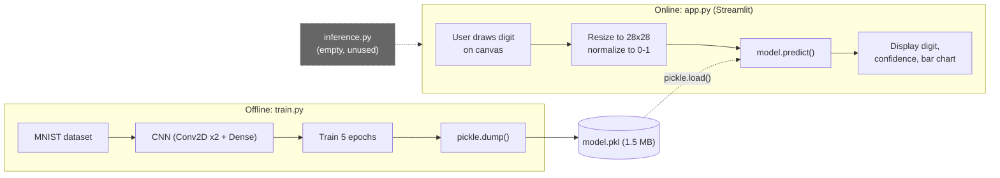

# Code Analysis Report: mnist-classifier

**Source:** https://github.com/Codivy4706/mnist-classifier
**Language:** Python 3
**Analyzed on:** 2026-08-05

## Overview

This is a small, single-purpose deep learning demo: a handwritten digit recognizer built on the MNIST dataset, with a Streamlit UI that lets a user draw a digit and get a live prediction. The repository has 3 Python files and one binary model artifact:

| File | Purpose | Lines |
|---|---|---|
| `train.py` | Loads MNIST, builds/trains a CNN, pickles the trained model | 41 |
| `app.py` | Streamlit UI: drawing canvas → preprocessing → prediction → results | 79 |
| `inference.py` | Intended inference module | **0 (empty)** |
| `model.pkl` | Serialized trained model | 1.5 MB (binary, not analyzed) |
| `requirements.txt` | Pinned dependencies | 70 packages |

There is no test suite, no CI configuration, and only one commit in the repository's history ("Streamlit MNIST digit classifier interface"), so this reads as an early-stage personal/portfolio project rather than a production system.

## Architecture

The pipeline is a classic two-stage ML app: an offline training script produces an artifact, and an online app consumes it. The only structural issue is that **`inference.py` exists but is empty** — its logical responsibility (preprocessing + prediction) is duplicated inline inside `app.py` instead, so the intended separation between "UI" and "inference" never actually happened.

## Findings

Findings are grouped by confidence. **Confirmed** issues were verified by static inspection or by actually running package resolution against PyPI in an isolated sandbox. **Recommendations** are stylistic/best-practice suggestions.

### Confirmed

1. **`requirements.txt` cannot be installed as-is.** The file pins several package versions that do not exist on PyPI. Verified by querying the real PyPI index from an isolated virtual environment:

   | Package | Pinned version | Latest actually available |
   |---|---|---|
   | `numpy` | `2.5.1` | `2.2.6` |
   | `pandas` | `3.0.3` | `2.3.3` |
   | `scipy` | `1.18.0` | `1.15.3` |
   | `scikit-learn` | `1.9.0` | `1.7.2` |
   | `keras` | `3.15.0` | `3.12.4` |

   `pip install -r requirements.txt` fails on the first of these it reaches. This file was almost certainly generated by `pip freeze` against a broken/mismatched local environment (or hand-edited), not from a clean install. Anyone cloning this repo cannot currently reproduce the environment.

2. **`requirements.txt` is UTF-16 encoded with CRLF line endings**, not the standard UTF-8/plain-text that `pip`, GitHub's diff viewer, and most tooling expect. It happens to still parse (Python's `open()` and `pip` both handled it in testing), but it's fragile — some tools that assume UTF-8 line-splitting will mis-handle it, and diffs will look noisy to any Linux/macOS collaborator. Likely produced by `pip freeze > requirements.txt` on Windows PowerShell redirection.

3. **`inference.py` is completely empty.** Given the README explicitly describes "model serialization, a Streamlit-based UI for inference," this file appears to be a stub that was never filled in, while its intended logic (image preprocessing + `model.predict()`) was written directly into `app.py` (lines 51–65) instead.

4. **The trained Keras model is serialized with `pickle` instead of Keras's native format.** Both `train.py` (`pickle.dump(model, f)`) and `app.py` (`pickle.load(f)`) treat the Keras `Sequential` model as a generic Python object. This is a well-known anti-pattern for TensorFlow/Keras models:
   - It is **not guaranteed to be portable** across TensorFlow/Keras versions — a model pickled with one Keras version can fail to unpickle with another (this is more fragile than the officially supported `.keras`/`.h5`/SavedModel formats via `model.save()` / `keras.models.load_model()`).
   - `pickle.load()` on an untrusted or corrupted file can execute arbitrary code. Here the file is the project's own artifact so risk is low today, but it's a bad habit to standardize on, especially if `model.pkl` is ever fetched from a shared/external location later.

### Recommendations

**Code quality / maintainability**

- No docstrings, type hints, or comments explaining *why* (only what) anywhere in `train.py` or `app.py` — acceptable for a demo script, but would help a reader understand choices like the epoch count or architecture.
- `train.py` imports `pickle` in the middle of the file (line 37) instead of at the top with the other imports — violates PEP 8 import ordering.
- `train.py` mixes `from tensorflow import keras` (line 2) with `from keras import datasets, layers, models` (line 3) — importing the standalone `keras` package alongside `tensorflow`'s bundled Keras is redundant and can create a version mismatch between the two (the project pins `tensorflow==2.21.0` *and* a separate `keras==3.15.0`, which don't have to agree). Pick one consistent import style (`tensorflow.keras` is the safer default when `tensorflow` is the primary dependency).
- `train.py` has no top-level guard (`if __name__ == "__main__":`) — running training as a side effect of import would surprise anyone who later imports this module for its constants/functions.
- No random seed is set before training (`tf.random.set_seed(...)`), so `train.py` produces a different model every run — makes results non-reproducible and hard to compare across runs.
- `app.py`'s `page_icon=":Heart:"` (line 10) uses mixed case in a Streamlit emoji shortcode; the convention is lowercase (`:heart:`). Worth double-checking it renders as intended.
- `model.pkl` (1.5 MB binary) is committed directly to git with no `.gitignore` exclusion. Binary model artifacts are usually either excluded from version control (regenerated via `train.py`) or tracked with Git LFS — committing them directly bloats repository history over time as the model is retrained.

**Structure**

- Delete `inference.py` if it's not going to be used, or — better — move the preprocessing + prediction logic out of `app.py` (lines 51–65) into it, so `app.py` only handles UI/display and `inference.py` owns "given a canvas image, return a prediction." This also makes the prediction logic independently testable without spinning up Streamlit.
- No tests exist for either the training pipeline or the preprocessing logic in `app.py` (e.g., verifying the resize/normalize/reshape steps produce the shape the model expects). Even a couple of unit tests around the preprocessing function (once extracted to `inference.py`) would catch shape/dtype regressions early.

## Dependency Analysis

- 70 packages are pinned in `requirements.txt`, but the two direct dependencies actually imported by the code are `tensorflow`/`keras` (training) and `streamlit` + `streamlit-drawable-canvas` + `numpy` + `pillow` (app). The remaining ~65 entries are transitive dependencies captured by a `pip freeze`, which is reasonable for reproducibility *if* the pinned versions were installable — see Confirmed issue #1 above, which breaks that goal in its current state.
- `python-multipart` and `uvicorn` are present in `requirements.txt` but are FastAPI/ASGI-server dependencies — unused by this Streamlit-only project. Likely leftover from a different environment that got captured into the same freeze. Candidates for removal.
- Recommend regenerating `requirements.txt` from a clean virtual environment with only the actual top-level imports (`tensorflow`, `streamlit`, `streamlit-drawable-canvas`, `numpy`, `pillow`, `pickle` is stdlib) installed via `pip install <package>` followed by `pip freeze > requirements.txt`, saved as UTF-8. I did not modify the file — let me know if you'd like me to generate a corrected version for your review.

## Testing Analysis

There is no test suite of any kind in this repository (no `tests/` directory, no `pytest`/`unittest` files, no CI workflow). Coverage is effectively 0%.

Suggested minimum tests, once `inference.py` is populated:
- Unit test that the preprocessing function turns a raw canvas array into a `(1, 28, 28, 1)` float32 array normalized to `[0, 1]`.
- Unit test that `predict()` returns a 10-element probability vector that sums to ~1.
- A smoke test for `train.py` using a tiny synthetic dataset (a handful of images) to confirm the model builds, compiles, and fits without needing the full MNIST download — keeps CI fast.

No HTML coverage report was generated since there is no existing test suite to measure coverage against.

## Performance Analysis

- **Model loading is cached** via `@st.cache_resource` (app.py line 15) — correct use of Streamlit's caching to avoid reloading the model on every UI interaction. Good practice already in place.
- **Training (`train.py`)** is a short, one-off CPU/GPU-bound script (2 Conv2D + 2 Dense layers, 5 epochs on 60k 28×28 images) — this is small enough that GIL contention and multiprocessing are non-issues; TensorFlow already parallelizes matrix ops internally below the GIL. No changes recommended here.
- **Inference (`app.py`)** runs one forward pass per button click on a single 28×28 image — negligible cost; no batching or async needed for a single-user local demo.
- No measurable performance problems were found. I did not recommend caching/async/multiprocessing changes because the current design already fits the problem size — adding them here would be premature optimization.

## Security

- `pickle.load()` used to deserialize `model.pkl` (app.py line 18) — deserializing untrusted pickle data is a known remote-code-execution vector. In this project the file is the app's own trusted artifact, so there's no exploitable path today, but this is worth flagging if the model is ever fetched from an external/shared source later. See Confirmed issue #4 for the recommended fix (native Keras save/load format).
- `unsafe_allow_html=True` is used twice (app.py lines 24–25) to render styled `<h1>`/`
` tags. Both strings are hardcoded literals with no user-supplied content interpolated into them, so there is no XSS risk currently. Flagging only so that if any dynamic/user-controlled text is ever inserted into these `st.markdown()` calls in the future, it gets escaped rather than passed through raw HTML.
- No secrets, credentials, or API keys were found in the repository.

## Conclusion

This is a clean, small, purpose-built demo of an MNIST digit classifier with a working Streamlit front end. The core logic (CNN architecture, preprocessing, and UI flow) is straightforward and functionally reasonable for its scope. The most impactful issue is that **`requirements.txt` is currently broken** — it pins several package versions that don't exist on PyPI, so a fresh clone cannot be set up without editing it first. The second most useful fix is closing the gap between the empty `inference.py` and the inference code actually living inside `app.py`, which would make the codebase easier to test and extend. Neither issue is difficult to resolve, and addressing them (plus regenerating a clean, UTF-8 `requirements.txt`) would bring this from "working demo" to "reproducible, maintainable project."
