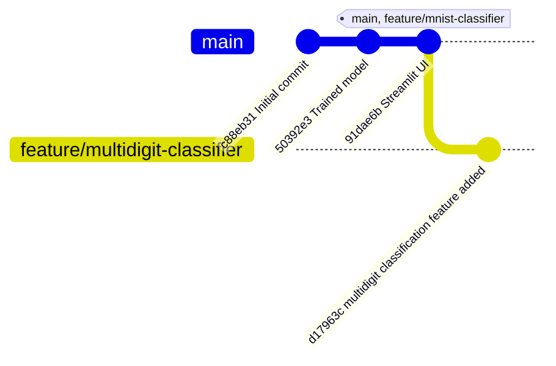
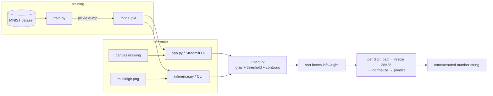

# Analysis Report — mnist-classifier

**Project:** `Codivy4706/mnist-classifier` (GitHub)
**Language:** Python (analyzed with the Python analyzer)
**Date:** 2026-08-05
**Scope:** All branches (`main`, `feature/mnist-classifier`, `feature/multidigit-classifier`)
**Verification:** Static analysis + isolated sandbox execution in `/tmp` (TensorFlow 2.21.0 + OpenCV, temporary venv, cleaned up afterward). No original project files modified.

---

## 1. Overview

A deep-learning handwritten digit recognition project:

- **`train.py`** — trains a small CNN on MNIST (2×Conv2D + 2×MaxPool + 2×Dense, ~122K params) and serializes it with `pickle`.
- **`app.py`** — a Streamlit web UI where you draw a digit (or multiple digits) on a canvas; the app segments the drawing into digits with OpenCV contours and predicts each one.
- **`inference.py`** — a CLI version that loads `model.pkl` and runs the same segmentation pipeline on `multidigit.png` (a committed synthetic two-digit test image).

**Key verified facts**
- The committed model reaches **99.12% accuracy** on the MNIST test set (measured in the sandbox).
- `inference.py` runs end-to-end and correctly recognizes the committed test image as **"25"**.
- The full app prediction pipeline (contour → pad → resize → predict) was validated on synthetic canvases: `[3]→3`, `[7,2]→72`, `[9,5,1]→951`, `[0]→0`, empty canvas → no digits.

**Overall verdict:** Functionally works, but the project is not reproducible "out of the box" because the pinned requirements are missing OpenCV (the app crashes on a fresh install), the model is stored as a raw pickle (fragile across library versions), there are zero tests, and the branch layout contains a redundant identical branch.

---

## 2. Branch Analysis



| Branch | Tip | Relationship | Contents |
|--------|-----|--------------|----------|
| `main` | `91dae6b` | base | Single-digit Streamlit UI; `inference.py` is **empty**; `app.py` uses PIL-only preprocessing |
| `feature/mnist-classifier` | `91dae6b` | **Identical to `main`** (same tree, same commit) | — |
| `feature/multidigit-classifier` | `d17963c` | `main` + 1 commit | Multi-digit detection in `app.py`; `inference.py` implemented; `multidigit.png` added; `model.pkl` replaced (same size, different bytes) |

**Branch findings**
- `feature/mnist-classifier` is byte-for-byte identical to `main` — it's a redundant branch that should be deleted or is a leftover.
- `main` is **behind** `feature/multidigit-classifier`: the multidigit work has never been merged/PR'd into `main`. `main` also still contains an empty `inference.py` and the older, less robust PIL preprocessing.
- `model.pkl` differs between `main` and the feature branch (both 1,500,922 bytes) — a retrained model was committed in the feature branch.
- Recommend: open a PR for `feature/multidigit-classifier` → `main`, then delete `feature/mnist-classifier`.

---

## 3. Architecture



The design is clean and simple: one shared model, two thin consumers (`app.py`, `inference.py`). The weak spot is that the **preprocessing pipeline is duplicated** in both consumers and has already **drifted** (see F-05).

---

## 4. Findings

Legend: 🔴 **Confirmed issue** (verified by inspection or execution) · 🟡 **Risk / improvement**

| ID | Severity | Finding |
|----|----------|---------|
| F-01 | 🔴 | **OpenCV is missing from `requirements.txt` but imported by both `app.py:6` and `inference.py:1`.** After `pip install -r requirements.txt` in a fresh sandbox, `import cv2` fails with `ModuleNotFoundError`. **The app cannot start on a fresh install.** Verified in sandbox. Fix: add `opencv-python-headless` (or `opencv-python`). |
| F-02 | 🔴 | **`requirements.txt` is a raw `pip freeze` dump saved in UTF-16 LE.** 70 fully-pinned transitive packages (verified). Problems: (a) UTF-16 + CRLF mangles in most editors/diffs/Git tools — modern pip 25 parses it (verified), older pip and many tools won't; (b) it pins *every* transitive dependency instead of top-level requirements, so unrelated packages are listed (`GitPython`, `pyarrow`, `pydeck`, `uvicorn`, `httptools`, `watchdog`, `websockets`, `rich`, `toml`, …); (c) test/lint tooling (`pytest`, `flake8`) is absent. |
| F-03 | 🟡 | **Model is stored as a raw pickle (`model.pkl`).** `train.py:37-39` does `pickle.dump(model)`; pickle opcodes confirm it's a `keras.src.models.sequential.Sequential` object. It loads fine with the pinned versions (verified), but a pickled live model is **version-fragile** — it can fail to load after TF/Keras upgrades and can't be inspected by standard tools. Keras best practice is `model.save("model.keras")` (SavedModel / `.keras` format). |
| F-04 | 🔴 | **`train.py` is not reproducible.** No `tf.random.set_seed`, no numpy seed, no callbacks (early stopping, checkpointing, `ReduceLROnPlateau`), no `--epochs`/CLI. Two runs give different models. It also imports `tensorflow as tf` and `from tensorflow import keras` but never uses them (pyflakes-confirmed). |
| F-05 | 🔴 | **Duplicated preprocessing has drifted between `app.py` and `inference.py`.** Both implement threshold→contour→pad→resize→normalize→predict, but with different constants: threshold **50** (`app.py:58`) vs **127** (`inference.py:38`); min-box filter **w>10, h>20** (`app.py:66`) vs **w>3, h>5** (`inference.py:52`); padding **15** (`app.py:79`) vs **4** (`inference.py:57`). The same image can yield different results in the UI vs the CLI. Extract this into a shared module. |
| F-06 | 🟡 | **Stale-result UI logic in `app.py`.** The display block at `app.py:110-116` runs on every rerun: once `full_number`/`detected_digits` are in session state, clicking **Predict** again on an *empty* canvas skips detection (image_data is `None`) but the stale metric is still shown — the "Canvas is empty" warning (`app.py:114`) is unreachable. Clear the session keys when the canvas is empty. |
| F-07 | 🟡 | **Unused import / bad shortcode.** `from PIL import Image` (`app.py:3`) is unused after the multidigit rewrite (pyflakes-confirmed). `page_icon=":Heart:"` (`app.py:11`) is not a valid emoji shortcode (should be `:heart:` lowercase or a literal emoji). |
| F-08 | 🟡 | **Aspect-ratio distortion in digit cropping.** A wide digit crop is resized to 28×28 without preserving aspect ratio or mass-centering (`app.py:81`, `inference.py:59`), and the fixed padding places thick freehand strokes far outside MNIST's typical digit occupancy. The MNIST-trained model still copes (99% accuracy on MNIST; synthetic tests passed), but accuracy on real freehand drawings could be improved by moment-based centering and aspect-preserving resize. |
| F-09 | 🟡 | **No tests, no CI, no lint config.** Zero test files exist in any branch. There is no CI workflow, no `.flake8`/`pyproject`, and no test dependencies. |
| F-10 | 🟡 | **Hardcoded paths + no CLI args.** `inference.py` hardcodes `'model.pkl'` and `'multidigit.png'` (`inference.py:8,11`); the test-image fallback (`inference.py:14-29`) downloads MNIST silently and seeds no random state. |
| F-11 | 🟡 | **Binary committed without LFS/tracking.** `model.pkl` (1.5 MB) is committed; fine for a demo, but for a real repo use `model.save()` output + `dvc`/`git-lfs`. |
| F-12 | ℹ️ | **Repo hygiene.** `README.md` is two lines with no run instructions (`streamlit run app.py` is undocumented); `multidigit.png` (66×28, two digit blobs — verified) is a generated test artifact committed to the repo. |

**What's working well (confirmed in sandbox):**
- Clean CNN, right input shape (`28×28×1`), correct `sparse_categorical_crossentropy`/softmax setup.
- Correct use of `@st.cache_resource` for model loading.
- Contour segmentation + left-to-right sorting correctly handles multiple digits.
- `model.predict(..., verbose=0)` is used to keep output clean.

---

## 5. Code Quality

- **Readability:** Good. Step-numbered comments (`# 1.`, `# 2.`, …) make the OpenCV pipeline easy to follow; naming is clear; files are short (40–116 lines).
- **Structure:** Only two responsibilities are duplicated (preprocessing). A shared `preprocess.py` would remove the drift in F-05.
- **Docstrings:** None. The project has zero docstrings and almost no comments explaining *why* (only *what*).
- **Error handling:** `inference.py:34-35` handles a missing image properly. But `pickle.load` (model) and `cv2.imread` have no try/except, and the model-load in `app.py` would raise a raw exception if `model.pkl` is absent.
- **Type hints:** None. For such a small project this is acceptable, but hints on the pipeline functions would document the tensor shapes.
- **Dead code:** `PIL.Image` (app.py), `tf`/`tensorflow.keras` imports (train.py).

---

## 6. Dependency Analysis

### 6.1 Findings (verified)

| Package | Status |
|---------|--------|
| `tensorflow==2.21.0`, `keras==3.15.0` | ✅ Present, installs & works (verified); `keras` one minor patch behind (3.15.1). |
| `streamlit==1.60.0`, `streamlit-drawable-canvas==0.9.3` | ✅ Present; latest is 1.61.0 (minor). |
| `numpy`, `pillow` | ✅ Present. |
| **OpenCV (`cv2`)** | 🔴 **Missing — required by `app.py` and `inference.py`.** |
| `pytest`, `flake8` | 🔴 Missing (no tests/lint possible). |
| `GitPython`, `pyarrow`, `pydeck`, `uvicorn`, `httptools`, `watchdog`, `websockets`, `rich`, `markdown-it-py`, `toml`, … | 🟡 Unnecessary transitive packages from a `pip freeze` dump. |

### 6.2 Recommendations

1. Replace `requirements.txt` with a small top-level list:
   ```
   tensorflow==2.21.0
   keras==3.15.0
   streamlit==1.60.0
   streamlit-drawable-canvas==0.9.3
   opencv-python-headless==5.0.0
   numpy==2.5.1
   pillow==12.3.0
   ```
   plus a separate `requirements-dev.txt` with `pytest`, `flake8`.
2. Re-save the file as UTF-8 (LF).
3. Pin `opencv-python-headless` (headless avoids GUI/`libGL` issues in containers/CI).
4. Prefer `model.save("model.keras")` over pickling (F-03).

---

## 7. Testing Analysis

- **Existing tests:** none. No `tests/` directory, no pytest/unittest files on any branch.
- **Coverage:** n/a (nothing to measure).
- **What should be tested** (highest value first):
  1. **Preprocessing unit tests** — the shared `preprocess` pipeline: threshold, contour filtering (the `w>10,h>20` vs `w>3,h>5` rules), padding, 28×28 resize, normalization. Edge cases: empty image → `[]`; single digit; many digits; digit touching canvas edge.
  2. **Prediction tests** — a fixture model or the committed `model.pkl`: `[3]→3`, `[7,2]→72` (these passed in my sandbox verification and make great regression tests).
  3. **App logic tests** — session-state behavior for empty canvas (stale-results bug F-06) using `streamlit.testing.v1.AppTest`.
  4. **Training smoke test** — train for 1 epoch on a tiny subset and assert the model serializes and reloads (guards against the pickle fragility).
  5. **CLI test** — `inference.py` on a known image prints the expected number.
- Note: testing `app.py` and `inference.py` requires the OpenCV dependency from F-01 to be installed.

---

## 8. Performance Analysis

- **Model:** tiny (~121,930 params); a forward pass on 28×28 is milliseconds. No bottleneck.
- **Per-digit predict calls:** `app.py:88` and `inference.py:66` call `model.predict` once **per digit**. For a drawing with *n* digits that's *n* small predictions. Easy win: batch all cropped digits into a single `model.predict(np.stack(...))` call (shape `(n,28,28,1)`) and `np.argmax(..., axis=1)`. Measurable for many-digit pages, negligible for typical use.
- **Regex/CV:** not applicable; OpenCV ops are vectorized and fast.
- **Concurrency:** The UI is single-user/single-pass; no thread/async work needed. **GIL:** irrelevant (the workload is a short CNN call, not CPU-bound loops).
- Recommendation: only apply the batching change if images will contain many digits — otherwise it's unnecessary complexity (the skill guidance: only optimize when there's a measurable benefit).

---

## 9. Security

- **No secrets** are committed (verified — only code, model, test image, README, gitignore). ✅
- **`pickle.load` of a model file** (`app.py:18`, `inference.py:8`) executes arbitrary code embedded in the pickle. The committed `model.pkl` is trusted, but if users ever point the app at a model from an untrusted source, this is a code-execution risk. `model.save()`/`.keras` format avoids this (F-03).
- **`unsafe_allow_html=True`** (`app.py:25-26`) is used only with static strings (no user input) — not exploitable here, but avoid it when dynamic content is involved.
- **OpenCV/Streamlit:** no file uploads, no user-controlled paths, no network I/O at inference. Low overall attack surface.

---

## 10. Suggestions (prioritized)

**Now (blockers)**
1. Add `opencv-python-headless` to `requirements.txt` — the app currently cannot start on a fresh install (F-01).
2. Rewrite `requirements.txt` as a small, UTF-8, top-level list + add `requirements-dev.txt` (F-02).
3. Switch to `model.save("model.keras")` / `tf.keras` SavedModel instead of `pickle` (F-03).

**Soon**
4. Extract the shared segmentation pipeline into one module and use it from both `app.py` and `inference.py` (F-05).
5. Fix the stale-result UI logic (F-06), remove the unused `PIL.Image` import and fix `page_icon` (F-07).
6. Add a `tests/` suite per §7.
7. Set seeds + callbacks in `train.py`; make epoch count and paths CLI arguments (F-04, F-10).

**Later**
8. Mass-center + aspect-preserve digit crops before resize (F-08).
9. Merge `feature/multidigit-classifier` into `main`, delete the redundant `feature/mnist-classifier` branch (§2).
10. Expand the README with install + `streamlit run app.py` instructions.

---

## 11. Conclusion

The core idea works and is verified: the CNN is well-built and achieves **99.12% MNIST accuracy**, the multi-digit segmentation correctly reads multi-digit drawings, and both the UI and CLI pipelines run — once OpenCV is installed. The main gaps are engineering hygiene rather than ML correctness: a missing required dependency, a version-fragile pickle model, an unpinned/unnecessary-heavy `pip freeze` requirements file, duplicated preprocessing logic that has drifted, and zero tests. These are all quick fixes and none require rethinking the architecture.

---

*Report generated by the Code Analyzer skill. Verification was performed in an isolated temporary sandbox (`/tmp/opencode/mnist-sandbox`, Python 3.12, TensorFlow 2.21.0) using the repository clone; the sandbox and clone are cleaned up after analysis. The original repository was not modified.*
